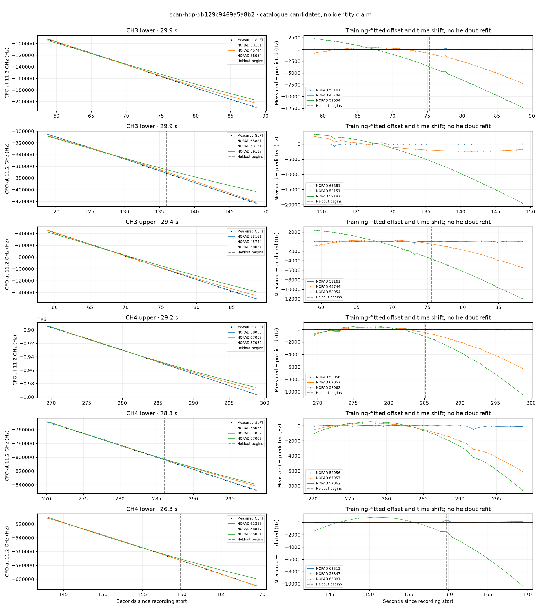

# scan-hop-db129c9469a5a8b2

Recorded **2026-09-14T19:40:12.731860Z**, RX0, 10 MS/s.

**Candidates pass descriptive checks; no identification.** Candidates: 53161 (2 tracklets), 64742 (2 tracklets), 58056 (2 tracklets).

[Satellite RMS comparisons and top-1 gains](scan-hop-db129c9469a5a8b2-candidates.md).

Counts are correlated lane tracklets, not independent detections or satellite counts. A recording can contain multiple transmitters; these are not one-label-per-file assignments.

Solid curves include a per-track constant carrier offset fitted on the first 60% of observations. The final 40% is held out. A close curve is not identity evidence by itself.

Catalogue: `sha256:4b2095c8131c06da613b154fc073602a412fc2bfa0847667b2c078799384e2ac`. Orbital-only exclusions: STARLINK-1770 (NORAD 46383; SGP4 []).

| Lane | Recording seconds | Top 3 training NORADs | Train / heldout RMS (Hz) | Leader heldout rank | Assessment |
|---|---:|---|---:|---:|---|
| CH3 lower | 58.8–88.6 | 53161, 45744, 58054 | 40.0 / 69.9 | 1 | Passes descriptive checks; candidate only |
| CH3 upper | 59.0–88.4 | 53161, 45744, 58054 | 62.6 / 49.6 | 1 | Passes descriptive checks; candidate only |
| CH3 lower | 119.0–148.8 | 65881, 53151, 59187 | 176.9 / 44.4 | 1 | Passes descriptive checks; candidate only |
| CH4 lower | 143.0–169.4 | 62313, 58847, 65881 | 19.2 / 120.1 | 1 | Passes descriptive checks; candidate only |
| CH4 lower | 173.9–195.6 | 64742, 59642, 62313 | 16.9 / 61.1 | 1 | Passes descriptive checks; candidate only |
| CH2 upper | 180.1–200.1 | 64742, 59642, 58847 | 31.3 / 69.3 | 1 | Passes descriptive checks; candidate only |
| CH4 upper | 269.5–298.8 | 58056, 67057, 57062 | 89.3 / 41.5 | 1 | Passes descriptive checks; candidate only |
| CH4 lower | 270.2–298.5 | 58056, 67057, 57062 | 21.7 / 135.8 | 1 | Passes descriptive checks; candidate only |

[Full candidate, control and measured-CFO evidence](scan-hop-db129c9469a5a8b2.json.gz).
