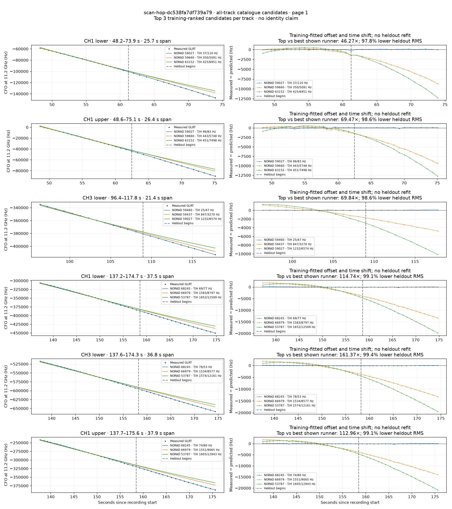
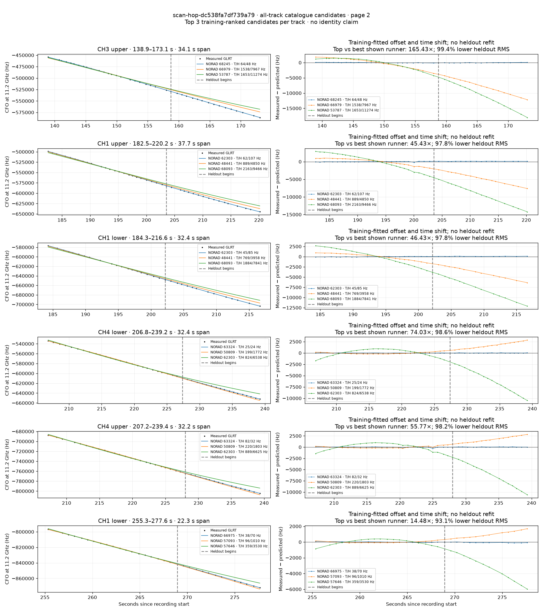

# All track overlays: scan-hop-dc538fa7df739a79

Recorded **2026-09-14T19:30:12.583313Z**, RX0, 10 MS/s. All **12 eligible tracks** are shown in chronological order.

[Recording assessment](scan-hop-dc538fa7df739a79.md) · [Candidate RMS and gains](scan-hop-dc538fa7df739a79-candidates.md)

Each row matches the requested view: measured GLRT CFO and the top three training-ranked TLE curves on the left, residuals on the right. Offset and time shift are fitted only on the first 60%; the last 40% is held out. These are candidate diagnostics, not satellite identifications.

RMS cells below are `training / heldout` in Hz. Runner-up 1 and 2 are training ranks two and three. The gain compares the top TLE with whichever of those two has lower heldout RMS.

| Track | Top TLE, train / heldout RMS | Runner-up 1, train / heldout RMS | Runner-up 2, train / heldout RMS | Top vs best shown runner, heldout |
|---|---:|---:|---:|---:|
| CH1 lower, 48.2–73.9 s | STARLINK-30863 / 59027: 36.7 / 110.0 Hz | STARLINK-31885 / 59660: 350.1 / 5090.7 Hz | STARLINK-32915 / 63152: 425.0 / 6951.4 Hz | 46.27× / 97.8% lower |
| CH1 upper, 48.6–75.1 s | STARLINK-30863 / 59027: 96.3 / 82.7 Hz | STARLINK-31885 / 59660: 443.4 / 5747.7 Hz | STARLINK-32915 / 63152: 450.7 / 7498.1 Hz | 69.47× / 98.6% lower |
| CH3 lower, 96.4–117.8 s | STARLINK-31620 / 59460: 25.2 / 46.8 Hz | STARLINK-31706 / 59437: 847.4 / 3270.2 Hz | STARLINK-30863 / 59027: 1232.1 / 6574.1 Hz | 69.84× / 98.6% lower |
| CH1 lower, 137.2–174.7 s | STARLINK-36247 / 68245: 69.3 / 76.7 Hz | STARLINK-36107 / 66979: 1582.7 / 8797.3 Hz | STARLINK-4743 / 53787: 1652.1 / 12508.8 Hz | 114.74× / 99.1% lower |
| CH3 lower, 137.6–174.3 s | STARLINK-36247 / 68245: 77.8 / 53.2 Hz | STARLINK-36107 / 66979: 1533.8 / 8577.0 Hz | STARLINK-4743 / 53787: 1574.5 / 12160.6 Hz | 161.37× / 99.4% lower |
| CH1 upper, 137.7–175.6 s | STARLINK-36247 / 68245: 74.4 / 80.2 Hz | STARLINK-36107 / 66979: 1550.9 / 9065.2 Hz | STARLINK-4743 / 53787: 1604.6 / 12943.0 Hz | 112.96× / 99.1% lower |
| CH3 upper, 138.9–173.1 s | STARLINK-36247 / 68245: 63.8 / 48.2 Hz | STARLINK-36107 / 66979: 1538.0 / 7967.2 Hz | STARLINK-4743 / 53787: 1653.5 / 11273.6 Hz | 165.43× / 99.4% lower |
| CH1 upper, 182.5–220.2 s | STARLINK-32621 / 62303: 62.1 / 106.8 Hz | STARLINK-2702 / 48441: 888.7 / 4850.3 Hz | STARLINK-36251 / 68093: 2162.7 / 9466.3 Hz | 45.43× / 97.8% lower |
| CH1 lower, 184.3–216.6 s | STARLINK-32621 / 62303: 45.2 / 85.2 Hz | STARLINK-2702 / 48441: 769.5 / 3957.6 Hz | STARLINK-36251 / 68093: 1884.4 / 7841.0 Hz | 46.43× / 97.8% lower |
| CH4 lower, 206.8–239.2 s | STARLINK-33619 / 63324: 24.6 / 23.9 Hz | STARLINK-3232 / 50809: 198.7 / 1771.8 Hz | STARLINK-32621 / 62303: 823.6 / 6537.6 Hz | 74.03× / 98.6% lower |
| CH4 upper, 207.2–239.4 s | STARLINK-33619 / 63324: 81.7 / 32.3 Hz | STARLINK-3232 / 50809: 220.3 / 1802.6 Hz | STARLINK-32621 / 62303: 888.5 / 6624.8 Hz | 55.77× / 98.2% lower |
| CH1 lower, 255.3–277.6 s | STARLINK-35777 / 66975: 37.6 / 69.7 Hz | STARLINK-6229 / 57093: 96.4 / 1010.1 Hz | STARLINK-30265 / 57646: 359.5 / 3530.4 Hz | 14.48× / 93.1% lower |

## Page 1

## Page 2

