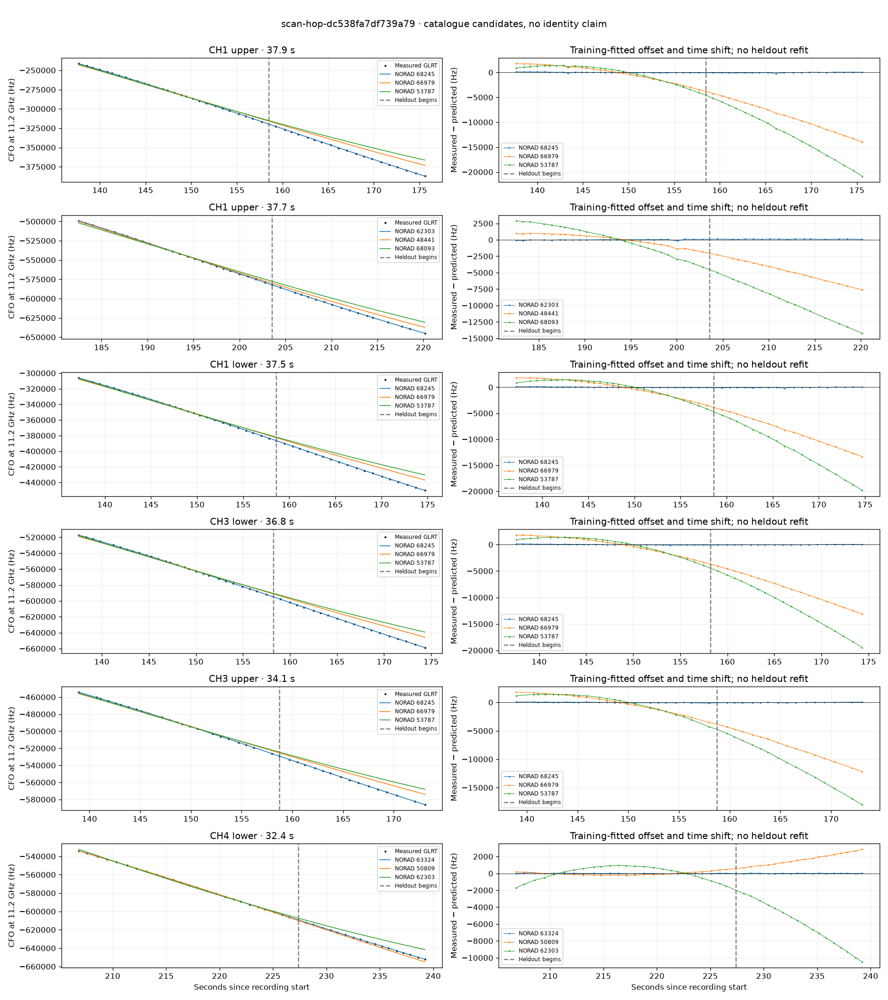

# scan-hop-dc538fa7df739a79

Recorded **2026-09-14T19:30:12.583313Z**, RX0, 10 MS/s.

**Candidates pass descriptive checks; no identification.** Candidates: 68245 (4 tracklets), 62303 (2 tracklets), 59027 (1 tracklets).

[Satellite RMS comparisons and top-1 gains](scan-hop-dc538fa7df739a79-candidates.md).

[Measured CFO/TLE overlays for every track](scan-hop-dc538fa7df739a79-all-tracks.md).

Counts are correlated lane tracklets, not independent detections or satellite counts. A recording can contain multiple transmitters; these are not one-label-per-file assignments.

Solid curves include a per-track constant carrier offset fitted on the first 60% of observations. The final 40% is held out. A close curve is not identity evidence by itself.

Catalogue: `sha256:4b2095c8131c06da613b154fc073602a412fc2bfa0847667b2c078799384e2ac`. Orbital-only exclusions: STARLINK-1770 (NORAD 46383; SGP4 []).

| Lane | Recording seconds | Top 3 training NORADs | Train / heldout RMS (Hz) | Leader heldout rank | Assessment |
|---|---:|---|---:|---:|---|
| CH1 lower | 48.2–73.9 | 59027, 59660, 63152 | 36.7 / 110.0 | 1 | 500s control fits as well or better |
| CH1 upper | 48.6–75.1 | 59027, 59660, 63152 | 96.3 / 82.7 | 1 | Passes descriptive checks; candidate only |
| CH3 lower | 96.4–117.8 | 59460, 59437, 59027 | 25.2 / 46.8 | 1 | Passes descriptive checks; candidate only |
| CH1 lower | 137.2–174.7 | 68245, 66979, 53787 | 69.3 / 76.7 | 1 | Passes descriptive checks; candidate only |
| CH3 lower | 137.6–174.3 | 68245, 66979, 53787 | 77.8 / 53.2 | 1 | Passes descriptive checks; candidate only |
| CH1 upper | 137.7–175.6 | 68245, 66979, 53787 | 74.4 / 80.2 | 1 | Passes descriptive checks; candidate only |
| CH3 upper | 138.9–173.1 | 68245, 66979, 53787 | 63.8 / 48.2 | 1 | Passes descriptive checks; candidate only |
| CH1 upper | 182.5–220.2 | 62303, 48441, 68093 | 62.1 / 106.8 | 1 | Passes descriptive checks; candidate only |
| CH1 lower | 184.3–216.6 | 62303, 48441, 68093 | 45.2 / 85.2 | 1 | Passes descriptive checks; candidate only |
| CH4 lower | 206.8–239.2 | 63324, 50809, 62303 | 24.6 / 23.9 | 1 | Passes descriptive checks; candidate only |
| CH4 upper | 207.2–239.4 | 63324, 50809, 62303 | 81.7 / 32.3 | 1 | -500s control fits as well or better |
| CH1 lower | 255.3–277.6 | 66975, 57093, 57646 | 37.6 / 69.7 | 1 | time-shift boundary |

[Full candidate, control and measured-CFO evidence](scan-hop-dc538fa7df739a79.json.gz).
