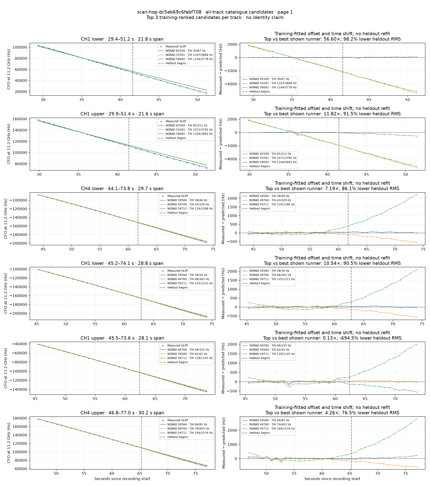
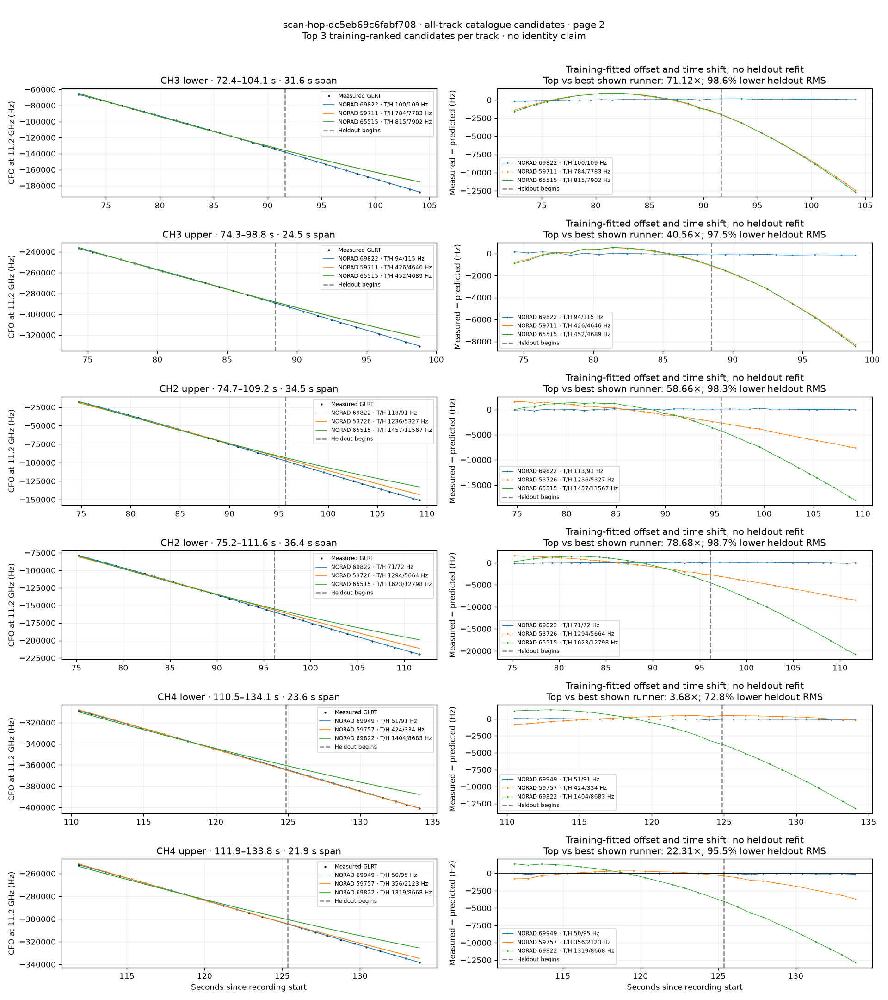
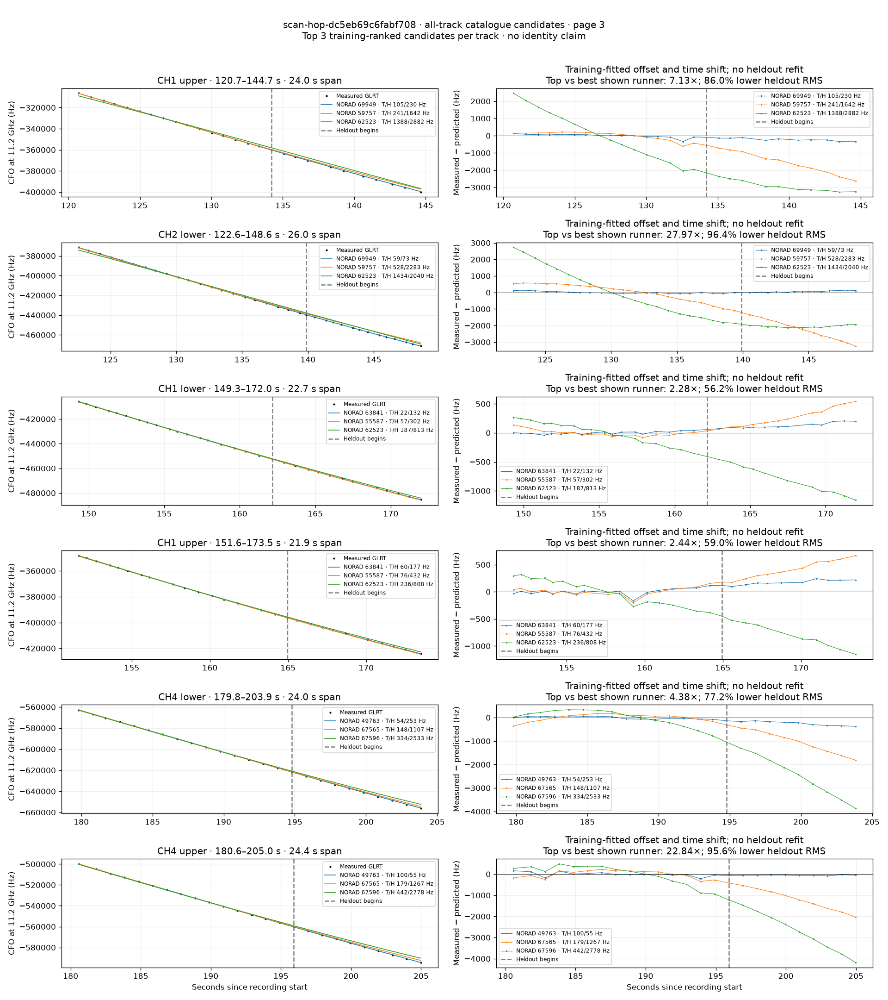
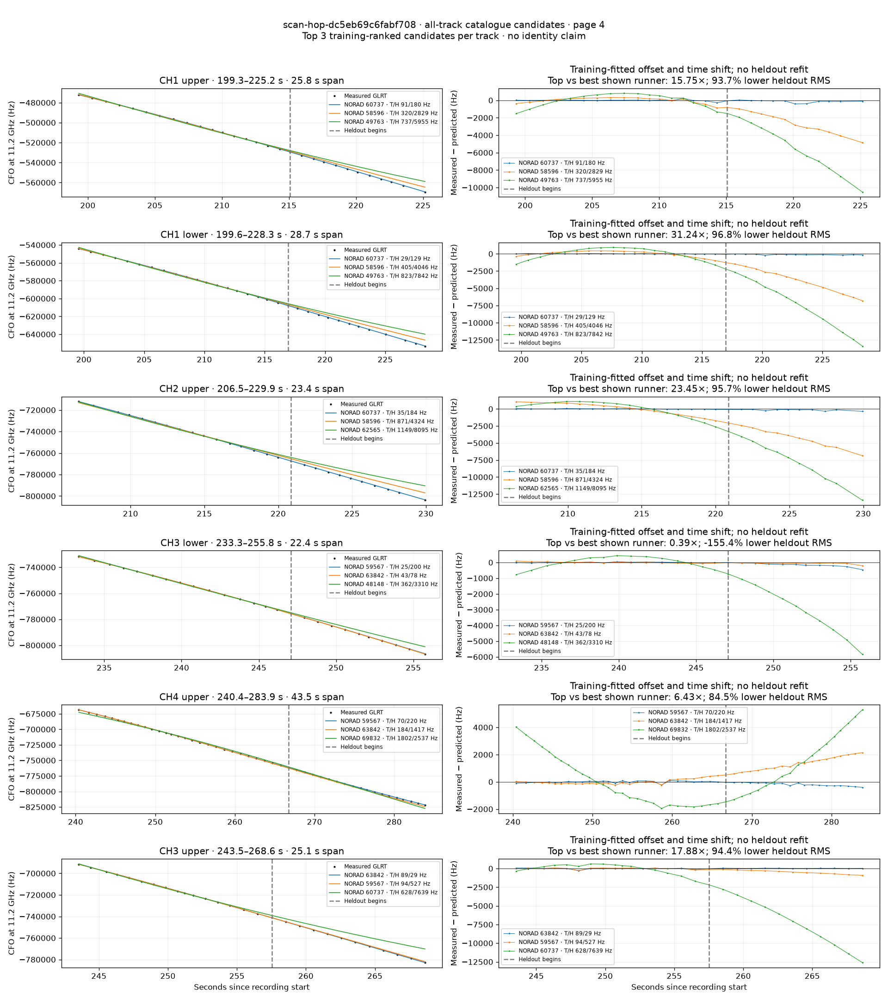
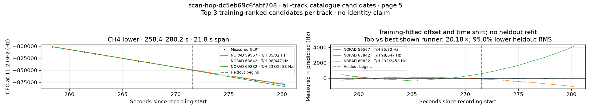

# All track overlays: scan-hop-dc5eb69c6fabf708

Recorded **2026-09-14T18:10:12.734255Z**, RX0, 10 MS/s. All **25 eligible tracks** are shown in chronological order.

[Recording assessment](scan-hop-dc5eb69c6fabf708.md) · [Candidate RMS and gains](scan-hop-dc5eb69c6fabf708-candidates.md)

Each row matches the requested view: measured GLRT CFO and the top three training-ranked TLE curves on the left, residuals on the right. Offset and time shift are fitted only on the first 60%; the last 40% is held out. These are candidate diagnostics, not satellite identifications.

RMS cells below are `training / heldout` in Hz. Runner-up 1 and 2 are training ranks two and three. The gain compares the top TLE with whichever of those two has lower heldout RMS.

| Track | Top TLE, train / heldout RMS | Runner-up 1, train / heldout RMS | Runner-up 2, train / heldout RMS | Top vs best shown runner, heldout |
|---|---:|---:|---:|---:|
| CH1 lower, 29.4–51.2 s | STARLINK-35168 / 65509: 30.4 / 66.8 Hz | STARLINK-5760 / 55591: 1107.3 / 3867.6 Hz | STARLINK-30615 / 58092: 1144.4 / 3778.3 Hz | 56.60× / 98.2% lower |
| CH1 upper, 29.9–51.4 s | STARLINK-35168 / 65509: 64.9 / 312.3 Hz | STARLINK-5760 / 55591: 1071.2 / 3794.5 Hz | STARLINK-30615 / 58092: 1103.8 / 3693.1 Hz | 11.82× / 91.5% lower |
| CH4 lower, 44.1–73.8 s | STARLINK-31662 / 59584: 37.5 / 45.7 Hz | STARLINK-3199 / 49760: 42.7 / 329.1 Hz | STARLINK-11082 / 59711: 115.8 / 1286.3 Hz | 7.19× / 86.1% lower |
| CH1 lower, 45.2–74.1 s | STARLINK-31662 / 59584: 37.9 / 34.4 Hz | STARLINK-3199 / 49760: 48.3 / 362.5 Hz | STARLINK-11082 / 59711: 124.6 / 1221.1 Hz | 10.54× / 90.5% lower |
| CH1 upper, 45.5–73.6 s | STARLINK-3199 / 49760: 45.9 / 335.0 Hz | STARLINK-31662 / 59584: 61.9 / 42.2 Hz | STARLINK-11082 / 59711: 129.1 / 1145.2 Hz | 0.13× / -694.5% lower |
| CH4 upper, 46.8–77.0 s | STARLINK-31662 / 59584: 65.7 / 94.5 Hz | STARLINK-3199 / 49760: 79.0 / 402.6 Hz | STARLINK-11082 / 59711: 169.4 / 1575.6 Hz | 4.26× / 76.5% lower |
| CH3 lower, 72.4–104.1 s | STARLINK-37521 / 69822: 100.3 / 109.4 Hz | STARLINK-11082 / 59711: 783.6 / 7782.9 Hz | STARLINK-35241 / 65515: 815.3 / 7901.5 Hz | 71.12× / 98.6% lower |
| CH3 upper, 74.3–98.8 s | STARLINK-37521 / 69822: 94.1 / 114.6 Hz | STARLINK-11082 / 59711: 425.8 / 4646.4 Hz | STARLINK-35241 / 65515: 451.7 / 4689.2 Hz | 40.56× / 97.5% lower |
| CH2 upper, 74.7–109.2 s | STARLINK-37521 / 69822: 112.6 / 90.8 Hz | STARLINK-4697 / 53726: 1235.6 / 5327.1 Hz | STARLINK-35241 / 65515: 1456.8 / 11567.4 Hz | 58.66× / 98.3% lower |
| CH2 lower, 75.2–111.6 s | STARLINK-37521 / 69822: 71.2 / 72.0 Hz | STARLINK-4697 / 53726: 1294.3 / 5664.2 Hz | STARLINK-35241 / 65515: 1623.3 / 12798.0 Hz | 78.68× / 98.7% lower |
| CH4 lower, 110.5–134.1 s | STARLINK-37923 / 69949: 51.3 / 90.9 Hz | STARLINK-11114 / 59757: 423.7 / 333.9 Hz | STARLINK-37521 / 69822: 1404.0 / 8682.8 Hz | 3.68× / 72.8% lower |
| CH4 upper, 111.9–133.8 s | STARLINK-37923 / 69949: 49.7 / 95.2 Hz | STARLINK-11114 / 59757: 355.7 / 2123.1 Hz | STARLINK-37521 / 69822: 1319.5 / 8667.8 Hz | 22.31× / 95.5% lower |
| CH1 upper, 120.7–144.7 s | STARLINK-37923 / 69949: 104.7 / 230.1 Hz | STARLINK-11114 / 59757: 241.0 / 1641.9 Hz | STARLINK-11527 / 62523: 1387.5 / 2882.4 Hz | 7.13× / 86.0% lower |
| CH2 lower, 122.6–148.6 s | STARLINK-37923 / 69949: 58.8 / 72.9 Hz | STARLINK-11114 / 59757: 528.2 / 2283.0 Hz | STARLINK-11527 / 62523: 1434.4 / 2040.1 Hz | 27.97× / 96.4% lower |
| CH1 lower, 149.3–172.0 s | STARLINK-34056 / 63841: 22.4 / 132.4 Hz | STARLINK-5727 / 55587: 57.2 / 302.2 Hz | STARLINK-11527 / 62523: 186.6 / 812.9 Hz | 2.28× / 56.2% lower |
| CH1 upper, 151.6–173.5 s | STARLINK-34056 / 63841: 59.6 / 177.0 Hz | STARLINK-5727 / 55587: 75.5 / 431.6 Hz | STARLINK-11527 / 62523: 235.7 / 807.7 Hz | 2.44× / 59.0% lower |
| CH4 lower, 179.8–203.9 s | STARLINK-3198 / 49763: 53.5 / 252.9 Hz | STARLINK-35725 / 67565: 147.6 / 1107.4 Hz | STARLINK-36629 / 67596: 333.6 / 2532.7 Hz | 4.38× / 77.2% lower |
| CH4 upper, 180.6–205.0 s | STARLINK-3198 / 49763: 100.4 / 55.5 Hz | STARLINK-35725 / 67565: 178.7 / 1266.7 Hz | STARLINK-36629 / 67596: 442.5 / 2777.8 Hz | 22.84× / 95.6% lower |
| CH1 upper, 199.3–225.2 s | STARLINK-32289 / 60737: 90.6 / 179.6 Hz | STARLINK-31059 / 58596: 320.3 / 2829.0 Hz | STARLINK-3198 / 49763: 736.9 / 5955.2 Hz | 15.75× / 93.7% lower |
| CH1 lower, 199.6–228.3 s | STARLINK-32289 / 60737: 29.1 / 129.5 Hz | STARLINK-31059 / 58596: 405.2 / 4045.6 Hz | STARLINK-3198 / 49763: 822.8 / 7841.7 Hz | 31.24× / 96.8% lower |
| CH2 upper, 206.5–229.9 s | STARLINK-32289 / 60737: 34.6 / 184.4 Hz | STARLINK-31059 / 58596: 871.2 / 4324.3 Hz | STARLINK-11523 / 62565: 1149.2 / 8094.8 Hz | 23.45× / 95.7% lower |
| CH3 lower, 233.3–255.8 s | STARLINK-31689 / 59567: 24.6 / 200.3 Hz | STARLINK-34026 / 63842: 42.5 / 78.4 Hz | STARLINK-2491 / 48148: 362.3 / 3310.1 Hz | 0.39× / -155.4% lower |
| CH4 upper, 240.4–283.9 s | STARLINK-31689 / 59567: 69.7 / 220.2 Hz | STARLINK-34026 / 63842: 184.4 / 1417.0 Hz | STARLINK-37887 / 69832: 1801.6 / 2537.1 Hz | 6.43× / 84.5% lower |
| CH3 upper, 243.5–268.6 s | STARLINK-34026 / 63842: 88.8 / 29.5 Hz | STARLINK-31689 / 59567: 94.3 / 527.2 Hz | STARLINK-32289 / 60737: 627.6 / 7638.9 Hz | 17.88× / 94.4% lower |
| CH4 lower, 258.4–280.2 s | STARLINK-31689 / 59567: 35.0 / 32.1 Hz | STARLINK-34026 / 63842: 98.1 / 647.1 Hz | STARLINK-37887 / 69832: 232.9 / 2453.0 Hz | 20.18× / 95.0% lower |

## Page 1

## Page 2

## Page 3

## Page 4

## Page 5

