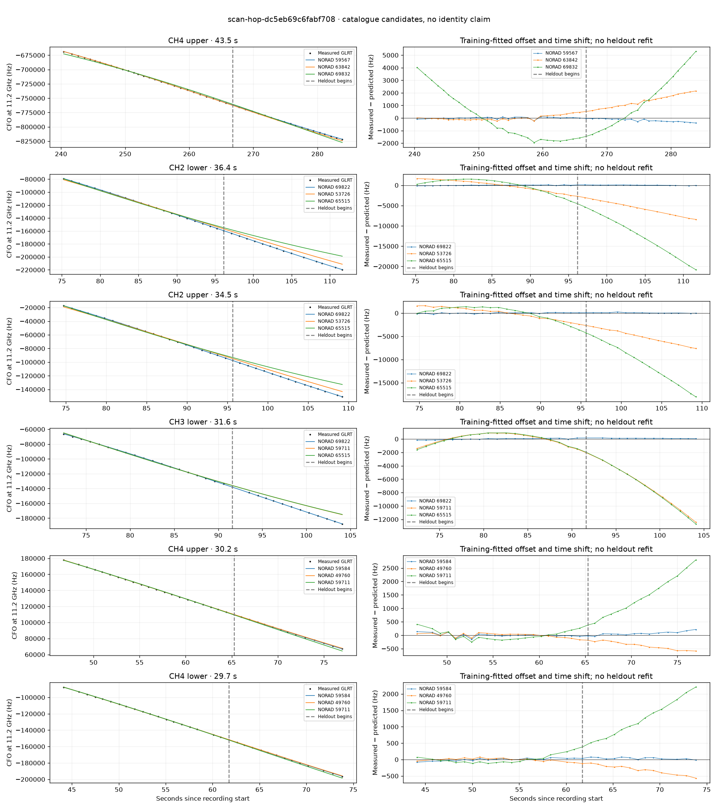

# scan-hop-dc5eb69c6fabf708

Recorded **2026-09-14T18:10:12.734255Z**, RX0, 10 MS/s.

**Candidates pass descriptive checks; no identification.** Candidates: 69822 (4 tracklets), 59584 (3 tracklets), 69949 (3 tracklets).

[Satellite RMS comparisons and top-1 gains](scan-hop-dc5eb69c6fabf708-candidates.md).

[Measured CFO/TLE overlays for every track](scan-hop-dc5eb69c6fabf708-all-tracks.md).

Counts are correlated lane tracklets, not independent detections or satellite counts. A recording can contain multiple transmitters; these are not one-label-per-file assignments.

Solid curves include a per-track constant carrier offset fitted on the first 60% of observations. The final 40% is held out. A close curve is not identity evidence by itself.

Catalogue: `sha256:f027c02cbe99846bc1b1e0b5a10d35c7fe22c60b64c3ddd0a6bf0efe667659cd`. Orbital-only exclusions: STARLINK-1770 (NORAD 46383; SGP4 []), STARLINK-34343 DEB (NORAD 69730; SGP4 [6]), STARLINK-37793 (NORAD 100286; SGP4 [1, 6]).

| Lane | Recording seconds | Top 3 training NORADs | Train / heldout RMS (Hz) | Leader heldout rank | Assessment |
|---|---:|---|---:|---:|---|
| CH4 lower | 44.1–73.8 | 59584, 49760, 59711 | 37.5 / 45.7 | 1 | Passes descriptive checks; candidate only |
| CH1 lower | 45.2–74.1 | 59584, 49760, 59711 | 37.9 / 34.4 | 1 | Passes descriptive checks; candidate only |
| CH1 upper | 45.5–73.6 | 49760, 59584, 59711 | 45.9 / 335.0 | 2 | leader changes on heldout; -500s control fits as well or better |
| CH4 upper | 46.8–77.0 | 59584, 49760, 59711 | 65.7 / 94.5 | 1 | Passes descriptive checks; candidate only |
| CH3 lower | 72.4–104.1 | 69822, 59711, 65515 | 100.3 / 109.4 | 1 | Passes descriptive checks; candidate only |
| CH3 upper | 74.3–98.8 | 69822, 59711, 65515 | 94.1 / 114.6 | 1 | Passes descriptive checks; candidate only |
| CH2 upper | 74.7–109.2 | 69822, 53726, 65515 | 112.6 / 90.8 | 1 | Passes descriptive checks; candidate only |
| CH2 lower | 75.2–111.6 | 69822, 53726, 65515 | 71.2 / 72.0 | 1 | Passes descriptive checks; candidate only |
| CH4 lower | 110.5–134.1 | 69949, 59757, 69822 | 51.3 / 90.9 | 1 | Passes descriptive checks; candidate only |
| CH4 upper | 111.9–133.8 | 69949, 59757, 69822 | 49.7 / 95.2 | 1 | Passes descriptive checks; candidate only |
| CH1 upper | 120.7–144.7 | 69949, 59757, 62523 | 104.7 / 230.1 | 1 | Passes descriptive checks; candidate only |
| CH2 lower | 122.6–148.6 | 69949, 59757, 62523 | 58.8 / 72.9 | 1 | time-shift boundary |
| CH1 lower | 149.3–172.0 | 63841, 55587, 62523 | 22.4 / 132.4 | 1 | 500s control fits as well or better |
| CH1 upper | 151.6–173.5 | 63841, 55587, 62523 | 59.6 / 177.0 | 1 | 500s control fits as well or better |
| CH4 lower | 179.8–203.9 | 49763, 67565, 67596 | 53.5 / 252.9 | 1 | -500s control fits as well or better |
| CH4 upper | 180.6–205.0 | 49763, 67565, 67596 | 100.4 / 55.5 | 1 | Passes descriptive checks; candidate only |
| CH1 upper | 199.3–225.2 | 60737, 58596, 49763 | 90.6 / 179.6 | 1 | Passes descriptive checks; candidate only |
| CH1 lower | 199.6–228.3 | 60737, 58596, 49763 | 29.1 / 129.5 | 1 | Passes descriptive checks; candidate only |
| CH2 upper | 206.5–229.9 | 60737, 58596, 62565 | 34.6 / 184.4 | 1 | Passes descriptive checks; candidate only |
| CH3 lower | 233.3–255.8 | 59567, 63842, 48148 | 24.6 / 200.3 | 2 | leader changes on heldout; 500s control fits as well or better |
| CH4 upper | 240.4–283.9 | 59567, 63842, 69832 | 69.7 / 220.2 | 1 | Passes descriptive checks; candidate only |
| CH3 upper | 243.5–268.6 | 63842, 59567, 60737 | 88.8 / 29.5 | 1 | Passes descriptive checks; candidate only |
| CH4 lower | 258.4–280.2 | 59567, 63842, 69832 | 35.0 / 32.1 | 1 | Passes descriptive checks; candidate only |
| CH1 lower | 29.4–51.2 | 65509, 55591, 58092 | 30.4 / 66.8 | 1 | Passes descriptive checks; candidate only |
| CH1 upper | 29.9–51.4 | 65509, 55591, 58092 | 64.9 / 312.3 | 1 | Passes descriptive checks; candidate only |

[Full candidate, control and measured-CFO evidence](scan-hop-dc5eb69c6fabf708.json.gz).
