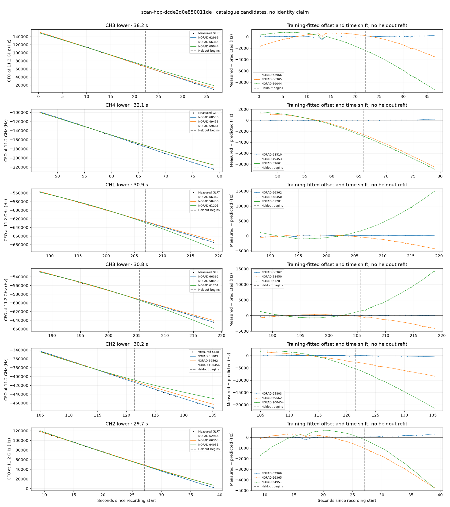

# scan-hop-dcde2d0e850011de

Recorded **2026-09-14T15:50:12.423649Z**, RX0, 10 MS/s.

**Candidates pass descriptive checks; no identification.** Candidates: 66362 (6 tracklets), 62966 (5 tracklets), 65803 (4 tracklets).

[Satellite RMS comparisons and top-1 gains](scan-hop-dcde2d0e850011de-candidates.md).

[Measured CFO/TLE overlays for every track](scan-hop-dcde2d0e850011de-all-tracks.md).

Counts are correlated lane tracklets, not independent detections or satellite counts. A recording can contain multiple transmitters; these are not one-label-per-file assignments.

Solid curves include a per-track constant carrier offset fitted on the first 60% of observations. The final 40% is held out. A close curve is not identity evidence by itself.

Catalogue: `sha256:f623da8623d574a387a40f84f1b4e813d76f1f993d2759f7aa9a8c002a1c272e`. Orbital-only exclusions: STARLINK-34343 DEB (NORAD 69730; SGP4 [6]), STARLINK-37793 (NORAD 100286; SGP4 [6]).

| Lane | Recording seconds | Top 3 training NORADs | Train / heldout RMS (Hz) | Leader heldout rank | Assessment |
|---|---:|---|---:|---:|---|
| CH3 lower | 0.3–36.4 | 62966, 66365, 69044 | 114.3 / 115.0 | 1 | Passes descriptive checks; candidate only |
| CH2 lower | 9.2–38.9 | 62966, 66365, 64951 | 61.4 / 174.9 | 1 | Passes descriptive checks; candidate only |
| CH3 upper | 9.8–31.8 | 62966, 66365, 59907 | 19.5 / 65.5 | 1 | Passes descriptive checks; candidate only |
| CH2 upper | 11.7–38.2 | 62966, 64951, 66365 | 97.6 / 196.9 | 1 | Passes descriptive checks; candidate only |
| CH4 lower | 16.6–37.7 | 62966, 64951, 66365 | 90.5 / 211.4 | 1 | Passes descriptive checks; candidate only |
| CH4 lower | 46.8–78.9 | 68510, 49453, 59661 | 18.9 / 63.9 | 1 | Passes descriptive checks; candidate only |
| CH3 lower | 47.0–74.1 | 68510, 49453, 59661 | 23.3 / 39.7 | 1 | Passes descriptive checks; candidate only |
| CH4 lower | 104.8–131.0 | 65803, 69562, 100454 | 47.4 / 70.8 | 1 | Passes descriptive checks; candidate only |
| CH2 lower | 104.9–135.2 | 65803, 69562, 100454 | 67.1 / 236.1 | 1 | Passes descriptive checks; candidate only |
| CH2 upper | 105.4–132.7 | 65803, 69562, 100454 | 74.0 / 83.1 | 1 | Passes descriptive checks; candidate only |
| CH4 upper | 105.8–129.3 | 65803, 69562, 100454 | 53.8 / 196.9 | 1 | Passes descriptive checks; candidate only |
| CH4 lower | 134.7–155.7 | 69304, 62097, 65803 | 22.3 / 128.1 | 1 | Passes descriptive checks; candidate only |
| CH3 lower | 143.7–163.9 | 69304, 59473, 65803 | 52.0 / 222.8 | 1 | Passes descriptive checks; candidate only |
| CH3 upper | 185.3–209.4 | 66362, 61201, 58450 | 92.2 / 153.1 | 1 | Passes descriptive checks; candidate only |
| CH1 upper | 186.4–209.3 | 66362, 61201, 58450 | 68.1 / 163.3 | 1 | Passes descriptive checks; candidate only |
| CH3 lower | 187.8–218.6 | 66362, 58450, 61201 | 85.4 / 121.9 | 1 | Passes descriptive checks; candidate only |
| CH1 lower | 188.2–219.1 | 66362, 58450, 61201 | 101.6 / 117.4 | 1 | Passes descriptive checks; candidate only |
| CH4 lower | 194.9–221.9 | 66362, 58450, 61201 | 84.0 / 62.8 | 1 | Passes descriptive checks; candidate only |
| CH4 upper | 195.8–221.0 | 66362, 58450, 61201 | 108.6 / 86.0 | 1 | Passes descriptive checks; candidate only |
| CH2 lower | 210.2–239.1 | 59927, 69348, 52280 | 51.8 / 44.0 | 1 | Passes descriptive checks; candidate only |
| CH2 upper | 233.6–260.8 | 64673, 69348, 62271 | 53.3 / 70.0 | 1 | Passes descriptive checks; candidate only |
| CH2 lower | 234.1–257.3 | 64673, 69348, 62271 | 53.5 / 92.6 | 1 | Passes descriptive checks; candidate only |
| CH2 lower | 135.2–159.2 | 69304, 65803, 62097 | 29.4 / 181.3 | 1 | Passes descriptive checks; candidate only |

[Full candidate, control and measured-CFO evidence](scan-hop-dcde2d0e850011de.json.gz).
