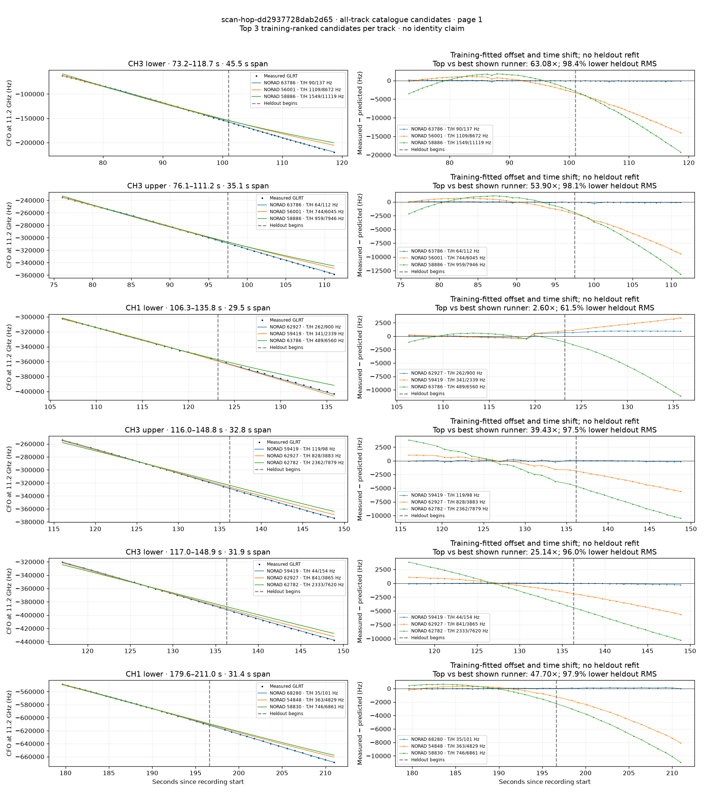
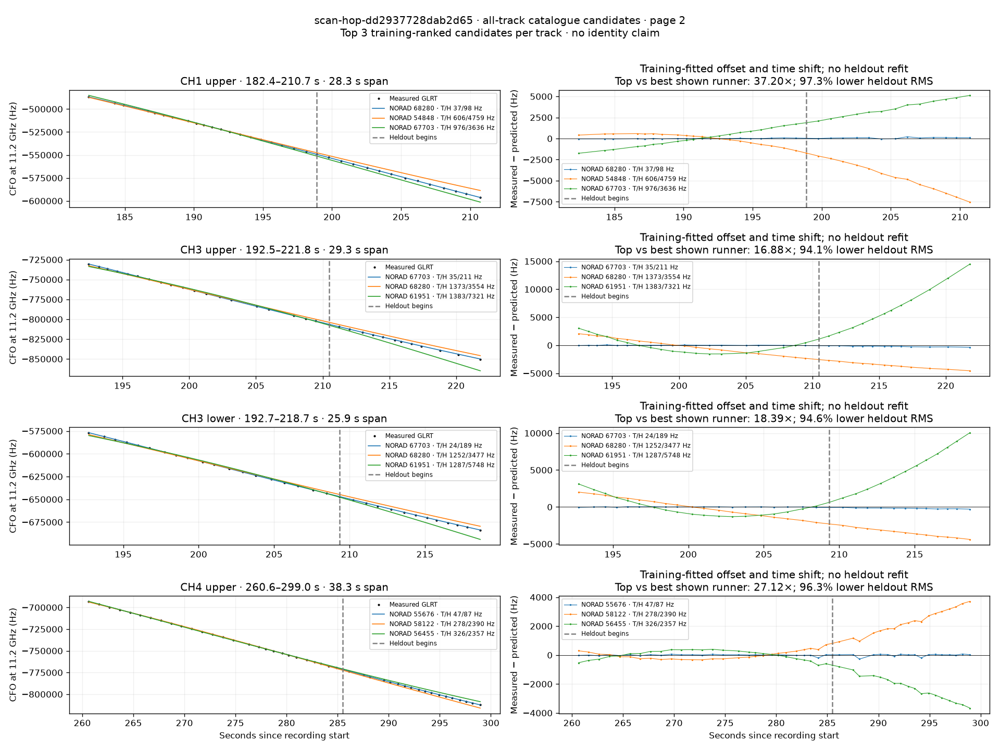

# All track overlays: scan-hop-dd2937728dab2d65

Recorded **2026-09-14T21:20:12.440309Z**, RX0, 10 MS/s. All **10 eligible tracks** are shown in chronological order.

[Recording assessment](scan-hop-dd2937728dab2d65.md) · [Candidate RMS and gains](scan-hop-dd2937728dab2d65-candidates.md)

Each row matches the requested view: measured GLRT CFO and the top three training-ranked TLE curves on the left, residuals on the right. Offset and time shift are fitted only on the first 60%; the last 40% is held out. These are candidate diagnostics, not satellite identifications.

RMS cells below are `training / heldout` in Hz. Runner-up 1 and 2 are training ranks two and three. The gain compares the top TLE with whichever of those two has lower heldout RMS.

| Track | Top TLE, train / heldout RMS | Runner-up 1, train / heldout RMS | Runner-up 2, train / heldout RMS | Top vs best shown runner, heldout |
|---|---:|---:|---:|---:|
| CH3 lower, 73.2–118.7 s | STARLINK-33923 / 63786: 89.5 / 137.5 Hz | STARLINK-5944 / 56001: 1109.2 / 8672.1 Hz | STARLINK-31320 / 58886: 1548.5 / 11118.8 Hz | 63.08× / 98.4% lower |
| CH3 upper, 76.1–111.2 s | STARLINK-33923 / 63786: 64.4 / 112.2 Hz | STARLINK-5944 / 56001: 743.6 / 6045.5 Hz | STARLINK-31320 / 58886: 959.5 / 7946.4 Hz | 53.90× / 98.1% lower |
| CH1 lower, 106.3–135.8 s | STARLINK-32891 / 62927: 261.9 / 900.1 Hz | STARLINK-31415 / 59419: 340.9 / 2339.5 Hz | STARLINK-33923 / 63786: 488.9 / 6559.8 Hz | 2.60× / 61.5% lower |
| CH3 upper, 116.0–148.8 s | STARLINK-31415 / 59419: 119.3 / 98.5 Hz | STARLINK-32891 / 62927: 828.5 / 3883.0 Hz | STARLINK-33585 / 62782: 2361.7 / 7879.3 Hz | 39.43× / 97.5% lower |
| CH3 lower, 117.0–148.9 s | STARLINK-31415 / 59419: 44.2 / 153.8 Hz | STARLINK-32891 / 62927: 840.8 / 3865.4 Hz | STARLINK-33585 / 62782: 2333.1 / 7620.3 Hz | 25.14× / 96.0% lower |
| CH1 lower, 179.6–211.0 s | STARLINK-37070 / 68280: 35.0 / 101.2 Hz | STARLINK-5432 / 54848: 363.5 / 4828.8 Hz | STARLINK-31253 / 58830: 746.5 / 6860.8 Hz | 47.70× / 97.9% lower |
| CH1 upper, 182.4–210.7 s | STARLINK-37070 / 68280: 37.0 / 97.7 Hz | STARLINK-5432 / 54848: 606.1 / 4759.4 Hz | STARLINK-36630 / 67703: 975.9 / 3635.6 Hz | 37.20× / 97.3% lower |
| CH3 upper, 192.5–221.8 s | STARLINK-36630 / 67703: 35.1 / 210.5 Hz | STARLINK-37070 / 68280: 1372.9 / 3554.5 Hz | STARLINK-11395 / 61951: 1383.3 / 7320.7 Hz | 16.88× / 94.1% lower |
| CH3 lower, 192.7–218.7 s | STARLINK-36630 / 67703: 23.5 / 189.1 Hz | STARLINK-37070 / 68280: 1252.2 / 3477.3 Hz | STARLINK-11395 / 61951: 1286.7 / 5748.0 Hz | 18.39× / 94.6% lower |
| CH4 upper, 260.6–299.0 s | STARLINK-5300 / 55676: 46.6 / 86.9 Hz | STARLINK-30759 / 58122: 278.0 / 2390.0 Hz | STARLINK-5987 / 56455: 326.4 / 2356.8 Hz | 27.12× / 96.3% lower |

## Page 1

## Page 2

