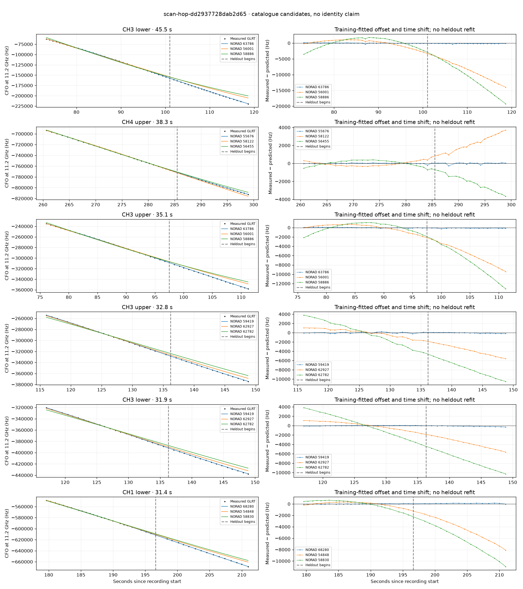

# scan-hop-dd2937728dab2d65

Recorded **2026-09-14T21:20:12.440309Z**, RX0, 10 MS/s.

**Candidates pass descriptive checks; no identification.** Candidates: 63786 (2 tracklets), 59419 (2 tracklets), 68280 (2 tracklets).

[Satellite RMS comparisons and top-1 gains](scan-hop-dd2937728dab2d65-candidates.md).

Counts are correlated lane tracklets, not independent detections or satellite counts. A recording can contain multiple transmitters; these are not one-label-per-file assignments.

Solid curves include a per-track constant carrier offset fitted on the first 60% of observations. The final 40% is held out. A close curve is not identity evidence by itself.

Catalogue: `sha256:5e48341ac859002618ed02192863efc22858a3e23cfba4b9b18348f0378e9657`. Orbital-only exclusions: STARLINK-34343 DEB (NORAD 69730; SGP4 [6]), STARLINK-37793 (NORAD 100286; SGP4 [1]).

| Lane | Recording seconds | Top 3 training NORADs | Train / heldout RMS (Hz) | Leader heldout rank | Assessment |
|---|---:|---|---:|---:|---|
| CH3 lower | 73.2–118.7 | 63786, 56001, 58886 | 89.5 / 137.5 | 1 | Passes descriptive checks; candidate only |
| CH3 upper | 76.1–111.2 | 63786, 56001, 58886 | 64.4 / 112.2 | 1 | Passes descriptive checks; candidate only |
| CH1 lower | 106.3–135.8 | 62927, 59419, 63786 | 261.9 / 900.1 | 1 | radio drift fits as well or better; -500s control fits as well or better; 500s control fits as well or better |
| CH3 upper | 116.0–148.8 | 59419, 62927, 62782 | 119.3 / 98.5 | 1 | Passes descriptive checks; candidate only |
| CH1 lower | 179.6–211.0 | 68280, 54848, 58830 | 35.0 / 101.2 | 1 | Passes descriptive checks; candidate only |
| CH1 upper | 182.4–210.7 | 68280, 54848, 67703 | 37.0 / 97.7 | 1 | Passes descriptive checks; candidate only |
| CH3 upper | 192.5–221.8 | 67703, 68280, 61951 | 35.1 / 210.5 | 1 | Passes descriptive checks; candidate only |
| CH3 lower | 192.7–218.7 | 67703, 68280, 61951 | 23.5 / 189.1 | 1 | Passes descriptive checks; candidate only |
| CH4 upper | 260.6–299.0 | 55676, 58122, 56455 | 46.6 / 86.9 | 1 | Passes descriptive checks; candidate only |
| CH3 lower | 117.0–148.9 | 59419, 62927, 62782 | 44.2 / 153.8 | 1 | Passes descriptive checks; candidate only |

[Full candidate, control and measured-CFO evidence](scan-hop-dd2937728dab2d65.json.gz).
