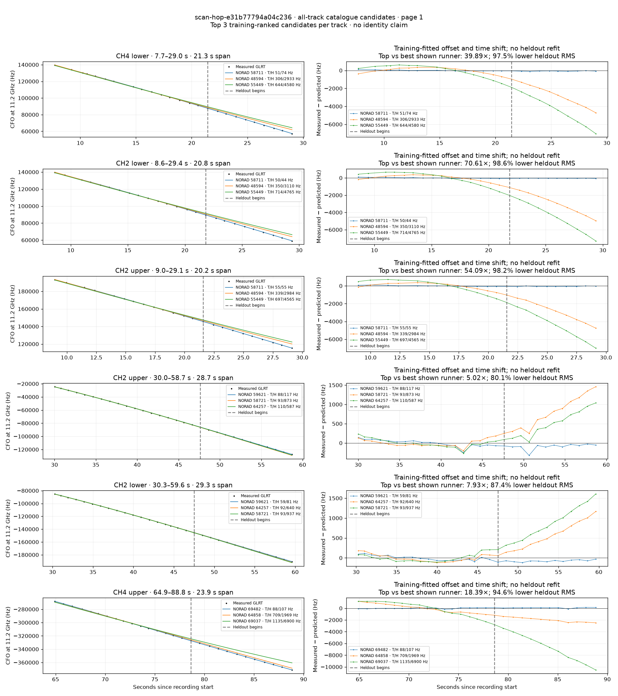
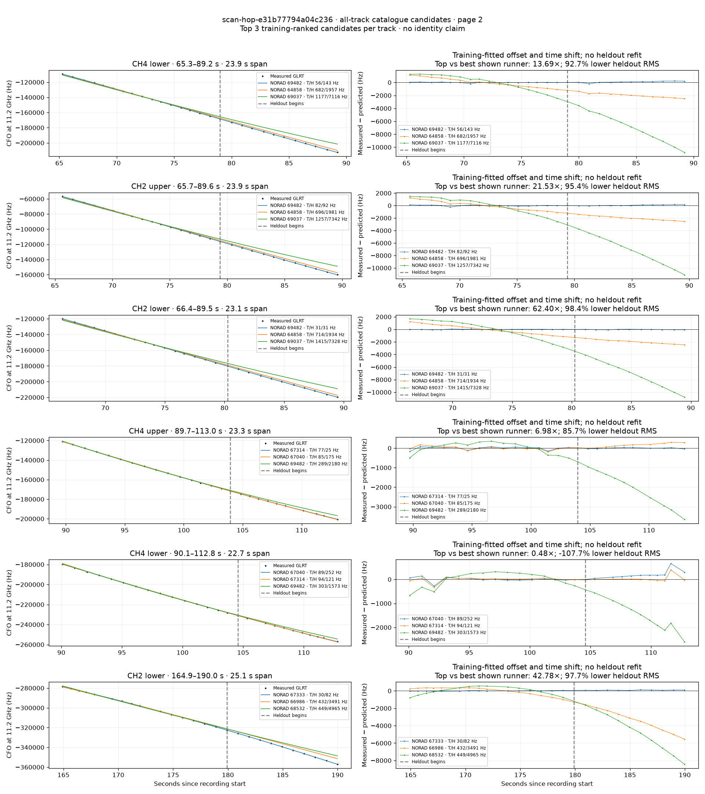
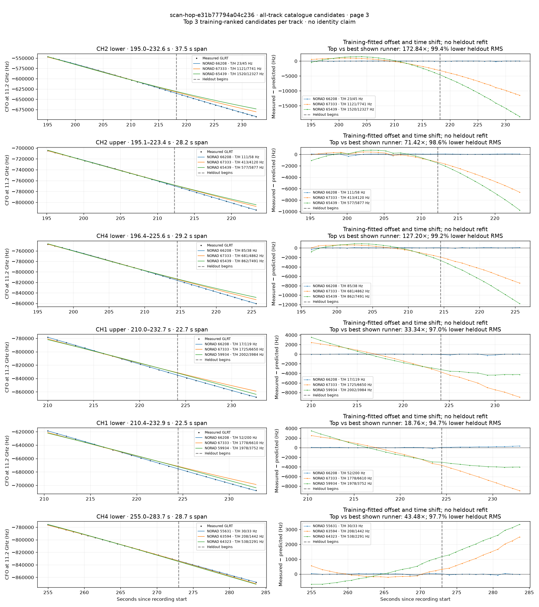
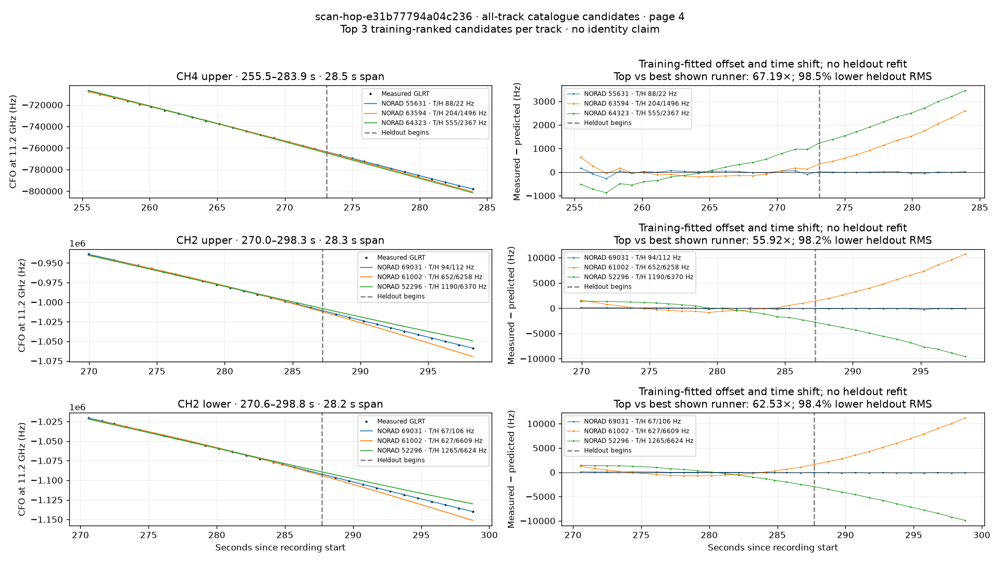

# All track overlays: scan-hop-e31b77794a04c236

Recorded **2026-09-14T15:30:12.305050Z**, RX0, 10 MS/s. All **21 eligible tracks** are shown in chronological order.

[Recording assessment](scan-hop-e31b77794a04c236.md) · [Candidate RMS and gains](scan-hop-e31b77794a04c236-candidates.md)

Each row matches the requested view: measured GLRT CFO and the top three training-ranked TLE curves on the left, residuals on the right. Offset and time shift are fitted only on the first 60%; the last 40% is held out. These are candidate diagnostics, not satellite identifications.

RMS cells below are `training / heldout` in Hz. Runner-up 1 and 2 are training ranks two and three. The gain compares the top TLE with whichever of those two has lower heldout RMS.

| Track | Top TLE, train / heldout RMS | Runner-up 1, train / heldout RMS | Runner-up 2, train / heldout RMS | Top vs best shown runner, heldout |
|---|---:|---:|---:|---:|
| CH4 lower, 7.7–29.0 s | STARLINK-31031 / 58711: 51.1 / 73.5 Hz | STARLINK-2251 / 48594: 306.2 / 2932.7 Hz | STARLINK-5699 / 55449: 643.7 / 4580.1 Hz | 39.89× / 97.5% lower |
| CH2 lower, 8.6–29.4 s | STARLINK-31031 / 58711: 50.3 / 44.0 Hz | STARLINK-2251 / 48594: 350.3 / 3109.7 Hz | STARLINK-5699 / 55449: 714.1 / 4765.3 Hz | 70.61× / 98.6% lower |
| CH2 upper, 9.0–29.1 s | STARLINK-31031 / 58711: 54.8 / 55.2 Hz | STARLINK-2251 / 48594: 339.2 / 2983.8 Hz | STARLINK-5699 / 55449: 697.0 / 4565.2 Hz | 54.09× / 98.2% lower |
| CH2 upper, 30.0–58.7 s | STARLINK-31758 / 59621: 88.2 / 117.1 Hz | STARLINK-30972 / 58721: 92.5 / 873.2 Hz | STARLINK-34352 / 64257: 109.8 / 587.3 Hz | 5.02× / 80.1% lower |
| CH2 lower, 30.3–59.6 s | STARLINK-31758 / 59621: 59.1 / 80.7 Hz | STARLINK-34352 / 64257: 92.1 / 639.5 Hz | STARLINK-30972 / 58721: 93.4 / 937.2 Hz | 7.93× / 87.4% lower |
| CH4 upper, 64.9–88.8 s | STARLINK-37814 / 69482: 87.7 / 107.1 Hz | STARLINK-34654 / 64858: 708.9 / 1969.0 Hz | STARLINK-37608 / 69037: 1135.4 / 6900.0 Hz | 18.39× / 94.6% lower |
| CH4 lower, 65.3–89.2 s | STARLINK-37814 / 69482: 56.2 / 143.0 Hz | STARLINK-34654 / 64858: 681.5 / 1957.0 Hz | STARLINK-37608 / 69037: 1176.6 / 7116.2 Hz | 13.69× / 92.7% lower |
| CH2 upper, 65.7–89.6 s | STARLINK-37814 / 69482: 82.3 / 92.0 Hz | STARLINK-34654 / 64858: 696.0 / 1980.6 Hz | STARLINK-37608 / 69037: 1256.7 / 7342.2 Hz | 21.53× / 95.4% lower |
| CH2 lower, 66.4–89.5 s | STARLINK-37814 / 69482: 30.5 / 31.0 Hz | STARLINK-34654 / 64858: 714.2 / 1934.3 Hz | STARLINK-37608 / 69037: 1415.5 / 7327.7 Hz | 62.40× / 98.4% lower |
| CH4 upper, 89.7–113.0 s | STARLINK-36476 / 67314: 76.8 / 25.1 Hz | STARLINK-35786 / 67040: 84.9 / 175.2 Hz | STARLINK-37814 / 69482: 289.3 / 2180.3 Hz | 6.98× / 85.7% lower |
| CH4 lower, 90.1–112.8 s | STARLINK-35786 / 67040: 89.2 / 252.1 Hz | STARLINK-36476 / 67314: 94.4 / 121.4 Hz | STARLINK-37814 / 69482: 302.9 / 1573.2 Hz | 0.48× / -107.7% lower |
| CH2 lower, 164.9–190.0 s | STARLINK-36427 / 67333: 29.8 / 81.6 Hz | STARLINK-36135 / 66986: 432.2 / 3491.0 Hz | STARLINK-36249 / 68532: 449.4 / 4965.3 Hz | 42.78× / 97.7% lower |
| CH2 lower, 195.0–232.6 s | STARLINK-35751 / 66208: 22.9 / 44.8 Hz | STARLINK-36427 / 67333: 1121.5 / 7741.4 Hz | STARLINK-35045 / 65439: 1520.1 / 12327.5 Hz | 172.84× / 99.4% lower |
| CH2 upper, 195.1–223.4 s | STARLINK-35751 / 66208: 110.8 / 57.7 Hz | STARLINK-36427 / 67333: 413.3 / 4120.3 Hz | STARLINK-35045 / 65439: 577.0 / 5877.3 Hz | 71.42× / 98.6% lower |
| CH4 lower, 196.4–225.6 s | STARLINK-35751 / 66208: 84.8 / 38.2 Hz | STARLINK-36427 / 67333: 680.7 / 4861.9 Hz | STARLINK-35045 / 65439: 862.4 / 7490.9 Hz | 127.20× / 99.2% lower |
| CH1 upper, 210.0–232.7 s | STARLINK-35751 / 66208: 16.6 / 119.5 Hz | STARLINK-36427 / 67333: 1725.1 / 6649.7 Hz | STARLINK-31971 / 59934: 2001.6 / 3983.7 Hz | 33.34× / 97.0% lower |
| CH1 lower, 210.4–232.9 s | STARLINK-35751 / 66208: 52.2 / 200.0 Hz | STARLINK-36427 / 67333: 1778.5 / 6609.9 Hz | STARLINK-31971 / 59934: 1978.4 / 3751.9 Hz | 18.76× / 94.7% lower |
| CH4 lower, 255.0–283.7 s | STARLINK-5558 / 55631: 30.3 / 33.2 Hz | STARLINK-33791 / 63594: 207.7 / 1441.6 Hz | STARLINK-11728 / 64323: 537.7 / 2291.4 Hz | 43.48× / 97.7% lower |
| CH4 upper, 255.5–283.9 s | STARLINK-5558 / 55631: 88.3 / 22.3 Hz | STARLINK-33791 / 63594: 203.7 / 1496.2 Hz | STARLINK-11728 / 64323: 555.3 / 2367.2 Hz | 67.19× / 98.5% lower |
| CH2 upper, 270.0–298.3 s | STARLINK-37240 / 69031: 94.5 / 111.9 Hz | STARLINK-11288 / 61002: 652.0 / 6257.8 Hz | STARLINK-3766 / 52296: 1189.5 / 6369.9 Hz | 55.92× / 98.2% lower |
| CH2 lower, 270.6–298.8 s | STARLINK-37240 / 69031: 67.0 / 105.7 Hz | STARLINK-11288 / 61002: 626.9 / 6609.5 Hz | STARLINK-3766 / 52296: 1264.7 / 6624.1 Hz | 62.53× / 98.4% lower |

## Page 1

## Page 2

## Page 3

## Page 4

