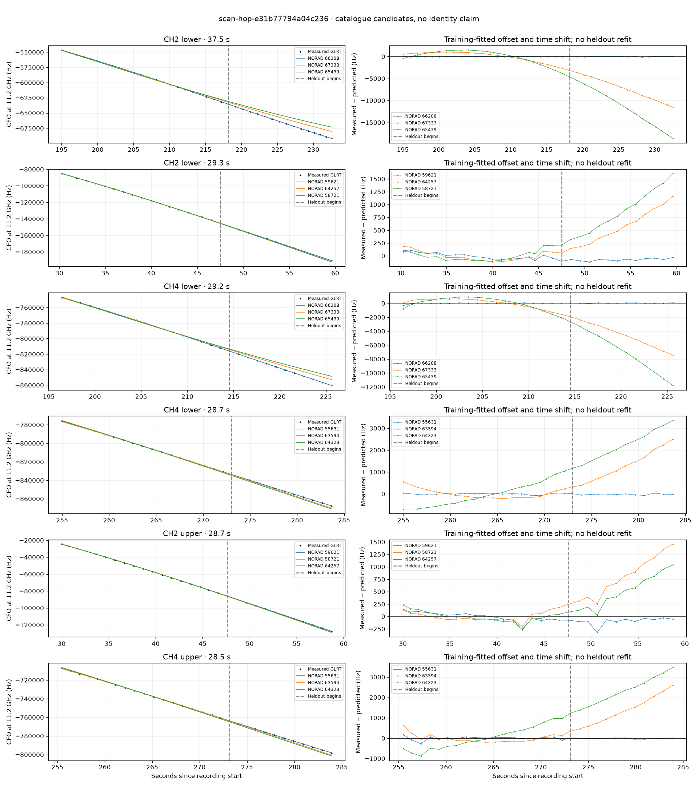

# scan-hop-e31b77794a04c236

Recorded **2026-09-14T15:30:12.305050Z**, RX0, 10 MS/s.

**Candidates pass descriptive checks; no identification.** Candidates: 66208 (5 tracklets), 69482 (4 tracklets), 58711 (3 tracklets).

[Satellite RMS comparisons and top-1 gains](scan-hop-e31b77794a04c236-candidates.md).

[Measured CFO/TLE overlays for every track](scan-hop-e31b77794a04c236-all-tracks.md).

Counts are correlated lane tracklets, not independent detections or satellite counts. A recording can contain multiple transmitters; these are not one-label-per-file assignments.

Solid curves include a per-track constant carrier offset fitted on the first 60% of observations. The final 40% is held out. A close curve is not identity evidence by itself.

Catalogue: `sha256:f623da8623d574a387a40f84f1b4e813d76f1f993d2759f7aa9a8c002a1c272e`. Orbital-only exclusions: STARLINK-1770 (NORAD 46383; SGP4 []), STARLINK-34343 DEB (NORAD 69730; SGP4 [6]), STARLINK-37793 (NORAD 100286; SGP4 [6]).

| Lane | Recording seconds | Top 3 training NORADs | Train / heldout RMS (Hz) | Leader heldout rank | Assessment |
|---|---:|---|---:|---:|---|
| CH4 lower | 7.7–29.0 | 58711, 48594, 55449 | 51.1 / 73.5 | 1 | Passes descriptive checks; candidate only |
| CH2 lower | 8.6–29.4 | 58711, 48594, 55449 | 50.3 / 44.0 | 1 | Passes descriptive checks; candidate only |
| CH2 upper | 9.0–29.1 | 58711, 48594, 55449 | 54.8 / 55.2 | 1 | Passes descriptive checks; candidate only |
| CH2 upper | 30.0–58.7 | 59621, 58721, 64257 | 88.2 / 117.1 | 1 | 500s control fits as well or better |
| CH2 lower | 30.3–59.6 | 59621, 64257, 58721 | 59.1 / 80.7 | 1 | 500s control fits as well or better |
| CH4 upper | 64.9–88.8 | 69482, 64858, 69037 | 87.7 / 107.1 | 1 | Passes descriptive checks; candidate only |
| CH4 lower | 65.3–89.2 | 69482, 64858, 69037 | 56.2 / 143.0 | 1 | Passes descriptive checks; candidate only |
| CH2 upper | 65.7–89.6 | 69482, 64858, 69037 | 82.3 / 92.0 | 1 | Passes descriptive checks; candidate only |
| CH2 lower | 66.4–89.5 | 69482, 64858, 69037 | 30.5 / 31.0 | 1 | Passes descriptive checks; candidate only |
| CH4 upper | 89.7–113.0 | 67314, 67040, 69482 | 76.8 / 25.1 | 1 | Passes descriptive checks; candidate only |
| CH4 lower | 90.1–112.8 | 67040, 67314, 69482 | 89.2 / 252.1 | 2 | leader changes on heldout |
| CH2 lower | 164.9–190.0 | 67333, 66986, 68532 | 29.8 / 81.6 | 1 | 500s control fits as well or better |
| CH2 lower | 195.0–232.6 | 66208, 67333, 65439 | 22.9 / 44.8 | 1 | Passes descriptive checks; candidate only |
| CH2 upper | 195.1–223.4 | 66208, 67333, 65439 | 110.8 / 57.7 | 1 | Passes descriptive checks; candidate only |
| CH4 lower | 196.4–225.6 | 66208, 67333, 65439 | 84.8 / 38.2 | 1 | Passes descriptive checks; candidate only |
| CH1 upper | 210.0–232.7 | 66208, 67333, 59934 | 16.6 / 119.5 | 1 | Passes descriptive checks; candidate only |
| CH1 lower | 210.4–232.9 | 66208, 67333, 59934 | 52.2 / 200.0 | 1 | Passes descriptive checks; candidate only |
| CH4 lower | 255.0–283.7 | 55631, 63594, 64323 | 30.3 / 33.2 | 1 | Passes descriptive checks; candidate only |
| CH4 upper | 255.5–283.9 | 55631, 63594, 64323 | 88.3 / 22.3 | 1 | Passes descriptive checks; candidate only |
| CH2 upper | 270.0–298.3 | 69031, 61002, 52296 | 94.5 / 111.9 | 1 | Passes descriptive checks; candidate only |
| CH2 lower | 270.6–298.8 | 69031, 61002, 52296 | 67.0 / 105.7 | 1 | Passes descriptive checks; candidate only |

[Full candidate, control and measured-CFO evidence](scan-hop-e31b77794a04c236.json.gz).
