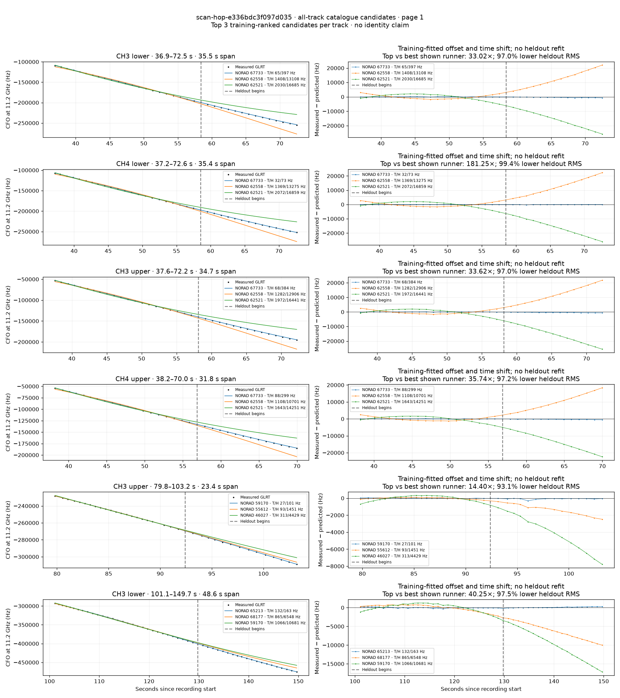
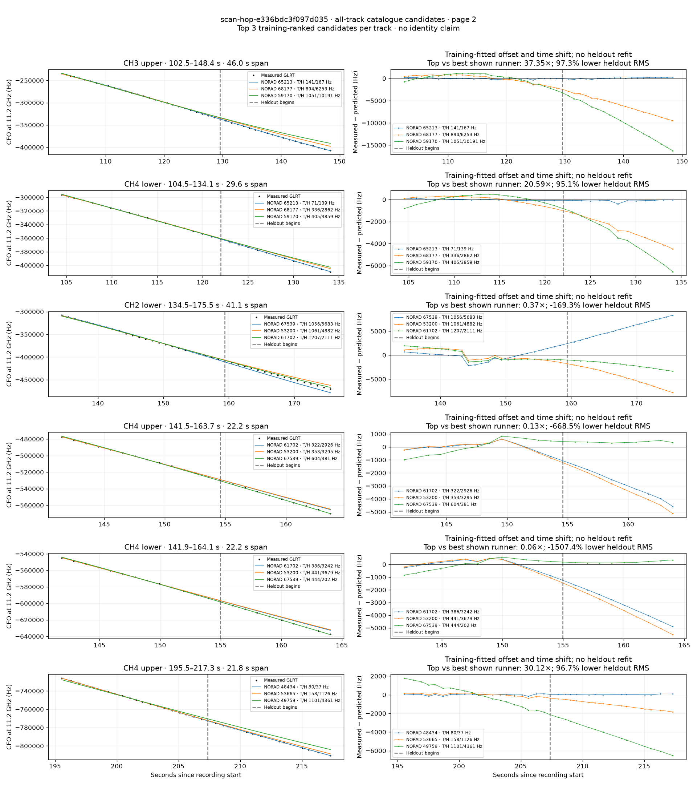
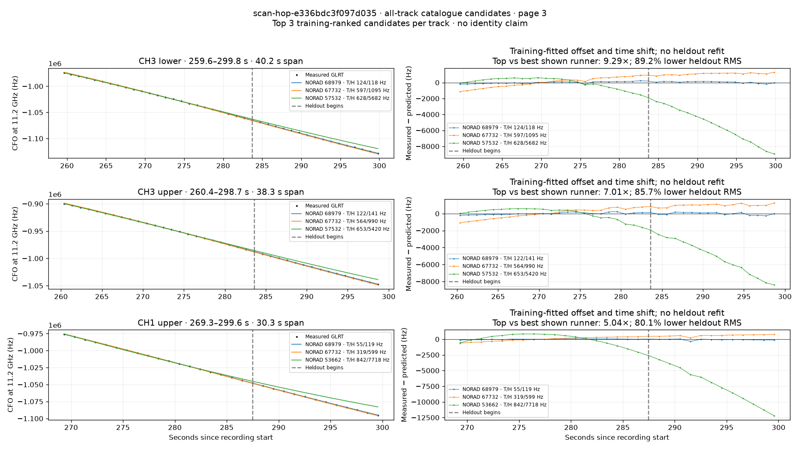

# All track overlays: scan-hop-e336bdc3f097d035

Recorded **2026-09-14T17:40:12.787119Z**, RX0, 10 MS/s. All **15 eligible tracks** are shown in chronological order.

[Recording assessment](scan-hop-e336bdc3f097d035.md) · [Candidate RMS and gains](scan-hop-e336bdc3f097d035-candidates.md)

Each row matches the requested view: measured GLRT CFO and the top three training-ranked TLE curves on the left, residuals on the right. Offset and time shift are fitted only on the first 60%; the last 40% is held out. These are candidate diagnostics, not satellite identifications.

RMS cells below are `training / heldout` in Hz. Runner-up 1 and 2 are training ranks two and three. The gain compares the top TLE with whichever of those two has lower heldout RMS.

| Track | Top TLE, train / heldout RMS | Runner-up 1, train / heldout RMS | Runner-up 2, train / heldout RMS | Top vs best shown runner, heldout |
|---|---:|---:|---:|---:|
| CH3 lower, 36.9–72.5 s | STARLINK-36746 / 67733: 65.0 / 397.0 Hz | STARLINK-11358 / 62558: 1408.4 / 13108.1 Hz | STARLINK-11528 / 62521: 2030.0 / 16684.7 Hz | 33.02× / 97.0% lower |
| CH4 lower, 37.2–72.6 s | STARLINK-36746 / 67733: 31.5 / 73.2 Hz | STARLINK-11358 / 62558: 1368.8 / 13274.9 Hz | STARLINK-11528 / 62521: 2072.2 / 16858.5 Hz | 181.25× / 99.4% lower |
| CH3 upper, 37.6–72.2 s | STARLINK-36746 / 67733: 67.8 / 383.9 Hz | STARLINK-11358 / 62558: 1281.6 / 12905.6 Hz | STARLINK-11528 / 62521: 1971.7 / 16441.2 Hz | 33.62× / 97.0% lower |
| CH4 upper, 38.2–70.0 s | STARLINK-36746 / 67733: 87.8 / 299.4 Hz | STARLINK-11358 / 62558: 1107.8 / 10701.2 Hz | STARLINK-11528 / 62521: 1643.0 / 14250.9 Hz | 35.74× / 97.2% lower |
| CH3 upper, 79.8–103.2 s | STARLINK-31340 / 59170: 26.8 / 100.7 Hz | STARLINK-5734 / 55612: 92.7 / 1450.7 Hz | STARLINK-1522 / 46027: 312.7 / 4428.9 Hz | 14.40× / 93.1% lower |
| CH3 lower, 101.1–149.7 s | STARLINK-34907 / 65213: 132.3 / 162.7 Hz | STARLINK-36668 / 68177: 864.9 / 6548.5 Hz | STARLINK-31340 / 59170: 1066.3 / 10681.5 Hz | 40.25× / 97.5% lower |
| CH3 upper, 102.5–148.4 s | STARLINK-34907 / 65213: 140.6 / 167.4 Hz | STARLINK-36668 / 68177: 893.9 / 6252.6 Hz | STARLINK-31340 / 59170: 1051.1 / 10191.4 Hz | 37.35× / 97.3% lower |
| CH4 lower, 104.5–134.1 s | STARLINK-34907 / 65213: 70.7 / 139.0 Hz | STARLINK-36668 / 68177: 335.9 / 2862.4 Hz | STARLINK-31340 / 59170: 404.5 / 3859.1 Hz | 20.59× / 95.1% lower |
| CH2 lower, 134.5–175.5 s | STARLINK-36573 / 67539: 1056.3 / 5683.0 Hz | STARLINK-4417 / 53200: 1061.5 / 4881.8 Hz | STARLINK-32299 / 61702: 1207.1 / 2110.6 Hz | 0.37× / -169.3% lower |
| CH4 upper, 141.5–163.7 s | STARLINK-32299 / 61702: 322.4 / 2925.9 Hz | STARLINK-4417 / 53200: 353.1 / 3295.1 Hz | STARLINK-36573 / 67539: 603.6 / 380.7 Hz | 0.13× / -668.5% lower |
| CH4 lower, 141.9–164.1 s | STARLINK-32299 / 61702: 386.0 / 3242.3 Hz | STARLINK-4417 / 53200: 441.2 / 3678.6 Hz | STARLINK-36573 / 67539: 444.1 / 201.7 Hz | 0.06× / -1507.4% lower |
| CH4 upper, 195.5–217.3 s | STARLINK-2692 / 48434: 79.6 / 37.4 Hz | STARLINK-4334 / 53665: 157.7 / 1126.4 Hz | STARLINK-3204 / 49759: 1101.1 / 4360.8 Hz | 30.12× / 96.7% lower |
| CH3 lower, 259.6–299.8 s | STARLINK-36248 / 68979: 123.8 / 117.8 Hz | STARLINK-36260 / 67732: 596.8 / 1095.0 Hz | STARLINK-30251 / 57532: 628.1 / 5682.5 Hz | 9.29× / 89.2% lower |
| CH3 upper, 260.4–298.7 s | STARLINK-36248 / 68979: 121.7 / 141.3 Hz | STARLINK-36260 / 67732: 564.4 / 990.3 Hz | STARLINK-30251 / 57532: 653.1 / 5420.3 Hz | 7.01× / 85.7% lower |
| CH1 upper, 269.3–299.6 s | STARLINK-36248 / 68979: 54.8 / 119.0 Hz | STARLINK-36260 / 67732: 318.9 / 599.4 Hz | STARLINK-4357 / 53662: 842.0 / 7717.7 Hz | 5.04× / 80.1% lower |

## Page 1

## Page 2

## Page 3

