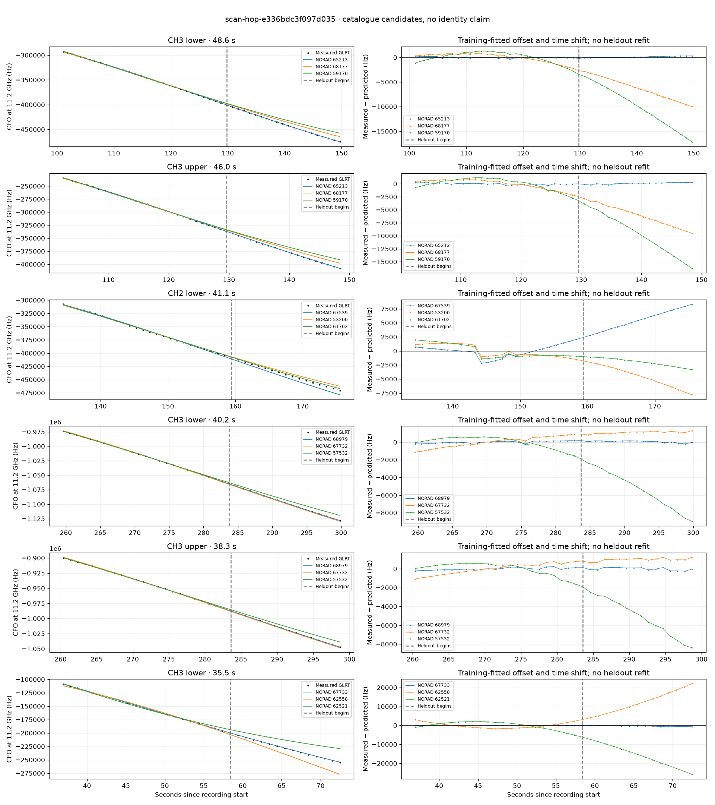

# scan-hop-e336bdc3f097d035

Recorded **2026-09-14T17:40:12.787119Z**, RX0, 10 MS/s.

**Candidates pass descriptive checks; no identification.** Candidates: 67733 (4 tracklets), 65213 (3 tracklets), 68979 (3 tracklets).

[Satellite RMS comparisons and top-1 gains](scan-hop-e336bdc3f097d035-candidates.md).

Counts are correlated lane tracklets, not independent detections or satellite counts. A recording can contain multiple transmitters; these are not one-label-per-file assignments.

Solid curves include a per-track constant carrier offset fitted on the first 60% of observations. The final 40% is held out. A close curve is not identity evidence by itself.

Catalogue: `sha256:f027c02cbe99846bc1b1e0b5a10d35c7fe22c60b64c3ddd0a6bf0efe667659cd`. Orbital-only exclusions: STARLINK-34343 DEB (NORAD 69730; SGP4 [6]), STARLINK-37793 (NORAD 100286; SGP4 [1, 6]).

| Lane | Recording seconds | Top 3 training NORADs | Train / heldout RMS (Hz) | Leader heldout rank | Assessment |
|---|---:|---|---:|---:|---|
| CH3 lower | 36.9–72.5 | 67733, 62558, 62521 | 65.0 / 397.0 | 1 | Passes descriptive checks; candidate only |
| CH4 lower | 37.2–72.6 | 67733, 62558, 62521 | 31.5 / 73.2 | 1 | Passes descriptive checks; candidate only |
| CH3 upper | 37.6–72.2 | 67733, 62558, 62521 | 67.8 / 383.9 | 1 | Passes descriptive checks; candidate only |
| CH4 upper | 38.2–70.0 | 67733, 62558, 62521 | 87.8 / 299.4 | 1 | Passes descriptive checks; candidate only |
| CH3 lower | 101.1–149.7 | 65213, 68177, 59170 | 132.3 / 162.7 | 1 | Passes descriptive checks; candidate only |
| CH3 upper | 102.5–148.4 | 65213, 68177, 59170 | 140.6 / 167.4 | 1 | Passes descriptive checks; candidate only |
| CH4 lower | 104.5–134.1 | 65213, 68177, 59170 | 70.7 / 139.0 | 1 | Passes descriptive checks; candidate only |
| CH2 lower | 134.5–175.5 | 67539, 53200, 61702 | 1056.3 / 5683.0 | 3 | leader changes on heldout; radio drift fits as well or better; -500s control fits as well or better; 500s control fits as well or better |
| CH4 upper | 141.5–163.7 | 61702, 53200, 67539 | 322.4 / 2925.9 | 2 | leader changes on heldout; radio drift fits as well or better; 500s control fits as well or better |
| CH4 lower | 141.9–164.1 | 61702, 53200, 67539 | 386.0 / 3242.3 | 2 | leader changes on heldout; time-shift boundary; radio drift fits as well or better; 500s control fits as well or better |
| CH4 upper | 195.5–217.3 | 48434, 53665, 49759 | 79.6 / 37.4 | 1 | Passes descriptive checks; candidate only |
| CH3 lower | 259.6–299.8 | 68979, 67732, 57532 | 123.8 / 117.8 | 1 | Passes descriptive checks; candidate only |
| CH3 upper | 260.4–298.7 | 68979, 67732, 57532 | 121.7 / 141.3 | 1 | Passes descriptive checks; candidate only |
| CH1 upper | 269.3–299.6 | 68979, 67732, 53662 | 54.8 / 119.0 | 1 | Passes descriptive checks; candidate only |
| CH3 upper | 79.8–103.2 | 59170, 55612, 46027 | 26.8 / 100.7 | 1 | Passes descriptive checks; candidate only |

[Full candidate, control and measured-CFO evidence](scan-hop-e336bdc3f097d035.json.gz).
