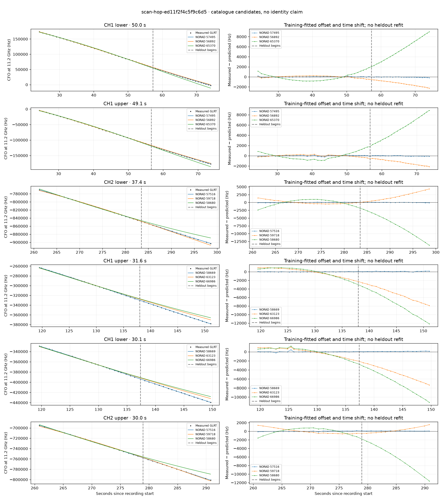

# scan-hop-ed11f2f4c5f9c6d5

Recorded **2026-09-14T18:50:12.794358Z**, RX0, 10 MS/s.

**Candidates pass descriptive checks; no identification.** Candidates: 57516 (5 tracklets), 57495 (2 tracklets), 58669 (2 tracklets).

[Satellite RMS comparisons and top-1 gains](scan-hop-ed11f2f4c5f9c6d5-candidates.md).

Counts are correlated lane tracklets, not independent detections or satellite counts. A recording can contain multiple transmitters; these are not one-label-per-file assignments.

Solid curves include a per-track constant carrier offset fitted on the first 60% of observations. The final 40% is held out. A close curve is not identity evidence by itself.

Catalogue: `sha256:f027c02cbe99846bc1b1e0b5a10d35c7fe22c60b64c3ddd0a6bf0efe667659cd`. Orbital-only exclusions: STARLINK-1770 (NORAD 46383; SGP4 []), STARLINK-34343 DEB (NORAD 69730; SGP4 [6]), STARLINK-37793 (NORAD 100286; SGP4 [6]).

| Lane | Recording seconds | Top 3 training NORADs | Train / heldout RMS (Hz) | Leader heldout rank | Assessment |
|---|---:|---|---:|---:|---|
| CH1 lower | 24.1–74.1 | 57495, 56892, 65370 | 57.5 / 71.3 | 1 | Passes descriptive checks; candidate only |
| CH1 upper | 24.5–73.6 | 57495, 56892, 65370 | 81.0 / 56.3 | 1 | Passes descriptive checks; candidate only |
| CH1 upper | 119.5–151.1 | 58669, 63123, 66986 | 24.9 / 96.5 | 1 | Passes descriptive checks; candidate only |
| CH1 lower | 119.6–149.7 | 58669, 63123, 66986 | 103.9 / 87.9 | 1 | Passes descriptive checks; candidate only |
| CH1 upper | 233.8–254.0 | 65356, 50186, 64374 | 78.1 / 85.6 | 1 | Passes descriptive checks; candidate only |
| CH4 lower | 256.4–283.9 | 57516, 59718, 50186 | 69.3 / 127.9 | 1 | Passes descriptive checks; candidate only |
| CH4 upper | 256.8–283.7 | 57516, 59718, 50186 | 68.7 / 116.3 | 1 | Passes descriptive checks; candidate only |
| CH2 upper | 260.8–290.8 | 57516, 59718, 58680 | 67.9 / 74.8 | 1 | Passes descriptive checks; candidate only |
| CH2 lower | 261.2–298.6 | 57516, 59718, 58680 | 57.8 / 49.5 | 1 | Passes descriptive checks; candidate only |
| CH1 lower | 254.5–279.1 | 57516, 59046, 57848 | 72.7 / 166.1 | 1 | Passes descriptive checks; candidate only |

[Full candidate, control and measured-CFO evidence](scan-hop-ed11f2f4c5f9c6d5.json.gz).
