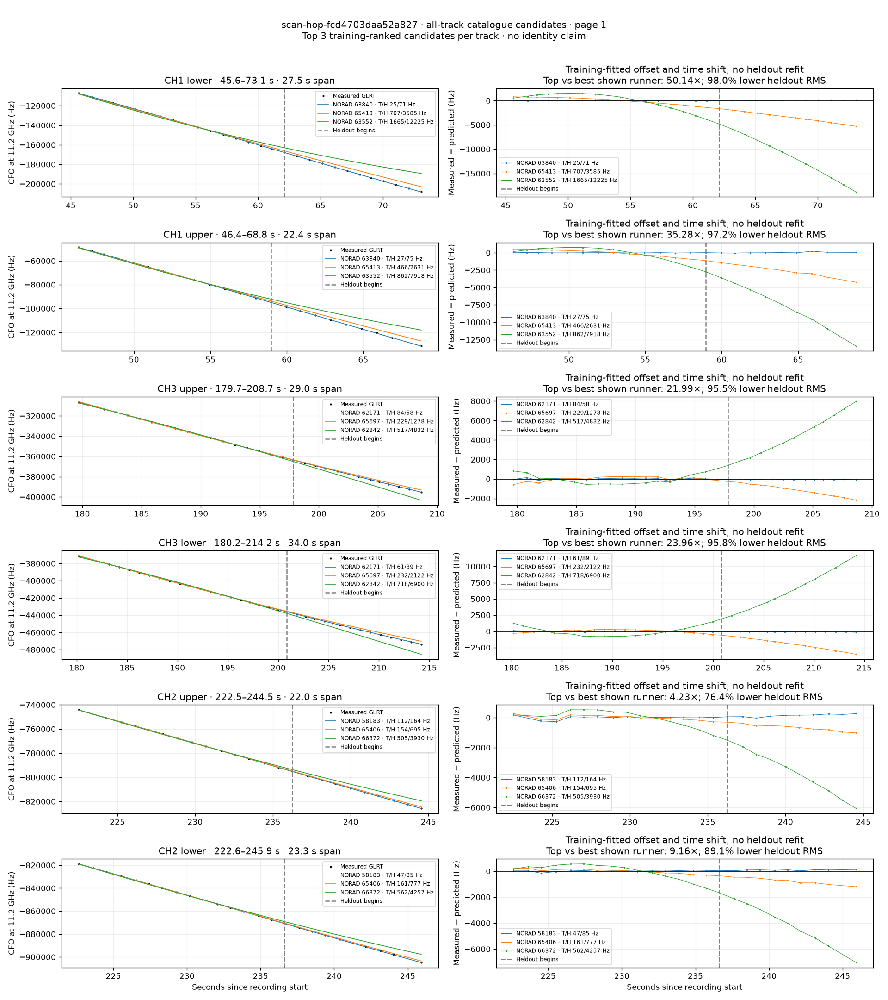
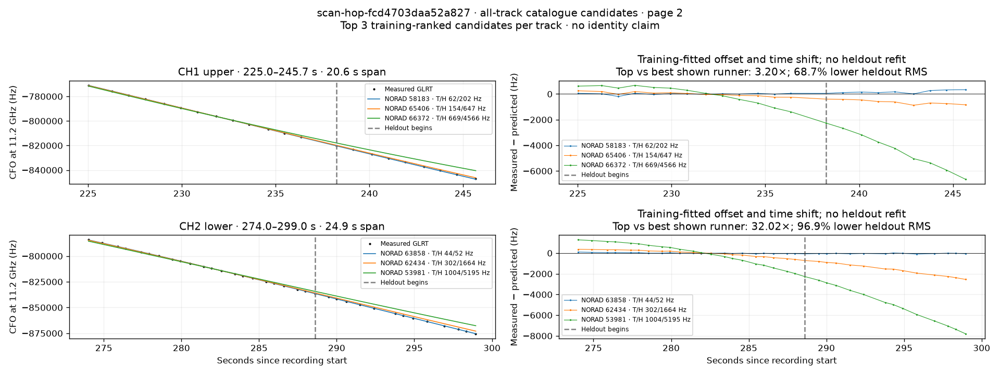

# All track overlays: scan-hop-fcd4703daa52a827

Recorded **2026-09-14T22:40:12.890860Z**, RX0, 10 MS/s. All **8 eligible tracks** are shown in chronological order.

[Recording assessment](scan-hop-fcd4703daa52a827.md) · [Candidate RMS and gains](scan-hop-fcd4703daa52a827-candidates.md)

Each row matches the requested view: measured GLRT CFO and the top three training-ranked TLE curves on the left, residuals on the right. Offset and time shift are fitted only on the first 60%; the last 40% is held out. These are candidate diagnostics, not satellite identifications.

RMS cells below are `training / heldout` in Hz. Runner-up 1 and 2 are training ranks two and three. The gain compares the top TLE with whichever of those two has lower heldout RMS.

| Track | Top TLE, train / heldout RMS | Runner-up 1, train / heldout RMS | Runner-up 2, train / heldout RMS | Top vs best shown runner, heldout |
|---|---:|---:|---:|---:|
| CH1 lower, 45.6–73.1 s | STARLINK-33990 / 63840: 25.5 / 71.5 Hz | STARLINK-35003 / 65413: 706.8 / 3584.8 Hz | STARLINK-11685 / 63552: 1664.9 / 12224.7 Hz | 50.14× / 98.0% lower |
| CH1 upper, 46.4–68.8 s | STARLINK-33990 / 63840: 27.4 / 74.6 Hz | STARLINK-35003 / 65413: 465.9 / 2631.3 Hz | STARLINK-11685 / 63552: 861.6 / 7917.6 Hz | 35.28× / 97.2% lower |
| CH3 upper, 179.7–208.7 s | STARLINK-32257 / 62171: 83.8 / 58.1 Hz | STARLINK-35113 / 65697: 229.3 / 1278.0 Hz | STARLINK-32755 / 62842: 517.3 / 4832.4 Hz | 21.99× / 95.5% lower |
| CH3 lower, 180.2–214.2 s | STARLINK-32257 / 62171: 61.5 / 88.6 Hz | STARLINK-35113 / 65697: 231.7 / 2121.6 Hz | STARLINK-32755 / 62842: 718.1 / 6900.1 Hz | 23.96× / 95.8% lower |
| CH2 upper, 222.5–244.5 s | STARLINK-30809 / 58183: 111.5 / 164.2 Hz | STARLINK-35036 / 65406: 153.6 / 695.2 Hz | STARLINK-35821 / 66372: 505.5 / 3929.7 Hz | 4.23× / 76.4% lower |
| CH2 lower, 222.6–245.9 s | STARLINK-30809 / 58183: 47.4 / 84.8 Hz | STARLINK-35036 / 65406: 161.2 / 777.2 Hz | STARLINK-35821 / 66372: 561.7 / 4257.0 Hz | 9.16× / 89.1% lower |
| CH1 upper, 225.0–245.7 s | STARLINK-30809 / 58183: 61.8 / 202.5 Hz | STARLINK-35036 / 65406: 154.5 / 647.5 Hz | STARLINK-35821 / 66372: 668.8 / 4565.5 Hz | 3.20× / 68.7% lower |
| CH2 lower, 274.0–299.0 s | STARLINK-33976 / 63858: 44.4 / 52.0 Hz | STARLINK-32674 / 62434: 301.5 / 1664.3 Hz | STARLINK-5149 / 53981: 1003.5 / 5194.7 Hz | 32.02× / 96.9% lower |

## Page 1

## Page 2

