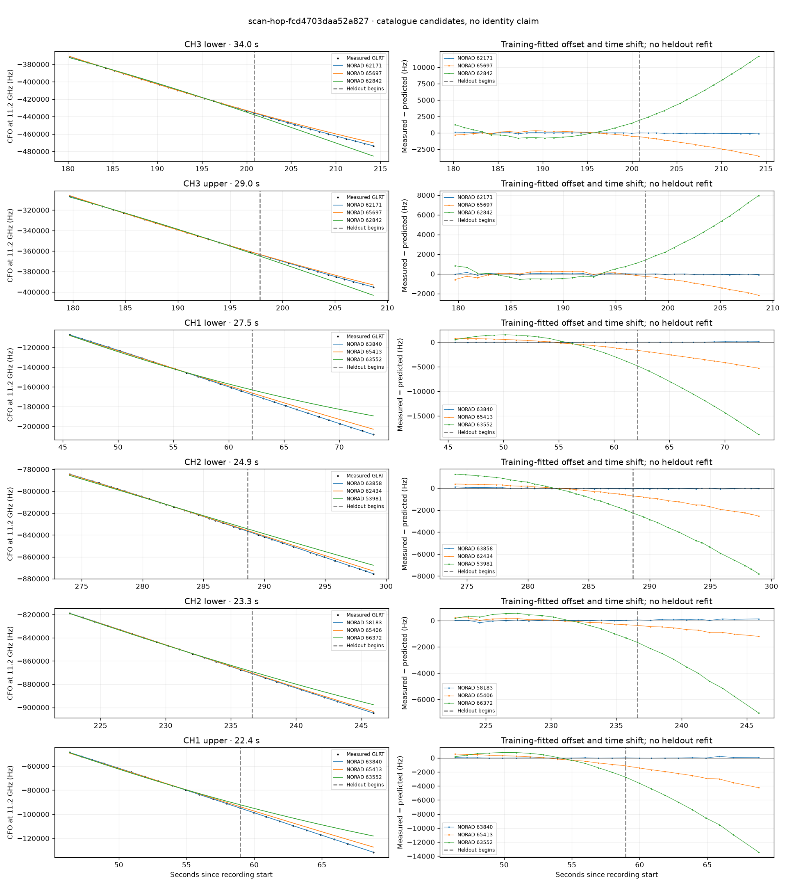

# scan-hop-fcd4703daa52a827

Recorded **2026-09-14T22:40:12.890860Z**, RX0, 10 MS/s.

**Candidates pass descriptive checks; no identification.** Candidates: 63840 (2 tracklets), 62171 (2 tracklets), 58183 (2 tracklets).

[Satellite RMS comparisons and top-1 gains](scan-hop-fcd4703daa52a827-candidates.md).

Counts are correlated lane tracklets, not independent detections or satellite counts. A recording can contain multiple transmitters; these are not one-label-per-file assignments.

Solid curves include a per-track constant carrier offset fitted on the first 60% of observations. The final 40% is held out. A close curve is not identity evidence by itself.

Catalogue: `sha256:d0d899a2d1da7811b03849396c03507e74e2de38d046edc9e068d12f2700ab20`. Orbital-only exclusions: STARLINK-34343 DEB (NORAD 69730; SGP4 [6]), STARLINK-37793 (NORAD 100286; SGP4 [1]).

| Lane | Recording seconds | Top 3 training NORADs | Train / heldout RMS (Hz) | Leader heldout rank | Assessment |
|---|---:|---|---:|---:|---|
| CH1 lower | 45.6–73.1 | 63840, 65413, 63552 | 25.5 / 71.5 | 1 | Passes descriptive checks; candidate only |
| CH1 upper | 46.4–68.8 | 63840, 65413, 63552 | 27.4 / 74.6 | 1 | Passes descriptive checks; candidate only |
| CH3 upper | 179.7–208.7 | 62171, 65697, 62842 | 83.8 / 58.1 | 1 | Passes descriptive checks; candidate only |
| CH3 lower | 180.2–214.2 | 62171, 65697, 62842 | 61.5 / 88.6 | 1 | Passes descriptive checks; candidate only |
| CH2 upper | 222.5–244.5 | 58183, 65406, 66372 | 111.5 / 164.2 | 1 | radio drift fits as well or better |
| CH2 lower | 222.6–245.9 | 58183, 65406, 66372 | 47.4 / 84.8 | 1 | Passes descriptive checks; candidate only |
| CH1 upper | 225.0–245.7 | 58183, 65406, 66372 | 61.8 / 202.5 | 1 | Passes descriptive checks; candidate only |
| CH2 lower | 274.0–299.0 | 63858, 62434, 53981 | 44.4 / 52.0 | 1 | Passes descriptive checks; candidate only |

[Full candidate, control and measured-CFO evidence](scan-hop-fcd4703daa52a827.json.gz).
