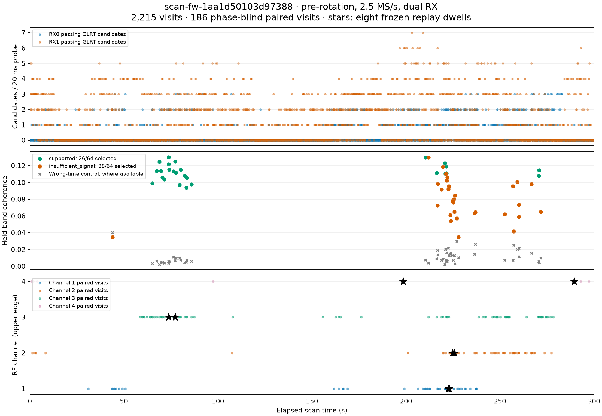
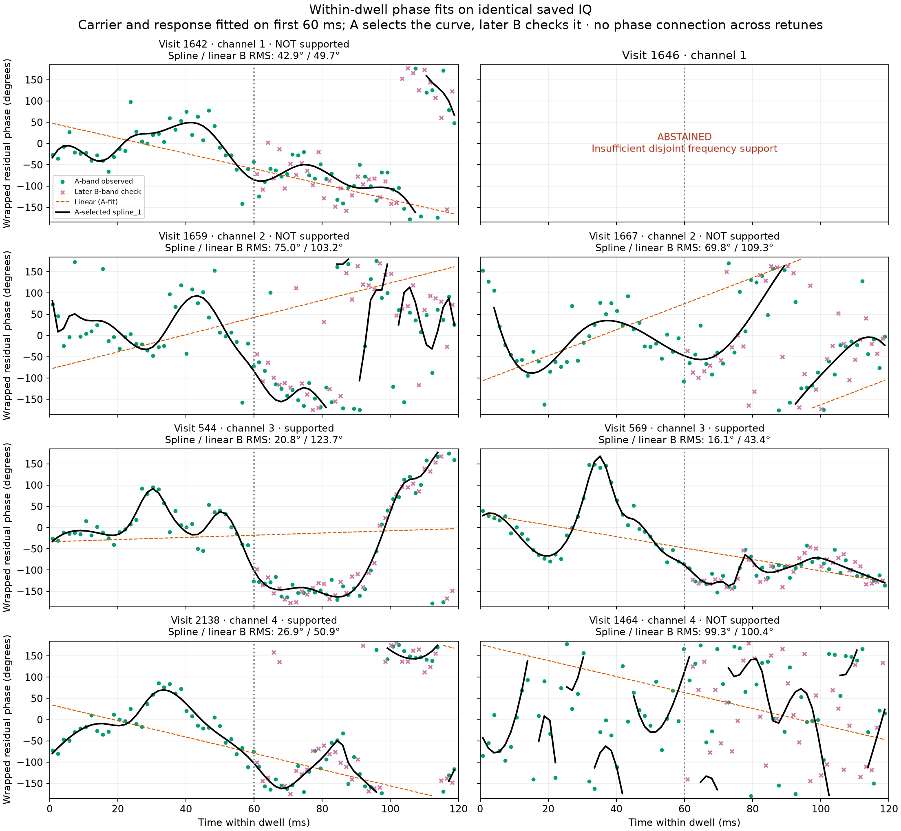
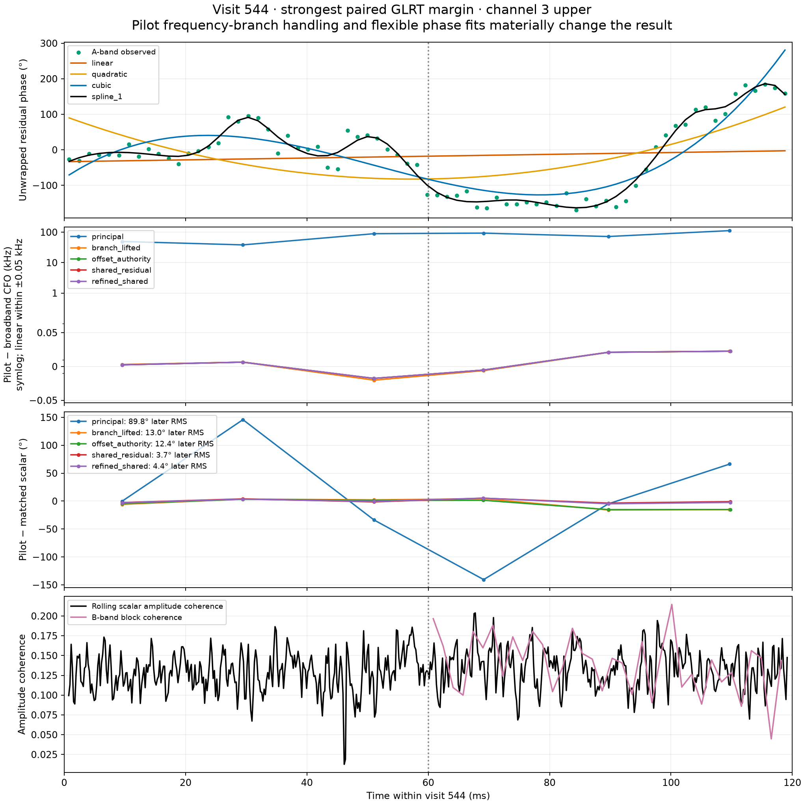
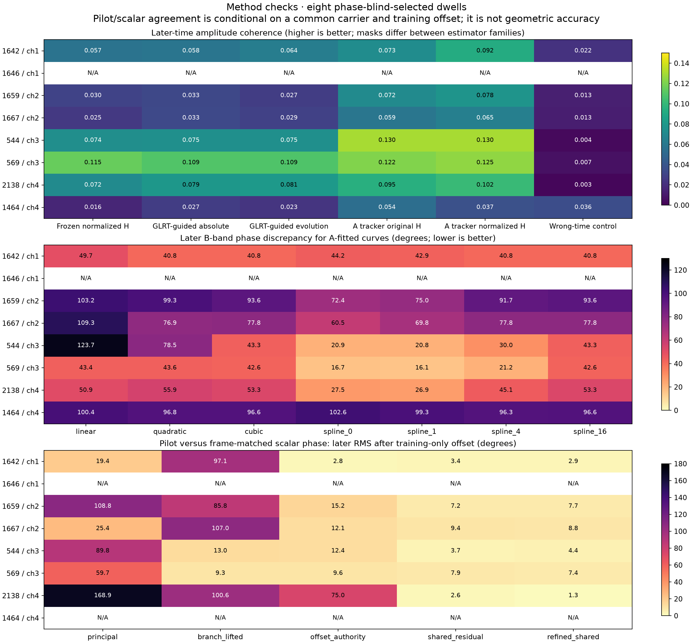
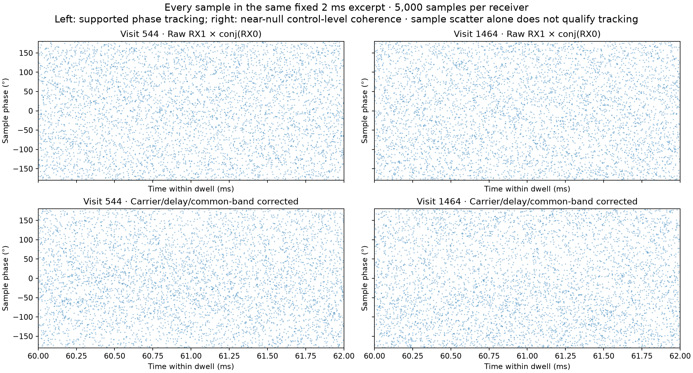
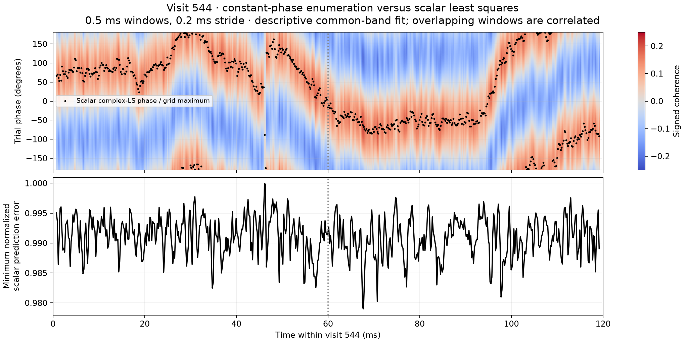
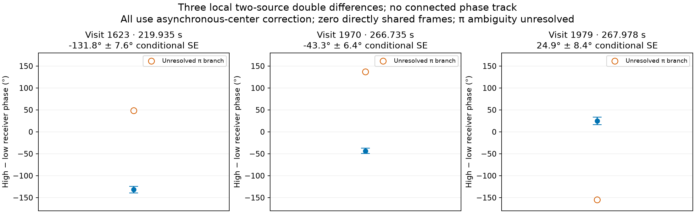

# Phase-method review: scan-fw-1aa1d50103d97388

This saved 300-second dual-RX recording starts at **2026-09-23 14:30:28.399 UTC**,
at **2.5 MS/s**, on `radio_pluto_19f2`. It ends before the announced array rotation.
No new RF collection, production publication, or estimator deployment was performed.

## Findings

The strongest examples support **time-varying relative receiver phase within a
120 ms dwell**. A shared receiver-offset authority and shared within-frame pilot
residual substantially improve pilot/broadband phase agreement. Neither a visually
smooth curve nor a small local pilot error bar establishes geometric phase or
phase continuity between retuned dwells.

- The scan has **2,215 visits**, with **639 RX0 and 2,414 RX1 passing GLRT
  candidates** in the existing 20 ms / 120 ms-stride analysis. There are 186
  phase-blind paired visits: 183 with one distinct pair and three with two.
- The existing production relative-phase sidecar selected the 64 strongest
  paired visits across the scan. **26/64 passed its support checks**; 38 did not.
  This is not an estimate of the success rate over all 2,215 visits.
- A fresh bounded replay selected **two highest minimum-RX GLRT margins per RF
  channel**, frozen before evaluating phase: channel 1 visits 1642/1646,
  channel 2 visits 1659/1667, channel 3 visits 544/569, channel 4 visits 2138/1464.
  These eight 120 ms dwells total **0.96 seconds of IQ per receiver**. Six 20 ms
  probes per dwell were scheduled for the denser saved-IQ GLRT pass. The channel-
  stratified selection is different from the existing strongest-64 population.
- Seven dwells completed the method comparison. **1646 abstained in the
  production-relative-phase stage** for insufficient disjoint frequency support;
  later method stages were not run for it. No replacement dwell was selected.
- Visits **544, 569 and 2138** pass the production broadband phase support rule.
  Visits 1642, 1659, 1667 and 1464 do not. In particular, 1464's tracked coherence
  (0.0372) is nearly its wrong-time control (0.0356), so its attractive-looking
  spline is not supported as a common-phase track.

## Applicable methods reviewed

| Method family | What was compared on this scan |
| --- | --- |
| Raw sample phase | Every RX1 × conj(RX0) sample in a fixed 60–62 ms excerpt; descriptive only |
| Corrected sample phase | Same samples after relative carrier/drift, delay, and physical common-band correction |
| Scalar complex least squares / constant-phase enumeration | Rolling 0.5 ms common-band cross product, advanced by 0.2 ms; enumeration has the same maximum |
| Frozen broadband model | First-half carrier/drift and spectral transfer; later-time unchanged prediction |
| GLRT-guided frozen model | Absolute-frequency and bias-tolerant evolution variants, with whole-frame-bootstrap guide uncertainty; research implementation |
| Frequency-held-out phase tracker | A-band phase used to correct disjoint B bands, with both original and phase-normalized training response |
| Polynomial phase fits | Linear, quadratic and cubic fits to A-band phase |
| Spline phase fits | Existing smoothing strengths 0, 1, 4 and 16, selected by A-only interleaved cross-validation |
| Pilot phase variants | Principal frame-frequency branch; within-frame branch lifting; broadband offset authority; shared residual; two-pass refined shared residual |
| Two-source double difference | All three visits with two phase-blind pair candidates; independent local hypotheses, not a connected track |
| Three-source closure | Not supported: no visit has three accepted phase-blind distinct receiver pairs in the original inventory |
| Calibrated geometric phase | Not available: installed mapping is provisional, RF phase centers and boresights unmeasured, and no qualified direction/calibration input supplied |
| Per-receiver Doppler/Kalman and phase-rate studies | Different observables; not relabeled as additional measured RX1−RX0 phase curves or rerun as relative-phase estimators |

The older scripts and research modules were used as estimator references, not
as a source of measurements from other recordings. All plotted replay methods
use this scan's same frozen dwells. Broken historical phase-restoration formulas
were not reinstated as competing estimators.

## Within-dwell tracking and curve complexity

The following comparisons use the phase-normalized transfer fitted on the first
60 ms. A-band data provide the current phase; disjoint B groups in the later
60 ms check agreement. Each FFT block spans 4096 samples, approximately 1.6384 ms.

| Visit / channel | Tracked B coherence | Wrong-time coherence | B phase resultant | Linear-fit B RMS | A-selected spline B RMS | Production support |
| --- | ---: | ---: | ---: | ---: | ---: | --- |
| 1642 / 1 | 0.0923 | 0.0219 | 0.770 | 49.7° | 42.9° | No |
| 1646 / 1 | — | — | — | — | — | Insufficient frequency support |
| 1659 / 2 | 0.0779 | 0.0131 | 0.561 | 103.2° | 75.0° | No |
| 1667 / 2 | 0.0650 | 0.0126 | 0.668 | 109.3° | 69.8° | No |
| 544 / 3 | 0.1304 | 0.0036 | 0.929 | 123.7° | 20.8° | Yes |
| 569 / 3 | 0.1249 | 0.0066 | 0.955 | 43.4° | 16.1° | Yes |
| 2138 / 4 | 0.1017 | 0.0029 | 0.867 | 50.9° | 26.9° | Yes |
| 1464 / 4 | 0.0372 | 0.0356 | 0.051 | 100.4° | 99.3° | No |

The production support rule requires tracked B coherence above both 0.05 and
three times the wrong-time control, plus B residual phase resultant above 0.8.
These are heuristic gates, not calibrated probabilities. The table's support
label uses the production tracker rule, not a new gate chosen after seeing results.

Every completed A-only curve selection chose `spline_1` on this replay. This is
an offline fit using A observations throughout the dwell, **not a forecast of
later phase from the first half**. It adapts better than low-order polynomials
on the supported examples; it does not rescue unqualified examples. No B-phase
metric selects the curve. The A cross-validation is conditional on fitted
response and unwrapping, rather than a fully independent re-fit of the pipeline.

At visit 544, frozen prediction on the same normalized B support has coherence
0.0741; current-A tracking raises it to 0.1304, versus 0.0036 wrong-time coherence.
The two GLRT-guided frozen models are both about 0.0749 and do not replace the
need for a varying residual phase. At visit 569 the frozen prediction already
has 0.1154 coherence, so tracking's increase to 0.1249 is smaller.

The guided, original-response, and normalized-response families can use different
spectral masks. Their coherence columns are diagnostic, not equal-bandwidth
head-to-head likelihoods. The normalized forecast versus normalized tracker is
the controlled same-mask comparison.

## Pilot branch and phase-reference handling

At visit 544, the principal-frequency variant ranges approximately −636 to
−562 kHz between probes, whereas branch lifting and broadband authority stay
near **−674.4 kHz**. Small local fit errors alone do not resolve this branch choice.

To compare phase fairly, the rolling scalar phase is evaluated at the pilot's
actual frame times, with its frame weights and local slope fit. A constant
pilot/scalar reference offset is fitted only on probes fully within the first
60 ms, then held fixed for later probes. All pilot variants have the same
broadband carrier removed at their respective measurement centers; their native
phase references remain recorded. The numbers below are later-time circular RMS
discrepancies after that training-only offset, **not physical phase errors**.

| Visit | Principal | Branch lifted | Offset authority | Shared residual | Refined shared | Held pilot comparisons |
| --- | ---: | ---: | ---: | ---: | ---: | ---: |
| 1642 | 19.4° | 97.1° | 2.8° | 3.4° | 2.9° | 3 |
| 1659 | 108.8° | 85.8° | 15.2° | 7.2° | 7.7° | 2 |
| 1667 | 25.4° | 107.0° | 12.1° | 9.4° | 8.8° | 3 |
| 544 | 89.8° | 13.0° | 12.4° | 3.7° | 4.4° | 3 |
| 569 | 59.7° | 9.3° | 9.6° | 7.9° | 7.4° | 3 |
| 2138 | 168.9° | 100.6° | 75.0° | 2.6° | 1.3° | 1 |

Visit 1464 has no valid later matched pilot/scalar comparison; 1646 stops before
this stage. Visit 2138's small refined discrepancy comes from **one** held probe
and one training probe, so it is especially limited evidence.

**Branch lifting alone is not consistently sufficient.** It helps on channel 3
but gives large discrepancies on the channel 1, 2 and 4 examples. A shared
within-frame residual after imposing broadband offset authority gives consistently
small local pilot/scalar discrepancies on these six comparable dwells. The
second refinement pass is not uniformly better: for example, 544 changes from
3.7° to 4.4°. Do not claim a universal improvement from the extra pass.

The broadband frequency authority and scalar reference derive from the same IQ.
Agreement is a conditional internal consistency check, not independent proof of
signal identity or geometric phase. The channel 1/2 cases illustrate this:
pilot/scalar agreement can be good while broadband B-band tracking still fails
the support gate. Pilot resultant and waveform amplitude coherence are different
statistics and should not be ranked on the same numeric scale.

## Raw sample phase and scalar phase enumeration

Both views show all 5,000 samples in a fixed 2 ms excerpt, without amplitude
selection or decimation. Filtering mixes adjacent inputs, and the common-band
display filter has support across the 60 ms boundary. These displays are
descriptive; held-frequency validation uses the blockwise estimator above.
Raw phase scatter is not a substitute for coherence and control comparisons.

The phase-grid objective is signed coherence `rho*cos(trial_phase − measured_phase)`;
its maximum is the same phase returned by the scalar complex least-squares fit.
Coherence magnitude alone cannot select a constant phase rotation. The normalized
scalar prediction error is `sqrt(1 − rho²)` with optimal complex gain. Overlapping
windows are correlated, and these fits have no independent geometric calibration.

## Two-source and geometric phase

All three original-inventory two-pair visits produce a local double-difference
hypothesis under the existing pilot/control and resultant gates:

| Visit | Elapsed time | High-minus-low phase | Conditional SE | Directly shared frames |
| --- | ---: | ---: | ---: | ---: |
| 1623 | 219.935 s | −131.8° | 7.6° | 0 |
| 1970 | 266.735 s | −43.3° | 6.4° | 0 |
| 1979 | 267.978 s | 24.9° | 8.4° | 0 |

Each uses separate local receiver-product rates to correct the asynchronous
source centers (approximately 0.25–0.47 ms separation). All retain unresolved
**modulo-π phase ambiguity**. These are three isolated hypotheses; no source
association or integer-cycle connection across retunes is established.

The capture's geometry binding is present, but RX-to-slot mapping remains
provisional and RF phase centers/boresights are null. No measured world-frame
baseline, frequency-dependent calibration, or independently qualified source
directions were supplied. Therefore no calibrated geometric-phase or angle-of-
arrival curve is plotted. Three-source closure is unavailable under the original
phase-blind pairing inventory. Dense re-analysis was confined to the eight
selected dwells, not used to claim an exhaustive whole-scan multi-source search.

## Recommended interpretation

Use the frequency-held-out tracker to establish whether a coherent within-dwell
relative-phase signal is supported. On supported examples, an A-selected spline
describes the varying residual better than linear/quadratic fits. Use the shared-
residual, broadband-authority pilot method as a local consistency check, preserving
its support, gauge and branch caveats. Do not connect phase over the scan's retunes
or convert these observations into array geometry without additional calibration.

## Verification and artifacts

- [Full replay results](comparison.json), [pilot comparisons](pilot-method-comparison.json),
  [double differences](double-differences.json), and [frozen visit selection](selection.json).
- [Capture/analysis inventory](inventory.json) and
  [existing 64-visit phase evidence](existing-relative-phase.json).
- [Replay runner](replay_methods.py), [pilot comparison runner](pilot_comparison.py),
  [PNG renderer](render_comparison.py), and [estimator source digests](source-digests.json).

The read-only store verifies bound capture/analysis publications and visit
products. Each replay row records its exact complex-IQ digest, shape, denser
GLRT product, model references, guides, phase variants, failures and fit results.
The five overlapping successful replay rows reproduce their existing production
relative-phase evidence **exactly** (1642, 1659, 1667, 544, 569). All six available
refined-pilot comparison RMS values reproduce the production calculation within
0.0001°. Four existing numerical suites passed **20 tests** in the production
environment. The initial workspace environment lacked SciPy; tests were rerun
successfully in the dependency-complete production environment.

The research GLRT-guided estimator comes from the sibling same-repository
`leo-tracker-adaptive-geometry-phase` checkout; its exact source digest is recorded.
The A-only curve selection reuses the existing adaptive-fit report implementation.
These exploratory imports do not change production dependencies. The replay used
a 600-second wall-clock cap and finished in roughly 22 seconds after loading
the data source; the inventory and plotting were separate bounded operations.

The replay scripts retain their original host paths and `/tmp/phase-1aa-review`
output location in this evidence bundle. To reproduce the figures from saved
JSON alone, run `render_comparison.py` from any directory with NumPy/Matplotlib
installed; it reads evidence adjacent to itself. Running numerical replay also
requires the saved scan, the declared source modules and a compatible environment.
