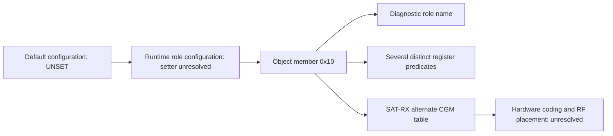

# PHY initialization modes are device roles

The fresh canonical-firmware audit identifies the previously unnamed mode
selector as a **device-role setting**. Its diagnostic function returns `SAT-RX`
for mode 3, `UT-TRX` for mode 4, and `UNSET` for the constructor's default 5.
This supplies a useful exclusion: the alternate mode-3 CGM table is selected
for the satellite-receive role. A two-way RF clustering split is not evidence
of switching between these firmware roles or of a message type bit.

## Evidence from actual code

The input is the existing `catson-bin--phyfw`, SHA256
`52285c9809696a88dca1a24407bc3ec5e853c255ca385f97b6da2463898cc326`.
Every inspected address is translated through a file-backed ELF load segment.
Complete disassembly, source hash, emulation results and method hash are in
ignored `local/initialization-execution.json`.

At **0x5e2d0**, the initialization diagnostic loads `object+0x10`, passes it to
**0x9eaa0**, and retains the returned pointer for logging. This is the same
object member used by CGM selection and the setup-register branches. Executing
that name function gives:

| Value | Actual returned string | CGM table in canonical firmware |
|---:|---|---:|
| 0 | SAG-TX | 0xaf7a0 |
| 1 | SAG-RX | 0xaf7a0 |
| 2 | SAT-TX | 0xaf7a0 |
| 3 | SAT-RX | 0xaf3a0 |
| 4 | UT-TRX | 0xaf7a0 |
| 5 | UNSET | 0xaf7a0 |
| 6 or 0xffffffff | ERROR_UNKNOWN | 0xaf7a0 |

The invalid/unset inputs demonstrate branch behavior, not valid operational
configurations. We do not expand the undocumented `SAG` abbreviation. Default
configuration at **0x6c474** copies eight bytes from **0xcb148** into object
offsets 0x10 and 0x14. Read as two little-endian words, those bytes are **5, 2**.
Thus the first word's default is explicitly `UNSET`, not an observed radio mode.
The base constructor calls this default initializer; runtime setters remain
untraced. The label function and diagnostic call connect names to actual use,
providing stronger evidence than finding an isolated string.

## Connected initialization execution

`initialization_execution.py` executes **0x5e0b0 through 0x5e1b0**, including
the actual predicate functions and both real table-loader calls. Object and
MMIO destinations are synthetic RAM. There are no hardware accesses, new
recordings, patched instructions or stubbed calls within that interval.
The test initializes registers to 0xa5a5a5a5 so preserved bits are also checked.

Eight inputs (0–6 and 0xffffffff) verify **98,304 table writes** in total:
each case writes 8,192 MODCOD words and 4,096 CGM words. Address, width and value
of every table write match independently constructed expectations. This also
confirms the MODCOD adjacent-word swap is a loading operation, not a recovered
RF bit-order transformation.

Different register predicates divide the same role values differently:

| Operation | Predicate established by execution |
|---|---|
| Register bank at object+0xcb0, offset 0x20, configured middle bits | Roles 2–4 versus other values |
| Same bank, setup words at offsets 4/8/12 | Role 3 versus other values |
| CGM source table | Role 3 versus other values |
| Bank at object+0xcc0, offset 4, bit 0 | Values 0–1 versus others |
| Same register, bit 2 | Role 4 versus others |
| Bank at object+0xca0, offset 0x50, clear bit 11 | Role 3 only |

These offsets are software/MMIO coordinates. They are not RF carrier or symbol
numbers. Register bit meanings remain undocumented.



## Consequences for symbol associations

**Changed interpretation:** referring to mode 3 simply as a waveform/header
mode was too permissive. The actual selector names describe equipment roles.
Our satellite-downlink recordings are therefore not evidence that the receiver
alternates between `SAT-RX` and `UT-TRX` when a waveform cluster changes.
The SAT-RX-specific table is a poor direct starting point for the recorded
downlink, although the labels alone cannot prove precisely which shared
hardware functions each table implements.

**Still supported:** the ordinary table is selected by both `SAT-TX` and
`UT-TRX`. Its relevance to a satellite-downlink implementation is more plausible
than the SAT-RX-only alternative, but no CGM opcode meaning, interleaver,
scrambler or mapping from table entries to RF coordinates is established.
Shared selection is not proof that TX and RX execute identical coding.

**Rejected inference:** two or four hierarchy groups cannot be labeled by
counting firmware roles, register branch outcomes or table alternatives. The
same role participates in several different partitions, and none of these
initialization branches consumes the recorded per-frame header signs.

This is an independent constraint against an interpretation of all inventoried
symbol/profile groups. It does not justify another blind RF scan. Existing
held-frame, receiver and revisit tests remain the appropriate evidence for
their waveform stability; SATAddr and NORAD identity remain unlinked.

## Verification and limits

```sh
uv run --no-project --with capstone --with pyelftools --with unicorn python reports/2026_09_29_firmware_cluster_reaudit/initialization_execution.py
OPENBLAS_NUM_THREADS=1 uv run --no-project --with numpy --with scipy --with matplotlib --with capstone --with pyelftools --with unicorn --with pytest pytest -q reports/2026_09_29_firmware_cluster_reaudit
```

All **12 component tests pass**. A regression specifically checks that SAT-TX
and UT-TRX select the same table but different register bits, while SAT-RX selects
the other table. The full boot path, runtime configuration setter, hardware
decoder operation, variant role naming and firmware version active during the
recordings remain outside this executed interval. No new decoded field is claimed.
