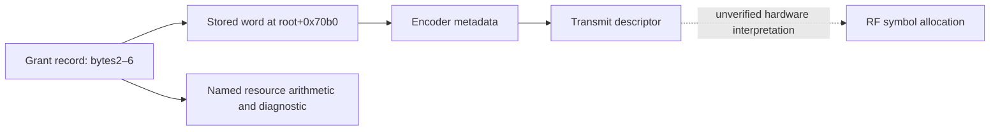

# Receive prefix fields select a conditional MCS-table branch

Fresh ELF-mapped disassembly and **72 bounded executions** show that the receive
parser's two prefix bits at software positions 4–5 are not sufficient by
themselves to identify its behavior. A feature-record value also controls whether
the parser selects its table loop. This expands the earlier non-table assay;
it does not establish a new RF header decode.

## Executed path

Actual `rx_lmac` initializer `0xea8b0`, parser `0xc6240`, bit reader and feature
query `0xffc40` execute in isolated AArch64 emulation. Synthetic input supplies
feature-record values 0/1/2, short/long forms, all four two-bit values and entry
counts 0/1/3. Each call is bounded by 2,500 instructions and 100 ms. Execution
stops at the single-entry, table-entry or no-entry branch before downstream
logging, table decoding and payload consumption. Binary and code-window hashes
are recorded; no firmware or fixture is changed.

| Entry count | Feature record +0x44 | Prefix bits 4–5 | Selected branch |
|---|---:|---:|---|
| 0 | Any tested value | Any | No entry |
| Positive | 0 or 2 | Any | Single entry |
| Positive | 1 | 0 | Single entry |
| Positive | 1 | 1, 2 or 3 | Table |

There are 36 single, 12 table and 24 no-entry cases. The parser expands short
prefix fields into the expected internal representation in every case. Six
synthetic short-form cases reach the table branch.

The feature query selects an object record using indexes at `0x1d3958+0xb0`
and `+0xb4`, a pointer at selected record+8, and a 0x6c-byte variant stride.
It compares the resulting word at +0x44 with **exactly 1**. Thus this is not
simply a truthy/falsey option. Its runtime initialization and valid configuration
combinations remain unverified.

## A constraint that deserves caution

The short path sets accounting width to 16 at `0xc65d4`; long accounting uses
20. However the table loop at `0xc66f8` explicitly requests **20 bits**, regardless
of that accounting width. The successful branch tests do not prove short/table
messages are valid or emitted. A caller invariant may prohibit that combination.
Do not turn this observation into a firmware-bug claim or assume a universal
16-bit short-table layout. Full table decoding and consumers require a separate
bounded assay with their configuration initialized.

## Consequence for clustering

It is unsupported to label a four-way dendrogram split with these two prefix
bits: three nonzero values select the same branch, and the feature mode can
disable that branch entirely. The test also supplies no mapping to RF symbol
positions, scrambling, FEC, beam state or satellite identity. A falsifiable
field claim needs a verified serializer/decoder-to-RF mapping, then held-out
predictions of both the field and its conditional behavior.

Reproduction:

```sh
uv run --no-project --with unicorn --with pyelftools --with capstone python reports/2026_09_29_firmware_cluster_reaudit/parser_gate.py
```

`local/parser-gate.json` records all cases and fresh instructions. The component
test runs this actual bounded firmware assay into temporary output, including
the six short/table selections; it does not modify golden fixtures.

## Transmit caller follow-up

Fresh instructions at TX `0x80fd4–0x80ff0` load the entry form from a configuration
byte: read a pointer from x22, read another pointer at that object+8, then load
the byte at the second object+`0x70c1`. They pass that value as w4 to helper
`0xc0f60`. This local call sequence does not extract form from the prefix.
The helper uses the low byte as an index into the existing 8/12-bit count-width
table and adds eight MCS bits. Values outside 0/1 were not exercised or claimed
valid; the shown helper has no explicit 0/1 range check before indexing.

`entry_caller.py` executes that actual caller sequence, helper and bit writer
on eight synthetic object graphs: two configuration forms and counts
0/255/256/4095. All reach the instruction following the call and reproduce
16/20-bit output. Count 256 truncates to zero in the short form and remains
256 in the long form. This is software packing evidence, not legal scheduler
range evidence or an RF bit-order claim.

The next missing constraint is the configuration byte's initializer and runtime
object coupling. Nothing here establishes that a transmitter
emits the receiver's synthetic short/table combination. Consequently this
follow-up does not justify another 16/20-bit RF layout scan.

```sh
uv run --no-project --with unicorn --with pyelftools --with capstone python reports/2026_09_29_firmware_cluster_reaudit/entry_caller.py
```

`local/entry-caller.json` includes the cases, binary/window hashes and fresh
instructions. A component test reruns the bounded actual-code assay in temporary
output and checks the observed width/truncation distinction.

### Prefix callers use the same relative configuration offset

Further fresh disassembly traces `0x7d854` forming x27 = x19 + 0x7000, then
`0x7d9bc` loading w4 from x27+0xc1 before calling prefix builder `0xc1210`.
An alternative caller at `0x7de64` loads the same member. The prefix prologue
copies w4's low byte into w27 at `0xc1274`; two additional actual-code executions
verify this for forms 0 and 1. The earlier prefix-branch assay establishes how
that register selects short/long serialization.

Thus both entry and prefix paths use a configuration member at relative offset
0x70c1. The following parent-wrapper trace strengthens this beyond a matching
offset. A nearby store to an unrelated object's +0xc1 cannot be accepted as this
setting's initializer from the offset alone. Initialization remains unresolved;
the observations do not justify an RF scan or establish validity of short-form
table messages.

### Shared storage is established on the traced parent call path

The parent at `0x7d2f0` keeps its argument in x28 and sets x20=x28+0x50.
At `0x7d340–0x7d344`, it reads the pointer at that context and then the pointer
at +8 into x19, the prefix configuration base. Its stack wrapper at sp+0x138
contains a pointer at +0x28 to sp+0xa8; the first word there is x20, stored at
`0x7d7fc`. It passes this wrapper to `0x80ec0` at `0x7d8d8`.
That function reads wrapper+0x28, then its first pointer into x22 at
`0x80f60–0x80f64`. The entry caller's subsequent pointer chain therefore reaches
the same configuration object used by the prefix path.

The updated `entry_caller.py` executes the actual stack-wrapper stores and both
pointer-load paths, verifying identical base addresses. This resolves the local
object-identity question; it does not execute the whole scheduler or prove that
the field cannot change between calls. The constrained inference is that entry
width and prefix form share a stored setting along this parent path. It remains
unsupported to treat them as independently selectable per-message RF fields.

### A separate SYSINFO-associated short/long decision

The diagnostic at file offset `0x10b578` reads
`mac_ut_handle_sysinfo: PDUs use %s GMH`. Its actual argument selection references
the strings `LONG` and `SHORT` at `0x10b358` and `0x10b360`. The decision at
`0x67fe4–0x68000` stores a byte at an object member corresponding to +0xe782:

| Enable byte (+0xe781) | Compared byte (another object+0x53c) | Stored value | Diagnostic |
|---|---|---:|---|
| Zero | Any | 1 | LONG |
| Nonzero | 0–5 | 1 | LONG |
| Nonzero | 6–255 | 0 | SHORT |

`sysinfo_format.py` executes the actual decision and string-selection instructions
for 1,024 combinations (all compared-byte values, enables 0/1/2/255). A component
test verifies boundary and disabled cases. The output's value 1 means LONG in
this diagnostic, not SHORT: naming the nearby enable byte is insufficient to
infer output polarity. The compared byte's meaning is unverified; it must not be
called a satellite ID, sequence number, MCS count or time field from its width.

This is a separate configuration lead, **not yet a proven setter of +0x70c1**.
Another raw-code consumer reads +0x782 at `0x642ac`, but its complete path and
object identity require further work. The diagnostic supports a conditional
format policy associated with SYSINFO handling; it does not establish the
policy's on-air location, update cadence or relation to any observed cluster.

```sh
uv run --no-project --with unicorn --with pyelftools --with capstone python reports/2026_09_29_firmware_cluster_reaudit/sysinfo_format.py
```

The ignored `local/sysinfo-format.json` records every executed case, code-window
hashes, binary provenance and the explicit gap between these two settings.

### The SYSINFO-associated decision affects capacity accounting

**Direction qualification:** the path below is associated with terminal uplink
scheduling. It does not establish 114/228 header-size switching in the recorded
Ku downlink. The raw-code direction audit follows the arithmetic description.

The consumer at `0x642ac` loads the format byte, then passes it as w4 to
`0x83b40` at `0x64310`. That routine indexes two actual relocated tables:

| Diagnostic decision | Table at 0x11f240 (byte entries) | Table at 0x11f250 (halfword entries) |
|---|---:|---:|
| 0 / SHORT | 114 | 16 |
| 1 / LONG | 228 | 24 |

ELF relative relocations at `0x16f930` and `0x16fce8` establish those addresses.
The routine subtracts the first table value from a resource budget before
division by symbols-per-codeword. It multiplies the quotient by bits-per-codeword,
subtracts the second value and 164, then converts to bytes with a right shift
of three, saturating at zero. For the tested nonnegative inputs the formula is:

```
available = (63*A - 16)*(D - 1)
words = max(0, available - first[form]) // symbols_per_word
bytes = max(0, words*bits_per_word - second[form] - 164) // 8
```

`format_budget.py` executes the actual arithmetic and table loads for 72 cases,
including zero-capacity and threshold cases, using explicitly synthetic codeword
dimensions. This does not assert that all combinations are valid MCS/allocation
choices. No encoder or waveform is synthesized.

This strengthens the interpretation of a substantive format-budget choice rather
than a diagnostic-only label. The first table's 114/228 is consistent with one
or two previously identified 114-symbol header units. The two tables operate in
different stages of the calculation: **16/24 must not be read as alternative
16/24-bit on-air prefixes**. The known entry widths remain 16/20, while the known
prefix widths remain 8/16. These quantities must not be conflated to fit clusters.

The configuration-to-serialization setter and RF placement remain unproved.
This result motivates tracing the resource/MCS path, not selecting carrier
windows of length 114 or 228 without independent placement evidence.

```sh
uv run --no-project --with unicorn --with pyelftools --with capstone python reports/2026_09_29_firmware_cluster_reaudit/format_budget.py
```

### Direction audit narrows applicability to our recordings

Fresh disassembly links the calculator's diagnostic at `0x83c74–0x83c98` to
`mac_ul_scheduler.c` at `0x110080`. The caller's diagnostic instructions at
`0x64380–0x643a4` reference `mac_ut.c` and
`mac_ut_get_mcs: Size mismatch: ...`. This is stronger than finding those names
somewhere in the binary: the relevant code constructs and passes their addresses.
The calculator's nonzero-mode lookup calls `0xe04c0`, whose root is `0x1a1a60`;
that must not be silently identified with the earlier downlink lookup root.

Accordingly the 114/228 choice is verified for this **uplink-associated capacity
path**. Table reuse elsewhere is possible, but does not establish downlink use.
The independent downlink scheduler evidence in the earlier firmware report
still supports 114 coded symbols per 32-bit GMH unit; it does not fix the total
number of units in any observed header. The new finding narrows the prior
interpretation rather than supplying a new downlink scan hypothesis.

`format_budget.py` now saves these fresh diagnostic-reference and lookup-root
instruction windows plus the pointed-to strings. All arithmetic tests remain
unchanged. No RF analysis was repeated under an inapplicable uplink assumption.

### Downlink accounting carries partial units rather than rounding each addition

The separate downlink code is in **`catson-bin--rx_lmac`**, hash
`9a41860c3623f6e484d46d17969e96f3dde97508644f7e4026792cdcb683cabe`.
Its addresses must not be applied to `tx_lmac`, where the same locations contain
different instructions. The caller at `0x92734` selects MCS ID 0 and invokes
the accounting helper at `0x90020`. Three existing source tables independently
contain the ID-0 record `(0,114,32,0)`.

`downlink_accounting.py` executes the actual helper from entry to its pre-log
boundary for every initial remainder 0–31 and addition 0–65: **2,112 cases**.
For these successful, non-overflowing inputs it computes:

```
completed_units, remainder = divmod(previous_remainder + added_bits, 32)
symbol_accumulator += completed_units * 114
remaining_units -= completed_units
```

Thus adding 31 bits to an empty remainder accounts for zero complete units;
adding one more bit accounts for 114 symbols. Starting with 31 and adding 65
accounts for three complete units (342 symbols), with no remainder. The unit
reservoir in the test is deliberately ample; exhaustion and invalid inputs are
outside scope. The component test reruns actual instructions and checks these
boundaries without changing golden fixtures.

This strengthens the incremental 32-bit/114-symbol accounting interpretation,
but **does not prove a final header is rounded down**, or reveal final padding,
flush behavior, total units, FEC generators or carrier placement. In particular,
one observed symbol association cannot be assigned a 114-element block merely
because this bookkeeping unit exists.

```sh
uv run --no-project --with unicorn --with pyelftools --with capstone python reports/2026_09_29_firmware_cluster_reaudit/downlink_accounting.py
```

### The observed downlink caller replenishes unused header capacity

The caller's diagnostic at `0x92a9c–0x92af4` points to
`DLSCH: GMH REPLENISH ... gmh_unused_bits ...` at `rx_lmac:0x11b918`, with
source `mac_dl_scheduler.c`. At `0x926dc–0x92704`, it adds the pending bit quantity
to a per-entry remainder, stores the low five bits back, and supplies only the
complete 32-bit multiple to the accounting helper. The caller therefore has its
own carry mechanism before the generic helper's unit conversion.

The same instructions increment a 16-bit member at another object+0xd8, saturating
at 65535. An additional **384 actual-code cases** verify the caller's carry,
complete-unit quantity and saturation at initial values 0/65534/65535.
The first harness attempt failed because it omitted incoming w4=65535, set by
the real caller at `0x926c8`; restoring that precondition made all cases pass.
This was a harness correction, not a change to firmware or expected results.
This is a counter within a replenishment path; no evidence places that counter
on air or identifies it with any recovered changing sign. It must not become a
new frame-counter hypothesis merely because it increments.

This direction and purpose audit further limits the inference: the helper uses
114-symbol units when replenishing a resource budget. It confirms an accounting
unit, not packet-construction order or a transmitted header boundary. The
codeword dimensions remain supported; assigning them to the observed early
symbol clusters still requires an independent PHY mapping.
# SYSINFO address decoder: full width and partial failure

The fresh receive-side audit executes canonical RX-LMAC code, rather than
inferring the address from a dump label or from the previously tested writer.
The type-zero dispatch at `0xd7b14` calls the SYSINFO decoder at `0xd6bb0`;
that calls the base decoder `0xd3bc0`. The base decoder requests 32 bits from
the real bit reader (`0xeada0`) and stores the full word. Two following reads
request eight bits each for the channel fields. These are software serialization
positions, not established RF symbol positions.

`sysinfo_address_decode.py` executes the actual reader initialization, consumes
the known 11-bit envelope, and calls the body decoder with 50 remaining body
bits and both optional sections absent. All 52 cases succeed: zero, every
one-hot address and channel bit, all ones, and two mixed patterns. Every address
bit survives, including the high byte. This path supplies no evidence that
SATAddr is restricted to a short field or equivalent to a cluster index.
Downstream semantic validation and the full outer dispatcher remain untested.

A deliberately insufficient remaining-bit count of 31 returns status 27, but
the decoder has already written the complete supplied address to its output.
The channel bytes and version retain their sentinel values. At `0xd3c0c` the
address store precedes the count check at `0xd3c14–0xd3c18`. Consequently a
plausible value in output memory must not be accepted without a successful
return status and correct framing. This is not a claim of a vulnerability;
the caller's treatment of partial output was not audited here.

The fixture is synthetic, with a physically available eight-byte buffer and a
short logical body count in the failure case. It does not test a memory-short
buffer, optional ephemeris decoding, RF FEC/interleaving, or packet authenticity.
There is no decoded SATAddr from DS7–DS10 and no demonstrated NORAD relationship.

Reproduce with `uv run --no-project --with capstone --with pyelftools --with unicorn
python reports/2026_09_29_firmware_cluster_reaudit/sysinfo_address_decode.py`.
The ignored receipt contains binary and instruction-window hashes, each input
and output, and the failure status. The component test executes all cases.

## Outer SYSINFO dispatch and error handling

`sysinfo_dispatch_decode.py` advances the previous body-only test to actual
outer decoder `0xd7990`. Only its buffer-length accessor `0xf1860` and buffer-data
accessor `0xf1910` are stubbed. Alignment adjustment, bit-reader initialization,
type/padding reads, type-zero dispatch, body decode and status return execute
the original instructions.

All 16 bounded cases behave consistently: four byte alignments, two physical
trailing padding values (000 and 111), and buffer lengths seven or eight bytes.
All eight complete messages succeed with the expected address/channels. All
eight seven-byte truncations return 27, despite having partially written the
address. Trailing padding values do not affect acceptance in these cases: the
decoder subtracts the declared padding count from the body budget, rather than
requiring those trailing bits to be zero. Thus zero-padding assumptions cannot
be used as validated checksums or strong evidence for random RF candidates.

The caller's raw instructions at `0x551e4–0x55224` show that status is saved in
`w22`, and only zero branches to `0x55280`, the success path. The nonzero path
increments a saturating halfword error statistic and enters logging/cleanup.
This is a static caller audit, not full handler execution. It supplies evidence
that the immediate caller checks the decoder status; it does not establish
behavior of every caller or authenticity of successfully parsed messages.

These stronger format constraints do not supply RF coding/interleaving or a
carrier map. No blind SYSINFO scan was repeated. The useful consequence for a
future constrained RF candidate is to require complete framing and successful
dispatch, then seek independent physical or cross-visit validation rather than
relying on a plausible address or zero padding.

Reproduce with `uv run --no-project --with capstone --with pyelftools --with unicorn
python reports/2026_09_29_firmware_cluster_reaudit/sysinfo_dispatch_decode.py`.

## Optional timing section: executed conditional layout

The SYSINFO base writer passes body+0x34 to presence writer `0xd3770`.
When present, it calls `0xd3670` with body+0x35. That writer serializes the low
and high nibbles of its first byte separately, then two complete 32-bit words.
The corresponding decoder `0xd3990` reconstructs the same memory layout. The
dump argument loads at `0xcca30–0xcca94` connect these slots to GroupFact,
GroupId, RFNum and ULTxTimeOffset. Their names alone do not establish units.

`sysinfo_timing_layout.py` executes the actual writer and body decoder for 74
cases: zero, every bit individually across the 8+32+32 bits, and all ones.
All serialized bytes match the explicit layout and all fields round-trip.
This closes a software-layout gap; it does not decode the recorded RF signal.

For version-zero SYSINFO, **ephemeris absent**, timing present, the timing
section's nested optional scalar absent, and its list empty:

| Field | Serialized bit offset, LSB first | Width |
| --- | ---: | ---: |
| Type | 0 | 8 |
| Padding count = 2 | 8 | 3 |
| SATAddr | 11 | 32 |
| DLChanID | 43 | 8 |
| ULChanID | 51 | 8 |
| Ephemeris presence = 0 | 59 | 1 |
| Timing presence = 1 | 60 | 1 |
| GroupFact | 61 | 4 |
| GroupId | 65 | 4 |
| RFNum | 69 | 32 |
| ULTxTimeOffset | 101 | 32 |
| Nested optional scalar presence = 0 | 133 | 1 |
| Empty list count = 0 | 134 | 8 |
| Padding | 142 | 2 |

The 131-bit body plus 11-bit envelope and two padding bits occupies 18 bytes.
Presence of ephemeris changes the timing offsets; later extensions can change
length as well. These are uncoded control-message positions, **not carrier or
OFDM-symbol coordinates**. Signed interpretation, scale, RFNum tick cadence,
epoch and rollover have not been established. Thus neither a four-bit-looking
cluster partition nor a periodic sign pattern can yet be identified with these
fields. No blind field or counter scan was repeated on DS7–DS10.

Reproduce with `uv run --no-project --with capstone --with pyelftools --with unicorn
python reports/2026_09_29_firmware_cluster_reaudit/sysinfo_timing_layout.py`.

## Ephemeris representation and displaced timing fields

`sysinfo_ephemeris_layout.py` executes the actual SYSINFO writer/body decoder
with ephemeris present, both without and with the timing section. It checks zero,
each of the 352 ephemeris bits independently, and all ones: **708 cases** total.
All serialized bytes agree with the explicit layout, and all input ephemeris
bits round-trip exactly. This includes nonphysical floating-point patterns;
the codec is not an orbit plausibility validator.

The presence wrapper at `0xce9b0` calls `0xce690`. That writer sends three
64-bit quantities through `0xeaf60`, which stores each double and writes its
eight memory bytes in order. Three 32-bit quantities use `0xeb090`, which moves
the single-precision register bits into a general register and writes 32 bits.
Two further 32-bit words follow. Thus this path preserves the decoded-memory
representations rather than adding numeric quantization at serialization.

| Quantity | Width | Serialized bit starts with ephemeris present |
| --- | --- | --- |
| Position components | 3 × 64 | 60, 124, 188 |
| Velocity components | 3 × 32 | 252, 284, 316 |
| Timestamp words | 2 × 32 | 348, 380 |
| Timing presence | 1 | 412 |
| GroupFact / GroupId, if timing present | 4 / 4 | 413 / 417 |
| RFNum, if timing present | 32 | 421 |
| ULTxTimeOffset, if timing present | 32 | 453 |

Under the tested version-zero and empty later-option choices, ephemeris without
timing occupies **52 bytes**, and ephemeris plus timing occupies **62 bytes**.
The timing displacement is exactly 352 bits relative to the ephemeris-absent
case. Units, coordinate system, epoch, propagation semantics and the relationship
to RF-coded bit positions remain unverified. A floating-point-looking subsequence
or a successful codec return cannot establish an ephemeris decoded from RF.

The first harness run stopped at its inherited 2,500-instruction allowance during
the longer decoder path. The script now resumes that same execution with a
10,000-instruction total bound; all calls reach the return sentinel. This was
a harness budget limit, not a firmware decoding failure. No fixtures changed.

Reproduce with `uv run --no-project --with capstone --with pyelftools --with unicorn
python reports/2026_09_29_firmware_cluster_reaudit/sysinfo_ephemeris_layout.py`.

## Consumer semantics: representation conversion and a nonexclusive change flag

The SYSINFO handler calls `0xd90b0` for a present ephemeris at `0x45018`.
Actual execution of that adapter confirms three double-precision position values
are copied, three single-precision velocity values are widened to doubles, the
first timestamp word is zero-extended to 64 bits, and the second remains 32 bits.
Twenty-four cases cover positive/negative zero, a subnormal, finite positive and
negative values, the largest finite float, and timestamp boundaries through
0xffffffff. They match the expected representation conversion exactly. No unit
scale or epoch adjustment occurs in this adapter; those semantics remain open.

The initial handler gate compares decoded version, full 32-bit address, DL
channel and UL channel against stored context. Executing the gate for unchanged
input and each of the 56 individual bits across these fields gives zero only
for unchanged input, and one for every changed input. This initial `w20` value
therefore cannot be interpreted specifically as “new satellite.” A channel or
version change produces the same initial indication. Later handler logic may
also modify it; the whole handler has not been executed here.

This constrains software interpretations of cluster transitions: even a future
connection to this flag would need to separate address changes from channel and
version changes. It does not establish that any observed RF sign encodes the flag.

Reproduce with `uv run --no-project --with capstone --with pyelftools --with unicorn
python reports/2026_09_29_firmware_cluster_reaudit/sysinfo_consumer.py`.

## PNT variance: custom unsigned floating-point representation

The diagnostic's call to `0xd7f20` now has an exhaustive executed interpretation.
For a 16-bit input `u`, let `e = u >> 10` and `m = u & 1023`. The decoded value is:

```
u == 0x0000: 0
u == 0xffff: NaN
otherwise:  (1 + m/1024) * 2**(e - 25)
```

There is no sign bit. This is **not IEEE binary16**. Exponent zero uses the
same implicit-one formula for nonzero fraction values; there is no ordinary
binary16-style subnormal range. Code zero is a special exception. The maximum
finite code is 0xfffe, yielding 549218942976; the decoder's sole NaN code is
0xffff.

| Input | Actual decoded value |
| --- | ---: |
| 0x0000 | 0 |
| 0x0001 | 2.9831426218152046e-8 |
| 0x3c00 | 0.0009765625 |
| 0x7c00 | 64 |
| 0x8000 | 128 |
| 0xffff | NaN |

`pnt_variance_format.py` executes the actual converter for **all 65,536 codes**.
It replaces only the imported `pow` call with exact integer powers of two,
after checking the ELF relocation at 0x17f710 identifies `pow` and verifying
every call has base two and an integer exponent from −25 to 38. The surrounding
integer/FP instructions execute unchanged. Every finite output matches the
formula exactly; the special NaN output is checked separately. A digest covers
all input/output bit patterns. Component tests cover every exponent and five
fraction boundaries, including special codes.

This resolves the earlier uncertainty about the representation named
`clock_bias_times_c_variance`; it does not establish its physical unit scaling,
the encoder's rounding behavior, or RF location. A candidate interpreted as an
IEEE half would be wrong even if the 16 recovered bits were correct. No RF
search was added because the coding and carrier mapping remain unverified.

Reproduce with `uv run --no-project --with capstone --with pyelftools --with unicorn
python reports/2026_09_29_firmware_cluster_reaudit/pnt_variance_format.py`.

## PNT telemetry satellite identity comes from context

A direct-call audit finds three calls to converter `0xd7f20` in canonical
RX-LMAC: two diagnostics and the telemetry-construction path at `0x55960`.
The latter supplies a record to `0xc1a90`, whose initialization uses the exact
name `lmac_fsw_pnt_info_to_control`. The bundled schema names its first device
field `satellite_id`, followed by two booleans and the variance double.

The actual construction at `0x5592c–0x5596c` distinguishes sources:

| Output field | Source in this code path |
| --- | --- |
| satellite_id | Device context + 0x41538, 32-bit load |
| disable_one_way / disable_two_way | Bits 24/25 of the decoded message storage word |
| clock_bias_times_c_variance | Decoded message halfword, passed through `0xd7f20` |

Device-context byte +0x4153f gates entry to construction. The output ID is stored
before calling the variance converter; its value does not come from PNT body
bytes. `pnt_context_identity.py` executes 272 bounded cases covering zero, every
address bit, all ones, all four flag combinations, and valid/invalid context.
With valid context, the output ID exactly follows the context and the flags
follow message storage. Invalid context branches away without constructing those
fields. Execution stops before conversion/publication; the subsequent converter
and publisher calls are statically audited, not a complete live IPC execution.

This strengthens an earlier possibility into code-backed evidence: **the PNT
telemetry schema's satellite_id is contextual on this path**. It does not prove
that PNT transmits an identity field. The source of the context ID and its
relationship to SATAddr or NORAD remain untraced. Consequently the schema is
not a justification for searching arbitrary RF positions for satellite IDs.
This finding concerns provenance of identity, not physical units of variance;
those units remain unresolved.

Reproduce with `uv run --no-project --with capstone --with pyelftools --with unicorn
python reports/2026_09_29_firmware_cluster_reaudit/pnt_context_identity.py`.

## Context-ID producer: type-15 UTGW SYSINFO and zero handling

Tracing direct immediate stores finds a context assignment at `0x56318` and
separate initialization stores at `0x41d84` (zero) and `0x42728` (another object
field). This search is not an exhaustive proof against indirect or bulk writes.
The runtime assignment belongs to **type 15**, whose diagnostic says
`mac_ut_handle_utgw_sysinfo`. The actual handler jump table sends type 15 to
`0x55580`, type 0 to `0x55cc0`, and type 13/PNT to `0x55914`. Type 15 must not
be conflated with type-0 SYSINFO just because both names contain SYSINFO.

After two feature queries allow this path, the code loads the received field
from outer-decoder storage at stack+0x14f3, compares it with device+0x4164c, and
may store it at device+0x41538—the context field used by PNT telemetry. The
output buffer begins at stack+0x14f0; the body starts two bytes later, and the
field begins at body+1. This is a software-memory connection, not an RF offset.

`utgw_identity_gate.py` executes the comparison/store branch for 36 combinations
of received and expected values, including zero, high-bit values and all ones:

| Condition | Result on this path |
| --- | --- |
| Expected ID zero | Store received ID; mark context valid |
| Received ID zero | Store zero; mark context valid |
| Equal nonzero IDs | Store received ID; mark context valid |
| Unequal nonzero IDs | Keep prior stored ID; clear validity |

All 16 accepted and 20 rejected cases match. In particular, zero is not rejected
or replaced with the expected ID. Its protocol meaning is unknown: do not label
it broadcast, unknown-satellite, or a catalog identifier without evidence.
The feature-mode queries and complete handler are not emulated here, so this is
a conditional code-path result rather than proof of every operational mode.

This advances the provenance chain from decoded type-15 storage to PNT context,
but does not connect that field to type-0 SATAddr or NORAD. It weakens any claim
that telemetry `satellite_id` must always be a unique physical satellite value.
The new constraint does not justify searching arbitrary RF bits for catalog IDs.

Reproduce with `uv run --no-project --with capstone --with pyelftools --with unicorn
python reports/2026_09_29_firmware_cluster_reaudit/utgw_identity_gate.py`.

## Composed routing qualifies the UTGW identity result

The two apparent feature queries read **the same configuration word**, record
offset +0x44 under global root 0x1d3958. `0xffc40` tests equality to 1;
`0xffce0` tests equality to 4. Treating them as independent booleans would permit
impossible combinations under a stable configuration.

`utgw_mode_route.py` executes the actual instructions from the post-decode route
at 0x55288 through the type jump table, both query functions and the identity
gate. It tests 96 configurations: enum values 0–5, two binary context flags,
and four received/expected address combinations. No query function is stubbed.

| Configuration for type 15 | Observed route |
| --- | --- |
| Enum other than 1 or 4, among tested values | Unsupported-type path |
| Enum 1 or 4; alternate-routing byte nonzero | Type rejection before UTGW handler |
| Enum 1; alternate-routing byte zero | Clear context validity |
| Enum 4; alternate-routing byte zero; device+0x41650 nonzero | Clear context validity |
| Enum 4; both bytes zero | Execute received/expected identity gate |

The enum-4 path at 0x566b0 bypasses the other feature branch and reaches the gate
at 0x562f4. Thus the assignment is reachable under the tested configuration;
it is not a general property of all modes. Of the 96 cases, three store an ID,
and the fourth address combination in the same configuration invalidates on
nonzero mismatch. The alternate-routing byte is loaded through the object at
device+0x53378, offset +0x2c4.

The enum and context flags have not been assigned semantic names. In particular,
**this enum must not be equated with the separately audited PHY role enum** merely
because both contain value 4. No evidence identifies the operating configuration
of our recorded satellites from this path. The experiment begins after successful
decoding and stops before logging/downstream handling; it is not whole-firmware
execution. It refines reachability of the earlier gate without changing its
verified zero/equality behavior.

Reproduce with `uv run --no-project --with capstone --with pyelftools --with unicorn
python reports/2026_09_29_firmware_cluster_reaudit/utgw_mode_route.py`.

## Receive-descriptor integrity flags are conditional metadata

The receive routine copies descriptor metadata separately from the payload
pointer. The copied descriptor's byte 5 bit 1 enables interpretation of the
low five bits of byte 6. Direct diagnostic references identify byte 6 bit 0 as
`crc_fail_flag` and bit 4 as `meh_crc_fail_flag`. These are **descriptor-memory
positions**, not locations of transmitted checksum bits.

`descriptor_integrity.py` executes the actual condition and status instructions
for 1,024 combinations: gate off/on, all 32 low-bit combinations, four local state
values, a separate conditional byte, and both diagnostic-logging outcomes.
Only the logging functions are stubbed. Primary descriptor errors and the high
three bits of byte 6 are held clear in this bounded experiment.

| Condition | Effect before later mode/length handling |
| --- | --- |
| Descriptor byte5 bit1 clear | Low-five-bit checks are skipped |
| Gate set; byte6 bit0 set | OR 0x4 into local error status |
| Gate set; byte6 bit4 set | Set local context byte +0x16 to 1 |
| Same MEH flag, context word +0x4c != 2 | Additionally OR 0x40 into local error status |
| Same MEH flag, context word +0x4c == 2 | Do not add that error-status bit |

The remaining low bits are propagated with their original conditional logic
and checked by the experiment, without assigning unverified semantic names.
Logging enabled/disabled does not change the status results. The diagnostic
string check initially encountered trailing newlines; the harness normalizes
only those terminators, and all instruction/status checks then pass.

This supplies a concrete integrity-status lead, but not a usable RF checksum
test. The polynomial, initialization, bit order, covered bytes, received checksum
location, producer of the verdict, and final packet-drop decision are still
unverified. In particular, a named CRC flag cannot be treated as a checksum
algorithm or mapped onto a correlated sign coordinate. The local state value 2
has not been identified with a device role or radio message type.

Reproduce with `uv run --no-project --with capstone --with pyelftools --with unicorn
python reports/2026_09_29_firmware_cluster_reaudit/descriptor_integrity.py`.

## MEH length and checksum-byte accounting

The separate helper `0xc6870` names its size argument `meh_crc_size_byte` in a
diagnostic. Its caller initializes that value to **2** at `0x312dc`. When the
parsed prefix byte's bit 1 is clear, the helper reads a **16-bit length** with
the real bit reader. Prefix bit 3 selects the extended path and changes the
checksum size to **3** at `0xc69a8–0xc69ac`.

`meh_length_crc.py` executes 384 boundary cases, with only buffer-length and
logging-query ports stubbed. Both normal and extended paths require:

```
2 + checksum_bytes <= decoded_length <= available_buffer_bytes
```

The normal path additionally rejects decoded lengths above 255. The extended
path accepts larger lengths when the buffer bound allows them. The caller later
uses `decoded_length - checksum_bytes` as its end limit, with an initial offset
of two on this path. This supports size/boundary accounting, not a checksum
coverage or bit-order inference.

The parsed-prefix bit-1 path is separate: it assigns a fixed length of seven,
sets its output mode flag, and checks that seven bytes are available. It does
not perform the same length read or promote the checksum-size variable to three,
even when bit 3 is also set. Tests include both flags together to avoid silently
applying the extended-path rules to this branch.

These are software parser flags, not the descriptor bits audited above. Their
full reachability from every valid transmitted prefix is not established by this
helper experiment. Nor does a two/three-byte checksum field identify a CRC
polynomial, initial state, reflection convention or protected byte range. The
new result narrows a future framing hypothesis but does not justify a blind
CRC scan over unknown RF ordering.

Reproduce with `uv run --no-project --with capstone --with pyelftools --with unicorn
python reports/2026_09_29_firmware_cluster_reaudit/meh_length_crc.py`.

## Transmit MEH helper reserves a trailer, not a calculated checksum

The transmit finalizer loads a form-selected halfword at `0xc12d8`, passes it
through `0xc0400`, and invokes `0xc1bb0`. The ELF relative relocation at 0x16fce8
points to 0x11f250, whose two halfwords are **16 and 24**. This agrees in width
with the receive helper's two/three-byte accounting, but does not identify a CRC
algorithm or prove the complete transmit/receive paths are connected.

Actual execution of `0xc1bb0` and its writer/query callees shows:

```
alignment = 8 if low_byte(mode) == 1 else 32
padding_bits = -(input_bits + trailer_bits) mod alignment
output = input bits | padding_bits ones | trailer_bits zeros
```

Here `trailer_bits` is 16 or 24, and the returned length is in bytes. The third
incoming argument is overwritten in this helper; the fourth argument supplies
the trailer width. `meh_transmit_trailer.py` verifies 576 cases over lengths
0–95, three modes, both widths, and deterministic varied data, including writer
word crossings. Input bits are preserved, all alignment bits are one, and all
trailer bits are zero. This differs from the earlier GMH helper's zero padding
and eight-bit trailer; the two helpers must not be conflated.

No successful-path function is replaced. The helper computes no data-dependent
checksum. A later software or hardware stage may replace the reserved zeros,
but that stage remains unverified. Therefore these zero bits cannot be treated
as immutable transmitted bits or used to select correlated RF coordinates.
The full enclosing builder and downstream mutations were not executed.

The same 576 cases now continue through the real flush helper `0xe1940`
and linked-buffer join helper `0xe7390`, both called by the finalizer at
`0xc13f0–0xc1448`. The meaningful output bits, including the zero trailer,
survive both helpers unchanged. Nonzero sentinels verify that flush argument
zero preserves the unused suffix of the pending word; it does not clear the
entire word. The join writes only the checked node tags, tail pointer and
link slot for the supplied disjoint nodes. Complete payload snapshots remain
unchanged by the join. These executions narrow the search past two helpers,
but do not execute the complete finalizer or establish a hardware CRC handoff.
In particular, they provide no new mapping from checksum bits to RF carriers.

Reproduce with `uv run --no-project --with capstone --with pyelftools --with unicorn
python reports/2026_09_29_firmware_cluster_reaudit/meh_transmit_trailer.py`.

## Finalized buffers reach a descriptor builder with shortened lengths

A direct-call audit finds two calls to the TX finalizer `0xc1210`, at
`0x7d9d8` and `0x7de7c`. On the second caller's success branch, `0x7df50`
builds a stack metadata record and `0x7e008` passes it and the finalized
buffer pointer separately to `0x28510`. A conditional path there calls
`0x73f60` at `0x28834`, retaining the metadata and buffer arguments. This
is a static path, not evidence that every runtime packet follows it.

The builder traverses buffers and writes address/length pairs. Its actual
length-write instructions, executed in `transmit_descriptor_lengths.py`, give:

| Branch | First buffer length | Second buffer length |
| --- | --- | --- |
| mode != 1, form 0 | input minus 1 byte | input minus 2 bytes |
| mode != 1, form 1 | input minus 1 byte | input minus 3 bytes |
| mode == 1 | input unchanged | input minus 1 byte |

The two/three-byte selection uses a little-endian halfword constant `0x0302`
stored at `0x740e8`; form indexes its bytes. Across 72 cases (three modes,
two forms, two buffer indices, six lengths), the complete destination region
and the local length accumulator match the instruction-derived expectations.
The signaling branch has different accounting and must remain separate.

These ordinary-branch exclusions match the previously verified reserved
GMH/MEH trailer sizes. Combined with zero trailer contents through flush/join,
they strengthen a **later checksum insertion hypothesis**. They do not prove
which hardware/software stage generates the checksum, its algorithm, or the
DMA engine's interpretation of these lengths. No scheduling, allocation,
cache-maintenance loop or hardware transaction is emulated by this test.
Nor does this supply a checksum test for our RF samples: field order,
coding and carrier mapping remain unknown. Existing RF negatives stand.

Reproduce with `uv run --no-project --with capstone --with pyelftools --with unicorn
python reports/2026_09_29_firmware_cluster_reaudit/transmit_descriptor_lengths.py`.

## Configuration-to-descriptor bit mapping

The post-finalization metadata producer also extracts five fields from a
64-bit word at its configuration object's `+0x70b0`. A new composed execution
uses the actual producer `0x7df90–0x7e008`, then supplies its output record to
the descriptor packing block `0x744ac–0x746e0` (including the branch at
`0x74748`). It does not execute intervening scheduling or builder setup.

| Source configuration bits | Metadata byte offset | Destination bits relative to descriptor +0x2058 |
| --- | --- | --- |
| 0–4 | 0x0c | 14–18, direct |
| 5–12 | 0x0e, stored as halfword | bit8 marks nonzero; bits19–26 hold value minus one when nonzero |
| 13–20 | 0x10, stored as halfword | 27–34, direct |
| 21–25 | 0x12 | 35–39, direct |
| 26–30 | 0x13 | 40–44, direct |

Zero in the second field clears its presence bit and encoded value. This
resembles a count-like encoding, but does not establish a count, unit, PHY
parameter name or checksum control. Source bits31–63 are ignored on this path;
destination bits45–63 are preserved. The lower descriptor bits are initialized
to a fixed value before the five fields are inserted.

`transmit_configuration_descriptor.py` tests 942 composed cases: every input
one-hot bit, every value of the transformed eight-bit field, mixed values,
and three distinct initial descriptor patterns. The first test run exposed
only an incorrect expected case count (945 rather than the deduplicated 942);
all per-case firmware-output assertions already passed.

This gives a concrete software association between configuration and descriptor
state. It does **not** assign any of our hierarchical clusters to these fields:
the source's initializer and meaning, hardware interpretation, and RF effects
remain unverified. No new RF scan is justified by matching these widths alone.

Reproduce with `uv run --no-project --with capstone --with pyelftools --with unicorn
python reports/2026_09_29_firmware_cluster_reaudit/transmit_configuration_descriptor.py`.

## Grant origin supplies names for three configuration fields

Fresh producer tracing changes the interpretation of the word at `+0x70b0`:
it is populated from a grant record, rather than established as an immutable
initialization constant. At `0x68b50`, the destination base is root plus0x80;
`0x68b64–0x68b94` adds0x7030 and copies five bytes from record plus2. The
call's PLT at `0x21bf0` resolves through relocation0x16f350 to `memcpy`.
This destination is exactly root plus0x70b0, consumed by the encoder audit.

The actual diagnostic names the handler `ut_context_handle_grant` and prints
`NumOfdmSymb`, `NumRb` and `NumDataSymb`. Executing its arithmetic and variadic
argument construction confirms the following associations, rather than relying
on nearby strings alone:

| Packed source field | Verified diagnostic association |
| --- | --- |
| bits5–12 | Second value in `NumOfdmSymb:%d:%u` |
| bits13–20 | First value in `NumOfdmSymb:%d:%u` |
| bits26–30 | `NumRb` |
| computed32-bit value | `NumDataSymb = (63 * NumRb - 16) * (first NumOfdmSymb - 1)` |

The two NumOfdmSymb values must not be collapsed into a single meaning. The
second is the field that later receives presence/value-minus-one descriptor
encoding. The meaning of the two five-bit fields at bits0–4 and21–25 remains
unknown. No field has been shown to be a satellite address.



`grant_configuration_origin.py` executes one-hot and boundary/mixed cases and
checks the exact logging arguments. Invalid-domain inputs expose32-bit wrap;
they do not establish valid grants. The memcpy binding is verified, while the
copy path is static evidence and the complete handler is not emulated.

This strengthens a **resource-allocation interpretation** of these three fields
and weakens treating this descriptor word as a candidate identity. It still
does not locate a grant in the recorded downlink, establish the RF direction of
the granted resource, or identify its hardware units. In particular,63 in the
arithmetic is not evidence that our recovered carriers should be grouped in63s.
No held-out RF test can yet be specified from this mapping without inventing
the missing carrier order and grant-to-frame relationship; earlier cluster
and counter negatives remain unchanged.

Reproduce with `uv run --no-project --with capstone --with pyelftools --with unicorn
python reports/2026_09_29_firmware_cluster_reaudit/grant_configuration_origin.py`.

## Grant queue has a session-qualified modulo-750 timing gate

The sole direct BL call found to `ut_context_handle_grant` is at TX `0x39c00`.
Its caller takes a record from a queue, checks its session and RF number, and
passes record plus0x20 to the grant handler. This establishes a queued software
message boundary; it does not identify the on-air message that populated it.
An aligned direct-call scan is not proof that no indirect callers exist.

Actual execution of `0x39b78` through its branch decisions confirms:

1. Record +8 is compared with the current session at context +0x1610.
2. Record +0x0c minus the current RF counter is evaluated as a signed32-bit
   difference and reduced modulo750, with explicit handling of negative
   remainders.
3. With matching session and a nonnull UT context, normalized residue0 reaches
   the handler; residues1–63 reach the future/requeue branch;64–749 are invalid.
4. Session mismatch reaches the stale-session branch regardless of residue.

`grant_timing_gate.py` executes6000 cases: every difference from-750 through749,
both matching/mismatched sessions, and two counter origins including uint32
wrap. Outcomes are3000 stale-session,4 handle-now,252 future and2744 invalid.
Boundary assertions use the complete actual arithmetic and branch instructions;
logging, queue mutation and the called handler are outside this experiment.
The names are supported by direct caller diagnostics `handle_grant:future grant`
and `handle_grant:invalid grant`, which name `rf_number` and `current_rf_num`.

This is a stronger counter constraint than a guessed binary period: under this
gate, records a multiple of750 ticks apart are indistinguishable in timing
unless other state separates them. It is **not** evidence that this RF counter
is the SYSINFO RFNum field, that a tick has a particular duration, or that an
observed sign repeats every750 frames. A750-Hz frame grid is suggestive but
does not prove the missing software-to-waveform association. Firmware session
IDs also must not be identified with our recording-session labels.

The message producer and RF direction remain to be traced. The prior grant
allocation interpretation stands, but there is still no independently defined
RF field to which this timing test can be applied without scanning arbitrary
bit permutations. Existing controlled RF counter negatives are unchanged.

Reproduce with `uv run --no-project --with capstone --with pyelftools --with unicorn
python reports/2026_09_29_firmware_cluster_reaudit/grant_timing_gate.py`.

## Internal control type4 is the grant queue producer

The producer is in the control callback beginning at TX `0x36900`. After
checking the supplied length against the header length and an enabled context,
its internal type byte selects branch `0x36ca4` for value4. This is a software
control-interface namespace; it must not be equated with type4 in an on-air
MAC decoder. The callback's upstream transport is not yet established here.

`grant_queue_origin.py` executes the actual successful type4 dispatch, then
the queue-record population instructions with synthetic allocated storage.
Only the external memcpy port is substituted; its exact source, destination
and length are asserted. Across366 cases (zero, all ones and every one-hot bit
of the combined120-bit session/RF/grant input, at three entry indices), all
selected values survive exactly:

| Input control-message location | Queued record location | Later use |
| --- | --- | --- |
| +4, uint32 | +8 | Session comparison |
| +0x2c +24×entry, uint32 | +0x0c | Modulo750 RF-number gate |
| +0x30 +24×entry, seven bytes | +0x20 | Argument passed to grant handler |
| Last five bytes of that grant | Handler copies to root+0x70b0 | Encoder metadata and descriptor fields |

These tests cover field preservation, not allocation failures, queue mutation,
invalid input-length validation or the complete callback. Together with the
prior consumer execution they establish a concrete software data path. The
seven bytes are an in-memory grant representation, not56 newly decoded RF bits.
Its leading16-bit value is compared with a UT context value in the handler;
neither that value nor this internal type number establishes satellite identity.

This revises the earlier unknown-producer boundary by one step: the queue is
fed by internal control type4. Whether RX LMAC, another controller or another
path produces that message, and which RF transmission it ultimately schedules,
remain open. No DS7–DS10 carrier positions follow from this internal layout.

Reproduce with `uv run --no-project --with capstone --with pyelftools --with unicorn
python reports/2026_09_29_firmware_cluster_reaudit/grant_queue_origin.py`.

## ULMAP diagnostic resolves all five packed field names

The RX firmware contains a producer identified by diagnostics as
`mac_ctrl_send_grant_to_txlmac`. Its header construction at `0x79d98–0x79dac`
writes internal type4 and length0x208, followed by the current session. Its
entry-copy block at `0x79e60–0x79e88` writes an RF number, a16-bit leading
grant value, and the five-byte packed suffix at the offsets consumed by TX.
This is concrete static evidence for an RX-to-TX internal grant path; the full
producer, transport and variant selection have not been executed.

More decisively, the ULMAP diagnostic at RX `0x12bab0` explicitly names the
seven-byte record fields. `ulmap_grant_fields.py` executes the extraction and
variadic argument construction at `0xcdcf8–0xcdd7c` for174 one-hot/zero/all-one
cases across three array positions. All diagnostic arguments match:

| Bit positions within the seven-byte in-memory grant, LSB first | Width | Diagnostic name |
| --- | --- | --- |
| 0–15 | 16 | SID |
| 16–20 | 5 | index |
| 21–28 | 8 | SymbOffset |
| 29–36 | 8 | NumSymb |
| 37–41 | 5 | RBOffset |
| 42–46 | 5 | NumRB |
| 47 | 1 | Not reported by this diagnostic |
| 48–55 | 8 | MCS |

This **refines the earlier ambiguous names**: the two values printed together
as NumOfdmSymb in the grant handler are respectively symbol count and symbol
offset. The field with the descriptor's presence/value-minus-one encoding is
the symbol offset, so calling it a count is no longer supported by this
diagnostic. The first five-bit field is named index, not MCS; MCS is a separate
byte that the previously audited descriptor-word extraction ignores. Ignored
there does not mean ignored by the entire transmit pipeline. Bit47 is merely
unreported here, not established reserved or constant on air.

The earlier arithmetic can now be named more precisely:

```
NumDataSymb = (63 * NumRB - 16) * (NumSymb - 1)
```

SID is the grant's leading value compared with a UT context value. No equivalence
to satellite SATAddr or NORAD has been found. These are software record positions,
not serialized on-air bit offsets, and this test does not execute the ULMAP
decoder. Uplink resource allocation is the supported interpretation from the
ULMAP names and RX-to-TX path; the corresponding downlink message's RF placement
and exact resource units remain open. Consequently these names improve future
decoded-record validation without labeling any current hierarchical cluster.

Reproduce with `uv run --no-project --with capstone --with pyelftools --with unicorn
python reports/2026_09_29_firmware_cluster_reaudit/ulmap_grant_fields.py`.

## RX sender and TX consumer now composed across the packet boundary

The366 cases in `grant_queue_origin.py` now begin with actual RX sender
instructions, rather than a hand-constructed internal message. RX writes its
type4/length0x208 header and session at `0x79d98–0x79db0`, packs the selected
entry at `0x79e2c–0x79eb0`, and writes an externally supplied completed-entry
count with the real instruction at `0x79edc`. The resulting520-byte packet is
copied unchanged into the separate TX emulator. TX's real length/type dispatch
accepts it, and the selected queue-record population preserves session, RF
number and all seven grant bytes exactly.

This replaces the earlier static-only sender/consumer connection with executed
evidence for those instruction windows. The grant's five-byte suffix is copied
from RX stored-entry +0x0f; its leading16-bit SID comes from +0x0c. The intervening
byte at +0x0e is a different field, copied elsewhere in the internal entry,
so a naive contiguous seven-byte read from the stored-entry SID would be wrong.

Entry slots0–2 are tested independently. Previous slots are not populated as
a valid multi-entry grant, the actual iteration/count calculation is bypassed,
and allocation, transport, queue insertion, full handler and earlier grant
storage are not executed. The sole substituted function remains external
memcpy in TX. This proves a software representation transfer, not an on-air
serialization layout or an additional decoded RF bit. The next relevant
boundary is how decoded ULMAP grants populate that RX stored-entry layout.

## Grant satellite validation uses stored identity context

The fresh RX audit exposes an important distinction in `mac_ut_validate_grant`
at `0x51b90`. Its named satellite-mismatch check does not compare an address
read from the supplied grant record. It compares root+0x41538 (stored identity)
with root+0x4164c (expected identity), the same context locations previously
traced through the conditional type15 UTGW SYSINFO path.

`grant_identity_context.py` executes the complete validator to its return,
holding timestamp, target, channel and minimum-version gates permissive and
providing valid UT context pointers. Only logging ports are replaced. The288
cases vary six stored IDs, six expected IDs, zero/all-one grant bytes, the
separate context-valid byte, and both logging-query outcomes:

| Identity condition | Result under these fixed other gates |
| --- | --- |
| Expected identity zero | Accept |
| Stored identity zero | Accept |
| Nonzero identities equal | Accept |
| Nonzero identities differ | Reject; increment mismatch counter and record stored ID |

There are128 accepted and160 rejected cases. When logging is selected, the
actual diagnostic arguments are the stored and expected context IDs. Altering
all supplied grant bytes or the context-valid byte at+0x4153f does not change
this gate. This is not a claim that these inputs never matter elsewhere: the
timestamp gate was deliberately disabled and the complete grant-processing
pipeline was not executed.

The result **weakens the inference that every grant must repeat a satellite
address**. The firmware can associate a grant with satellite context acquired
earlier. It does not prove grants lack addresses, nor that this context contains
a globally unique physical-satellite identifier. In particular, neither the
diagnostic's wording nor successful validation establishes a SATAddr-to-NORAD
mapping. For our clusters, identity may be indirect or context-dependent;
failure to find a fixed address in every early-symbol excerpt is consequently
not evidence against satellite association by the actual terminal.

Reproduce with `uv run --no-project --with capstone --with pyelftools --with unicorn
python reports/2026_09_29_firmware_cluster_reaudit/grant_identity_context.py`.
