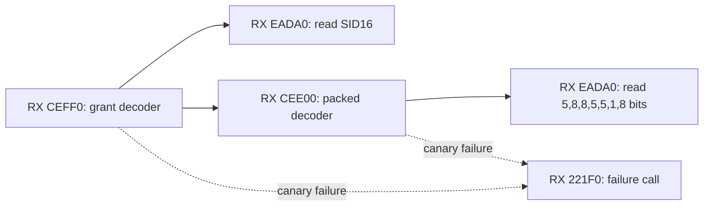
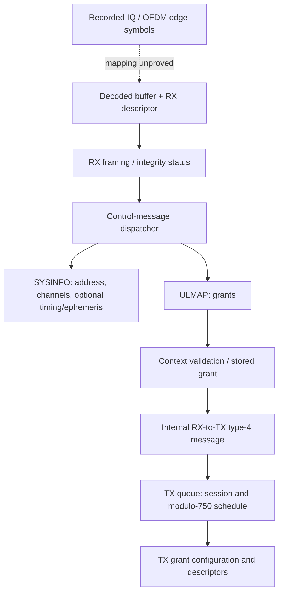

# Receive and transmit lower-MAC executable atlas

The dish package contains receive/transmit lower-MAC code that parses and
constructs control messages. This is a useful software boundary, but it is not
yet an IQ-to-message decoder. Names below are analyst-assigned unless identified
as firmware diagnostic names. Prototypes describe observed AArch64 register
interfaces; opaque structure names do not claim recovered original C types.

The machine-readable [catalog](mac_functions.json) records 17 high-value entries,
their binary hashes, fresh entry disassembly, inferred interfaces, evidence
scripts and variant match candidates. Two entries are explicitly instruction
windows rather than callable functions. The overall automated atlas supplies
the broader candidate-function inventory. Neither inventory proves complete
function discovery or reconstructs trustworthy prototypes for every function.

## Fresh full decoder execution: ULMAP grant

We executed RX `0xceff0` and its nested decoder `0xcee00` using the actual bit
reader `0xeada0`. Unlike the earlier ULMAP diagnostic assay, this runs the
decoder itself. Across **986 synthetic cases**, successful decoding preserves
every one of the 56 serialized software bits:

| Serialized offset | Width | Field interpretation | Basis |
|---:|---:|---|---|
| 0 | 16 | SID | Decoder plus earlier ULMAP diagnostic |
| 16 | 5 | Index | Decoder plus diagnostic |
| 21 | 8 | Symbol offset | Decoder plus diagnostic |
| 29 | 8 | Symbol count | Decoder plus diagnostic |
| 37 | 5 | Resource-block offset | Decoder plus diagnostic |
| 42 | 5 | Resource-block count | Decoder plus diagnostic |
| 47 | 1 | **Unknown** | Explicit read/store at `0xcef58`/`0xcef6c` |
| 48 | 8 | MCS | Decoder plus diagnostic |

Offsets start at the beginning of this grant substructure, not the complete
message and not any RF symbol. In particular, **bit 47 is retained by the
decoder** even though the diagnostic does not print it. Calling it unused or
reserved would be unsupported. SID is not established as satellite identity.

The reconstructed interfaces are:

```c
status32 ulmap_grant_decode(reader *x0, uint8_t output_x1[7],
                           uint32_t *remaining_bits_x2); // RX 0xceff0
status32 ulmap_packed_decode(reader *x0, uint8_t output_x1[5],
                            uint32_t *remaining_bits_x2); // RX 0xcee00
```

Examples, using LSB-first software serialization:

| Input seven bytes | Logical bits available | Status | Output / remaining |
|---|---:|---:|---|
| `00 00 00 00 00 00 00` | 56 | 0 | Same seven bytes; 0 bits |
| `ff ff ff ff ff ff ff` | 56 | 0 | Same seven bytes; 0 bits |
| `00 00 00 00 00 80 00` | 56 | 0 | Same bytes, including unknown bit 47; 0 bits |
| Any tested input | 57 | 0 | Same seven bytes; 1 bit |
| Any tested input | 55 | 27 | All seven bytes already written; 7 bits remain |

The final example is consequential: a length error can occur **after** the
field write. Output memory is not evidence of a successfully decoded message
unless the return status is checked. The experiment tests logical remaining
counts using a physical 128-byte buffer; it does not test physical truncation.
Inputs include zero, all-one and all 56 one-hot patterns at 17 logical lengths.
No native firmware execution, RF collection or golden-fixture changes occur.

Direct callgraph edges below were re-read from both complete decoder bodies;
the catalog includes callsite addresses, including all seven nested reader calls.



## Other bounded, executed interfaces

These results come from existing component-owned executable assays, with fresh
entry disassembly recorded in the new catalog. Each referenced script documents
its synthetic structures, stubs and stopping boundaries.

| Binary: entry | Interface / behavior | Example evidence |
|---|---|---|
| RX `ea8b0`, `eada0` | Reader initialization and bit extraction | Known SYSINFO bytes consumed as 11-bit envelope followed by body |
| RX `d7990` | `status32(message *x0, buffer_wrapper *x1)` | Eight-byte minimal SYSINFO accepted; seven-byte logical length returns 27 |
| RX `d6bb0`, `d3bc0` | SYSINFO body/base decoders | SATAddr `0x12345678`, DL 7, UL 9 preserved; no NORAD interpretation |
| RX `d90b0` | Packed-to-expanded ephemeris adapter | Float32 velocities widen to double; first timestamp word zero-extends |
| RX `d7f20` | `double(uint16_t w0)` | `0x3c00 → 0.0009765625`; `0xffff → NaN`; not IEEE half |
| RX `51b90` | Grant validation against context | Different nonzero expected/stored addresses reject under constrained other gates |
| RX `c6240` | Prefix parse into normalized header | Zero entry count selects no-entry branch |
| RX `27168` window | Receive-descriptor integrity flags | CRC diagnostic/status changes; no checksum polynomial recovered |
| TX `e1430` | `status32(writer *x0, uint32_t w1, uint32_t width_w2)` | Software words serialized LSB-first |
| TX `c1bb0` | Padding and trailer reservation | Alignment padded with ones, checksum trailer with zeroes |
| TX `e1940`, `e7390` | Writer flush / buffer metadata join | Inspected success paths leave zero trailer unchanged |
| TX `741b8` window | Descriptor-length arithmetic | Excludes mode-dependent reserved trailer bytes |

Complete input/output examples and executable harnesses are linked through each
catalog row's `method` and SHA-256. Values above are synthetic known-format tests,
not independently decoded satellite transmissions. Return types marked unknown
remain unknown; names such as reader/writer/body represent opaque structures.

## Variants and whole-system interpretation

The six MAC executables have distinct SHA-256 hashes. We compare a fresh 32-byte
entry signature against both alternate binaries for every curated entry.
Exact matches are candidate anchors only: matching prologues, file offsets and
similar names are insufficient to transfer function semantics or addresses.
Consequently every alternate entry is marked `semantics_transferred: false`.
Relocation-aware complete-function matching and variant execution are pending.

The supported software relationships are:



This is an evidence-backed architecture summary, not a complete direct callgraph:
the queue/message arrows include interprocess handoffs. Internal message type 4
does not establish on-air control type 4. A grant's identity validation can rely
on stored context, so repeated grants need not each expose a readily searchable
address. None of this equates SATAddr, SID or context identifiers with NORAD IDs.
The new grant layout supplies software serialization constraints; it supplies no
independent carrier, coding or interleaver assignment. Blindly scanning DS7–DS10
for these bit widths would create a multiple-comparison problem without fixing
that missing mapping.

## Reproduction and limits

```bash
uv run --no-project --with capstone --with pyelftools --with unicorn \
  python reports/2026_09_30_firmware_atlas/mac_probe.py
uv run --no-project --with capstone --with pyelftools --with unicorn --with pytest \
  pytest -q reports/2026_09_30_firmware_atlas/test_mac_probe.py
```

Generated case-level receipt: `local/mac-grant-probe.json`. The curated JSON
stores executable hashes and evidence-method hashes. Actual firmware and raw
receipts remain local. This is a curated semantic subset, not a claim to have
fully reverse engineered six MAC executables or recovered all original types.
