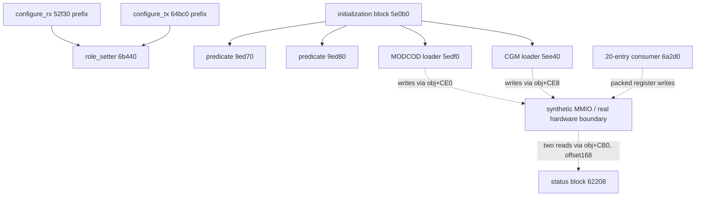

# PHY executable audit

The three PHY executables contain CPU code that configures radio-processing
hardware, writes large tables and reads status. This is a verified interface to
radio processing. It does **not** establish a software routine that takes IQ and
returns a control message. The semantics of the uploaded CGM words and the
downstream hardware remain unresolved.

This audit freshly disassembles 13 selected functions or bounded code regions
across `phyfw`, `phyfw_v4` and `phyfw_catapult`. The machine-readable
[catalog](phy_functions.json) records per-binary SHA-256, audited addresses,
analyst-assigned prototypes, confidence and concrete examples. It is the
semantic subset of the broader executable inventory, not an assertion that all
functions are understood. In particular, a basic block with live x19/x20/x22
registers must not be called as though it were an ordinary x0-argument function.

## Curated functions and examples

Member offsets and addresses in this table are hexadecimal; quantities are
decimal unless prefixed `0x`. Function names are analyst annotations.

| Binary / address | Observed interface | Example input → output | Scope |
|---|---|---|---|
| PHY `6b440` | `int role_setter(void *obj, uint32_t role)` | 4 → `obj+10=4`, returns 0 | Full short function |
| PHY `9eaa0` | `const char *role_label(uint32_t role)` | 4 → `UT-TRX`; 3 → `SAT-RX`; 6 → `ERROR_UNKNOWN` | Executed label helper |
| PHY `52f30` | `configure_rx(obj, role, submode, packed)` | role4, other args0 → members F0/F4/FC/100/104 = 3/4/20/0/51 | Entry prefix; return unknown |
| PHY `64bc0` | `configure_tx(obj, role, unknown_x2, submode, packed)` | role4, other args0 → 3/16/16/0/63 | Entry prefix; return unknown |
| PHY `5e0b0` | Basic-block sequence; live x19=obj | role4 → 8192 MODCOD writes and 4096 CGM writes | Connected initialization, not function entry |
| PHY `5edf0` | `int load_modcod_table(void *obj)` | source indices XOR1, 512 uint32 words repeated16 → MMIO; returns0 | Executed through initialization |
| PHY `5ee40` | `int load_cgm_table(void *obj)` | role3 → AF3A0 table; others → AF7A0; 256 words repeated16 | CPU copying only |
| PHY `6b590` | `int build_threshold20(void *obj)` | FC=1, byte100=1 → 20 words `[0,4,4,…]`; flag0 reverses | Executed builder |
| PHY `6a2d0` | `int write_threshold20_registers(void *obj, const uint32_t *table)` | twenty4s, initial0x25a5a5a5 → packed words0x24924924 twice | MMIO consumer |
| PHY `6b6d0` | `int build_threshold60(void *obj)` | FC=2, obj8=1 → 60 words `[0,0,6,…]`; other tested kinds use8 | Executed; not known T-code |
| PHY `62208` | Basic block; x20=obj, x22=output | first register read0x1234aaaa, second0x5678bbbb → output16=0x1234, output18=0xbbbb | Newly executed below |
| v4 `5f2d0` | `int load_cgm_table_v4(void *obj)` | role3 → B1D10, otherwise B2510; 8192 writes through obj+1A588 | Actual variant instructions |
| catapult `64ad0` | `int load_cgm_table_catapult(void *obj)` | role3 → B7980, otherwise B8180; 8192 writes through obj+1A5A0 | Actual variant instructions |

The existing execution assays have synthetic objects/MMIO but run actual ELF
instructions, with bounded instruction counts and output assertions. Their
receipts and hashes are incorporated into `local/phy-audit.json`; source
scripts are `role_configuration.py`, `initialization_execution.py`,
`configuration_mask.py`, `sixty_entry_audit.py`, and `variant_execution.py` in
the preceding firmware-cluster re-audit directory. None supplies real hardware
I/O or an end-to-end RF example.

## Verified call graph and hardware boundary

Fresh instruction decoding records every BL/BLR in the selected windows in
`local/phy-audit.json`. These are machine call edges; arrows to hardware below
are data writes, explicitly not calls.



Absence of a call in a selected window is not proof that the complete enclosing
function is a leaf. Indirect calls elsewhere, interrupt entry paths and the
hardware's processing of tables remain outside this graph.

## New verification: status halves are separate CPU reads

The block at `62208–62220` reads a 32-bit register at `*(obj+CB0)+168`
twice. It stores the high half of the first read to output+16 and the low half
of the second to output+18. We executed 35 stable inputs (zero, all ones,
0x1234abcd and all 32 one-hot words), then a deliberately changing input:

```text
first MMIO read:  0x1234aaaa
second MMIO read: 0x5678bbbb
output+0x16:     0x1234
output+0x18:     0xbbbb
```

All 36 cases passed, including canaries around the four output bytes. This
rules out treating these CPU loads as one atomic 32-bit sample. It does not
prove real hardware values can change between reads: a hardware latch could
still provide consistency. It also does not establish which half counts which
header condition. Do not interpret their concatenation as a satellite address
or time counter merely because together they contain 32 bits.

## Variant equivalence must be checked, not assumed

Fresh byte comparison gives a useful distinction:

| Binary | Mode3 table / ordinary table | Table bytes | Same bytes? | Destination member |
|---|---|---:|---|---|
| PHY | AF3A0 / AF7A0 | 1024 each | No | CE8 |
| v4 | B1D10 / B2510 | 2048 each | No | 1A588 |
| catapult | B7980 / B8180 | 2048 each | **Yes** | 1A5A0 |

Thus catapult's mode-dependent pointer selection does not change the bytes
uploaded by this particular loader in this build. The other two do change
bytes. This corrects any inference that taking the alternate branch necessarily
selects different microcode. No claim follows about other registers or the
entire runtime configuration. Original table bytes and CPU-loader behavior
are separate evidence; CGM instruction semantics have not been decoded.

## Implications for the recorded signal

1. Role enum4 is `UT-TRX`, not satellite ID4. This enum cannot interpret an
   arbitrary recovered two- or three-bit feature without an RF mapping.
2. The 20/60-entry arrays are threshold-based configuration. The 60-entry
   resemblance to T-code length is insufficient: the prior exhaustive
   rotation/reversal/complement comparison found no nonconstant T-code match.
3. Reciprocal SAT-TX/UT-RX configuration values support a downlink role pairing,
   but neither their numerical equality nor CGM table size establishes which
   recorded OFDM carriers encode a particular control field.
4. PHY is a high-value place to trace register programming and decoder status;
   MAC parsers remain a different layer. There is still no proved call/data
   chain from our IQ samples through this PHY interface into SYSINFO bytes.

## Reproduction and limitations

```sh
OPENBLAS_NUM_THREADS=1 uv run --no-project --with numpy --with capstone --with pyelftools --with unicorn python reports/2026_09_30_firmware_atlas/phy_probe.py
OPENBLAS_NUM_THREADS=1 uv run --no-project --with numpy --with capstone --with pyelftools --with unicorn --with pytest pytest -q reports/2026_09_30_firmware_atlas/test_phy_probe.py
```

The new component test passes; lint passes for its two Python files. Existing
receipt examples are identified as prior evidence rather than presented as
newly executed cases. The new probe freshly checks binary hashes, disassembly,
table bytes and 36 readback executions. Raw binaries and generated receipt
data remain local. No RF collection, native firmware execution, golden-fixture
modification or unrelated file edits were performed.
