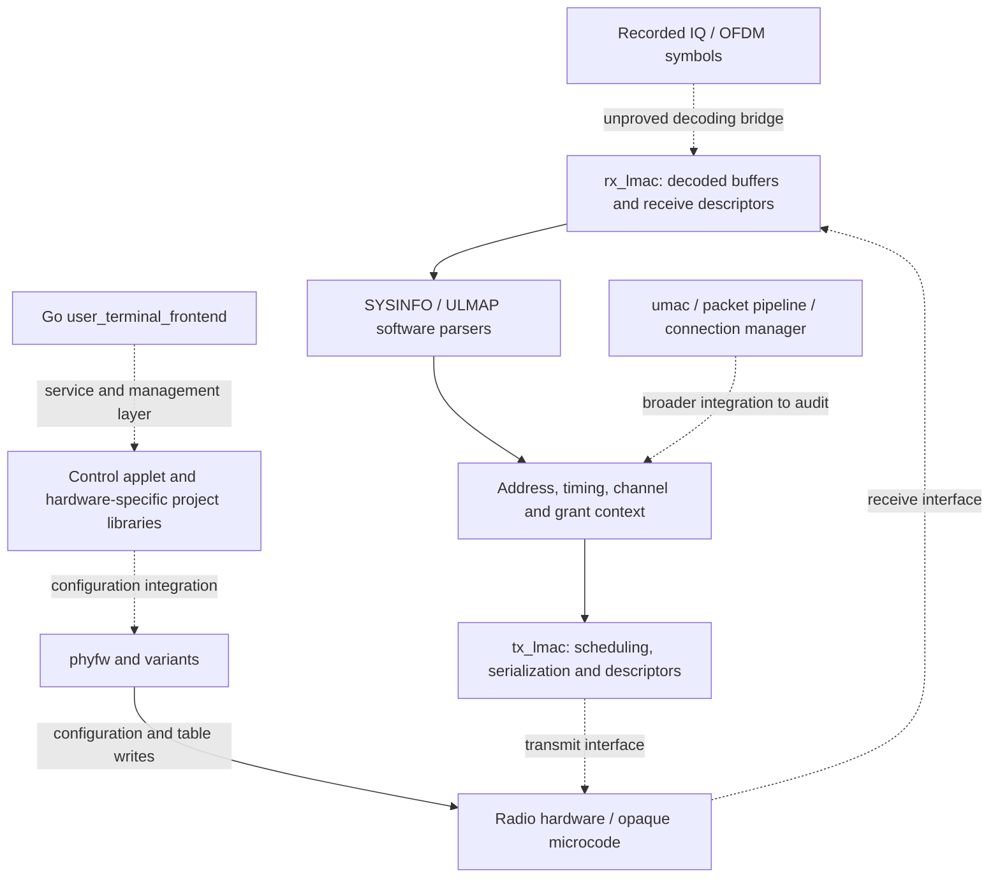

# Dish firmware executable atlas — 30 September 2026

The existing dish runtime bundles contain **47 distinct ELF objects across 62
archive locations**, including hardware-specific shared libraries. All have
candidate-function catalogs, machine call-site tables and compressed executable
disassembly. Three agents separately built the general catalog, audited PHY
code, and audited receive/transmit MAC code. The Go frontend additionally
preserves **23,365 named function ranges** in its runtime metadata.

The final atlas contains **181,894 entries**: 177,387 supported by metadata and
4,507 call-target/entry candidates. It records 1,360,131 direct call sites,
102,664 indirect calls and 13,262 indirect branches across all variants.

This is a broad static atlas plus a tested semantic subset, **not complete
semantic reverse engineering of every executable**. Original C/C++ prototypes
are mostly stripped. Automatically inventing their types or example outputs
would undermine the investigation. Unknown prototypes and examples are explicit
nulls in the general catalog; the curated catalogs supply observed interfaces,
synthetic examples, confidence and supporting executable experiments.

## Where to look

- [Every ELF object, counts, function lists, call-site tables and disassembly](INVENTORY.md).
- [MAC report: message fields, prototypes, examples and callgraphs](MAC.md),
  with [17 curated entries](mac_functions.json), including two instruction windows.
- [PHY report: radio configuration, tables, MMIO and variants](PHY.md),
  with [13 curated entries](phy_functions.json), including bounded code regions.
- Local provenance and archive aliases: `local/corpus.json`.

Function records are keyed by binary SHA-256 plus virtual address; address alone
is insufficient across variants. Each general entry records names when present,
discovery provenance, metadata ranges, candidate extent, confidence and semantic
unknowns. Call records retain each instruction address, direct target or
unresolved register, and heuristic source attribution. They support per-function
graph construction; they are not a complete resolved interprocedural graph.

## Whole-system picture



Solid labeled paths summarize audited behavior; dotted paths include unresolved
interfaces or architectural hypotheses. This is not an instruction callgraph.
The strongest result is that we have both CPU code configuring the radio and
software parsing control messages. We still lack the demonstrated mapping from
our recovered RF symbols through coding/interleaving/scrambling to those buffers.
No newly named function establishes a decoded satellite identity or a NORAD link.

The nine radio ELF variants are byte-identical between the two update archives;
the canonical, `_v4`, and `_catapult` variants differ from each other. Shared
`.project.so` objects expose control-runtime entry points, including
`controlcode_execute` and `controlcode_init_runtime`; names alone do not explain
their full behavior. Sixteen executable aliases per archive point into the
`uterm_binbox_user_terminal` multicall binary, including `user_terminal_control`,
`gps_driver`, `process_monitor`, and the update applet. Treating these aliases as
independent binaries would duplicate work. Likewise, repeated common runtime
functions across variants do not represent independent scientific evidence.

## New findings from executed code

1. **All 56 software grant bits are consumed**, including the previously unnamed
   bit 47. The decoder uses widths `16+5+8+8+5+5+1+8`. Its meaning remains unknown;
   these offsets are not RF symbol coordinates. Across 986 synthetic cases,
   short logical lengths can produce output writes before error status 27.
2. **A PHY status pair comes from two separate MMIO reads.** Thirty-six bounded
   cases include a changing synthetic register producing mixed halves. Actual
   hardware may latch values, so this does not prove a hardware race.
3. **Catapult's two selected CGM tables are identical**, whereas the corresponding
   canonical and v4 tables differ. Mode-dependent pointer selection does not
   by itself imply different uploaded microcode.

## Coverage and limitations

The automatic inventory combines ELF function symbols, unwind FDE ranges, Go
metadata, the ELF entry and aligned direct-call targets. FDEs describe unwind
ranges, not necessarily source functions. BL targets may point into embedded
data. Inferred next-entry boundaries and caller attribution are heuristic.
Indirect calls, tail calls, interrupt paths, inlining and stripped leaf functions
prevent a completeness claim. The Go reader follows the supported format in
[Go's own implementation](https://go.dev/src/debug/gosym/pclntab.go), validates
ranges and names, and recovers no source-language types.

The manifest separately lists 40 scripts and 32 aliases. Opaque MCU signed
images and XP70 S-records are **not disassembled by this ELF pass**; their CPU
architecture and loading context need establishing before safe interpretation.
Non-radio services currently have structural catalogs, not detailed behavioral
audits. The next useful semantic expansion is to trace buffer ownership and
descriptor interfaces across UMAC, packet pipeline and radio initialization,
then resolve the uploaded hardware program formats. Exhaustively assigning
names to generic runtime helpers would contribute less to the RF question.

All firmware and bulk generated artifacts remain under ignored `local/`.
No firmware ran natively, no RF was collected, and no golden fixture was changed.
The source is the existing March 2026 runtime package previously extracted from
the Android app; third-party package authenticity is not independently proved.

## Reproduction

Run from the repository root with the existing local firmware source present:

```bash
uv run --no-project --with zstandard python reports/2026_09_30_firmware_atlas/extract_corpus.py
uv run --no-project --with pyelftools --with capstone python reports/2026_09_30_firmware_atlas/catalog.py reports/2026_09_30_firmware_atlas/local/binaries --output reports/2026_09_30_firmware_atlas/local/catalog --disassemble
uv run --no-project --with pyelftools --with capstone --with unicorn python reports/2026_09_30_firmware_atlas/mac_probe.py
uv run --no-project --with pyelftools --with capstone --with unicorn python reports/2026_09_30_firmware_atlas/phy_probe.py
python3 reports/2026_09_30_firmware_atlas/build_index.py
OPENBLAS_NUM_THREADS=1 uv run --no-project --with numpy --with pyelftools --with capstone --with unicorn --with pytest pytest -q reports/2026_09_30_firmware_atlas
```

The probes document their synthetic inputs, stubs and stopping boundaries.
Examples are known-input software experiments, not decoded on-air messages.
Validation: all 13 atlas tests pass, including malformed Go metadata, synthetic
ELF boundaries and the two new firmware execution probes.
