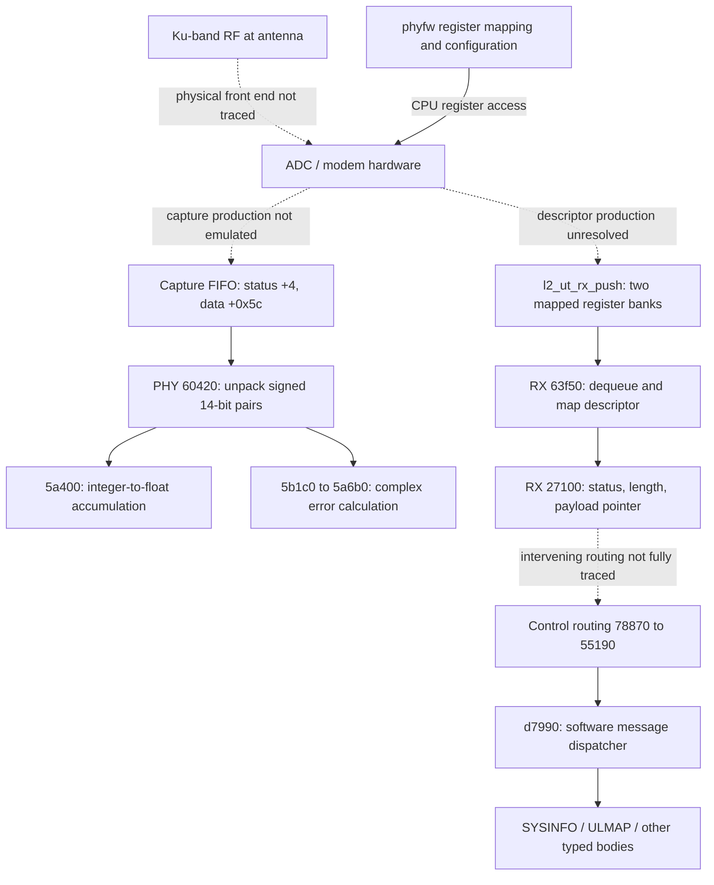

# Tracing the dish receive path — 30 September 2026

Follow-up: [expected versus received identity sources](IDENTITY_ORIGIN.md).
The [local routing-context lookup](RECEIVE_ROUTE.md) distinguishes the record
pointer passed to control dispatch from the separate received-buffer path.
The [embedded-image audit](EMBEDDED_IMAGES.md) adds six XP70 S-record images
to the radio-side inventory beyond the Linux executables.
The [extraction report](UNPACKED_IMAGES.md) documents the unpacked package trees,
all six decoded XP70 memory images, their strings and extraction limitations.
The [device-tree cross-check](DEVICE_TREE_RECEIVE.md) corroborates the receive
register banks and identifies two distinct FIFO address maps across variants.
The transmit-side [SYSINFO/ULMAP IPC handoff](TX_SYSINFO.md) distinguishes
internal structure transfers from the serialized over-the-air message.
The formerly unresolved dequeue target is now traced in
[hardware-facing receive FIFO](RECEIVE_FIFO.md).
The packet-adjacent [demodulator trailer](DEMOD_TRAILER.md) now has executed
entry-selection, byte-preservation and metric-conversion checks. Two fields
represent CE RSSI and SNR; its other fields remain unresolved.

**We can identify where hardware-produced samples and packet buffers enter CPU
code, but cannot yet connect recorded RF symbols to a decoded control message.**
Fresh instruction inspection and emulation distinguish two paths: sample capture
for receiver measurements, and descriptor-driven MAC input. This improves on the
earlier broad picture of the PHY as configuration code: it also contains actual
numeric sample processing, though this audited branch is not a payload decoder.

Scope: canonical `catson-bin--phyfw` SHA-256
`52285c9809696a88dca1a24407bc3ec5e853c255ca385f97b6da2463898cc326`
and `catson-bin--rx_lmac` SHA-256
`9a41860c3623f6e484d46d17969e96f3dde97508644f7e4026792cdcb683cabe`.
Addresses below are ELF virtual addresses, hexadecimal. Do not transfer them to
other hardware variants. Tests use synthetic memory and actual instructions;
no hardware was accessed and no new RF was collected.

## Receive architecture



Solid edges show inspected software operations or calls; dotted edges mark
unresolved connections. The two FIFO paths have not been proved to be taps on the
same stage. In particular, the capture samples' positions relative to FFT,
equalization, demapping and FEC remain unproved. No complete software FFT or LDPC
decoder was established by this bounded investigation.

## 1. Where the CPU accesses the radio hardware

PHY `4f3c0` supplies the path
`/sys/devices/platform/soc/soc:adc_if_mmap/mmap/syscfg_adc` and length `0x100000`
to helper `9ee80`. We resolved that helper's imported calls through ELF PLT/GOT
relocations: it opens the device, obtains the page size, calls `mmap`, closes the
descriptor, and returns the adjusted mapping. The fallback supplies physical
address `0x0c400000` to a separate helper. Adjacent `4f480` uses the `modem_adc`
mapping path. These are register mappings; they are not demonstrated continuous
IQ input buffers.

The previous [PHY audit](../2026_09_30_firmware_atlas/PHY.md) traces MODCOD/CGM
table uploads and configuration. Those establish hardware control, not the
meaning of every hardware processing stage or uploaded instruction word.

## 2. An actual CPU-visible sample stream

PHY worker `60420` reads a register-bank pointer from `object+0x7548`:

| Operation | Instructions | What is established |
|---|---|---|
| Read status | `60480–60490` | Load bank `+4`; bit 1 gates capture validity |
| Extract count | `60488` | Status bits 16–29 form a 14-bit count |
| Check available samples | `60494–604a0` | Require count at least requested count minus one |
| Limit loop | `604a4–604ac` | Process at most 1,024 requested coordinates |
| Pop a sample word | `604bc` | Repeated reads at bank `+0x5c` |
| Extract first component | `604cc` | Signed 14-bit value from word bits 2–15 |
| Extract second component | `604d0` | Signed 14-bit value from word bits 18–31 |
| Dispatch numeric work | `60500–60514`, `6059c` | Integer arrays to `5a400` or `5b1c0`, selected by object field `+0x150c` |

The extracted pair has range **−8192…8191 per component**. Bits 0–1 and 16–17
are not used by this extraction. Their hardware meaning is unknown; they are
not thereby available message bits. The order and scaling of physical I/Q, the
capture point, and the relationship to our SDR carrier indices remain unknown.

The [execution probe](symbol_probe.py) runs the real loop, supplying synthetic
FIFO words and checking output canaries, read counts and stopping PC. It passed
eight batches totaling **3,074 words**, including all four combinations of the
ignored two-bit fields, sign extremes, and lengths 1, 2, 1,023 and 1,024. This is
an isolated loop test: it does not execute the preceding hardware validity gate.

## 3. What happens to those captured values

The `5a400` branch converts each signed integer component to float, calls
`5a2e0`, accumulates into an object array and increments a capture counter.
The meaning of `5a2e0` is not newly established here.

The other branch calls `5b1c0`, which contains a call to `5a6b0` at `5b880`.
At `5a6b0`, two input arrays supply components `(a,b)` and two object arrays
supply `(c,d)`. The inspected positive-denominator branch computes:

```text
D = a*a + b*b
real_ratio = (a*c + b*d) / D
imag_ratio = (a*d - b*c) / D
error = (1 - real_ratio)^2 + imag_ratio^2
```

Thus, naming the arrays `reference=a+ib` and `observed=c+id`, the arithmetic is
`|1 − observed/reference|²`. These names describe the equation, not recovered
original parameter names or a proved training-symbol source. For zero reference
power the code writes 1 instead. The result goes to `object+0x4524+4*index`.
Diagnostics in the same routine name equalization and noise-power calculation.

Six executions of the complete function under a one-coordinate, mode-3 setup
matched an independent complex-number calculation:

| Reference | Observed | Error |
|---|---|---:|
| 1 | 1 | 0 |
| 1 | −1 | 4 |
| 1 | i | 2 |
| 1+2i | 3+4i | approximately 1.6 |
| 0 | 3+4i | 1, special guard |
| 2 | 1 | 0.25 |

This confirms CPU complex arithmetic in the capture branch. It does not recover
an information-bearing constellation, hard bits, FEC parameters, or a pilot
sequence. The one-coordinate setup bypasses broader allocation-classification
and logging branches.

## 4. Timing and file-export paths

The separate TOA worker `61560` calls `60d20` to unpack count, valid and last
flags from a global register-bank status word. It calls `60d50` to read words
at bank `+0x5c`. The inspected loop initially reads 14 words, then continues with
status checks and a 30-word limit. These are software record sizes, **not proved
OFDM symbol counts**. The meaning of their fields and how the timing estimator
maps to over-the-air time remain to be traced.

PHY `552d0` is a distinct capture exporter. Resolved imports establish
`fopen → memcpy → fwrite → fclose`, using `/tmp/iq_capture.bin`. Before writing,
it performs cache maintenance, inspects an eight-byte capture header, and checks
the calculated byte count against the expected size. One mode uses the header's
32-bit count directly; modes 0 and 2 use `8*count + popcount(header_byte_4) − 8`.
It writes from the object's payload pointer at `+0x50`. This is useful format
evidence for existing capture files, not proof that our SDR recordings have this
header. No capture was triggered, and no device file was opened by this audit.

## 5. Where packet bytes enter RX MAC

The main receive routine at RX `27100` calls `63f50` with a queue selector and
an output descriptor pointer. That helper checks initialization and bounds,
selects a FIFO object, invokes the method at vtable+0x10, then calls `fe6b0`
to obtain a CPU-visible descriptor pointer. Follow-up execution resolved the
vtable at `188ab0` to `be5b0`, reading bank offsets `+0x34/+0x38`.
Initialization maps two `l2_ut_rx_push` register banks, with physical-address
fallbacks `0x0c204000/0x0c205000`. Descriptor type 0 uses the returned address
directly; types 1–3 translate it through mapping records. These software
boundaries are now tested; the hardware that produces the descriptor remains
unresolved. See [FIFO evidence and execution scope](RECEIVE_FIFO.md).

RX `653e0` copies the first **16 descriptor bytes** using the resolved `memcpy`
import. In the caller, those bytes are used for a length, flags and other
metadata. The payload pointer is loaded separately from `descriptor+0x10`.
RX `27180` onward branches on status bits before the normal buffer path; the
inspected normal path rejects missing pointer/length and imposes a mode-dependent
64 KiB or 256 KiB limit. These checks show a byte-buffer interface, not a stream
of complex samples. Descriptor offsets are CPU memory offsets, not on-air bits.

The [previous control-route audit](../2026_09_28_sequence_semantics/firmware_control_receive_path.py)
establishes eligible buffers reaching `78870`, then `55190`, then parser
`d7990`. The [MAC atlas](../2026_09_30_firmware_atlas/MAC.md) documents the typed
SYSINFO and ULMAP decoders. This turn re-read entry/call windows but did not
execute the full chain from receive queue through a typed message.

## Implications for our recorded signals

We now have a defensible **capture-word representation and numeric processing
target** for comparison, not a recovered air-interface mapping. The two 14-bit
components are digitized values; they are not 28 payload bits. Likewise a
16-byte receive descriptor is not evidence for a 128-bit radio header.

The highest-value next traces are:

1. Trace configuration of the capture bank and coordinate counts to determine
   which stage is sampled, and whether indices are carriers, time samples or
   selected measurements.
2. Follow the buffers entering `5b1c0`, the TOA record parser and the remaining
   receive status bits. Only then compare constrained coordinates against our
   existing DS7–DS10 and public recordings.
3. Trace the producer of UMAC's optional target record. The expected satellite
   ID supplied to RX and the address decoded from received SYSINFO have distinct
   sources. [Identity evidence](IDENTITY_ORIGIN.md) records the tested transfers,
   mode-dependent gates and remaining provenance gaps.

## Where message meaning first becomes visible

| Boundary | Representation | Established meaning |
|---|---|---|
| PHY capture FIFO | Two signed 14-bit components per word | Numeric receiver measurements; exact radio processing stage unresolved |
| RX hardware-facing FIFO | Descriptor address, flags, length, payload pointer | CPU-visible packet buffer, not constellation samples |
| Packet trailer | Typed metadata entries | Two extracted metrics used as CE RSSI and SNR; remaining fields unresolved |
| Control dispatcher and body decoder | Typed message fields | SYSINFO includes a received address and channel fields |
| UMAC link-up request | Internal software message | Supplies a separate expected satellite ID to RX |
| RX feedback to PHY | Internal type-7 message, 184-byte external length | Carries selected received ID/channel state and timing context |

The received ID in PHY telemetry therefore has a demonstrated MAC-to-PHY
software source. Seeing it in PHY does not establish an independent PHY-level
identity decoder. Likewise, an expected ID is not evidence that the current
radio packet contains that value. No tested path establishes a conversion to
NORAD identity, or the carrier/symbol coordinates containing SYSINFO in our
recordings. The instruction-level probes distinguish these limits from the
transfers they actually execute.

We should not search the 14-bit capture words for SATAddr: no message-bit or
carrier mapping supports that test yet. FEC, scrambling, interleaving and exact
hardware demodulation remain the missing bridge to control-message bytes.

## Reproduction and artifacts

From the repository root, with existing firmware on disk:

```bash
uv run --no-project --with capstone --with pyelftools python starlink_firmware/apk_fw_v1/reports/2026_09_30_rf_receive_trace/receive_trace.py
uv run --no-project --with pyelftools --with unicorn python starlink_firmware/apk_fw_v1/reports/2026_09_30_rf_receive_trace/symbol_probe.py
uv run --no-project --with pytest --with pyelftools --with unicorn pytest -q starlink_firmware/apk_fw_v1/reports/2026_09_30_rf_receive_trace
```

`local/receive-trace.json` contains 18 fresh instruction windows with window
hashes, binary hashes, selected diagnostics and resolved import calls.
`local/symbol-probe.json` records execution examples and source hash. Both are
ignored generated artifacts. Component tests cover signed extraction, ignored
bits, complex phase error and the zero-reference guard.
