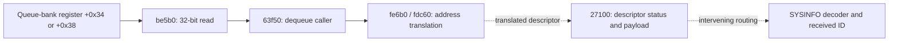

# Hardware-facing source of the RX descriptor word

The previously unresolved virtual call inside RX dequeue `63f50` now has a
concrete target for the inspected initialization path: **`be5b0`**, which reads
one 32-bit queue-bank register. This narrows the upstream source of the packet
buffers that can eventually supply SYSINFO. It does not identify raw RF samples
or decode any new satellite address.

All addresses refer to canonical RX LMAC SHA-256
`9a41860c3623f6e484d46d17969e96f3dde97508644f7e4026792cdcb683cabe`.

## Initialization and virtual-call resolution

Receive FIFO initialization `63cd0–63cec` calls `be660` with mode 1. In that
constructor, `be6dc–be6e4` installs vtable address `188aa0` in the object.
The ELF relocation at `188ab0`, the method slot at vtable+0x10, is
`R_AARCH64_RELATIVE` with addend `be5b0`. Mode-1 setup obtains its register-bank
pointer through the global reached by GOT `17fa88`, and stores the bank in the
private object. Actual physical mapping and live hardware configuration remain
to be traced; this is an identified software initialization path.

## Actual dequeue operation

`63f50` splits queue selector q into object index `q & 1` and channel
`(q >> 1) & 1`, then calls the resolved method. The method follows two object
pointers and reads:

```text
word = *(uint32_t *)(register_bank + 0x34 + 4*channel)
```

It returns that word in w0. The caller transfers it to w1, loads its memory-type
selector into w0, and calls `fe6b0`. That translation dispatcher returns the
zero-extended word directly for memory type 0, calls `fdc60` for types 1–3, and
returns null for other values. Translation for the configured descriptor memory
type is still unresolved; the returned register word must not be called a CPU
pointer without that step.



These edges describe distinct stages. The register word is a descriptor/address
input, **not a satellite ID, message word or IQ sample**. The hardware logic that
populates it remains outside the executed CPU path.

## Execution evidence

[receive_fifo.py](receive_fifo.py) applies the real vtable relocation and executes
`63f50` through the indirect call, stopping immediately before `fe6b0`.
Synthetic objects and register banks replace physical hardware. The test verifies
exactly one four-byte bank read at the selected register and all 32 returned
bits. **140 cases pass**: four queue selectors × 35 words, including zero,
all ones and every one-hot bit. The address-translation memory type is initialized
to 2 and verified at the stopping boundary; its translation is not emulated.

The harness neither simulates FIFO-pop side effects nor executes constructor
allocation, register setup or the hardware producer. It establishes the CPU
dequeue mechanics under the inspected object layout. A first harness attempt
used an unmapped stack address and was corrected to the existing emulator's
mapped stack; no firmware/fixture bytes were changed.

The upstream investigation can now focus on **`fdc60` address translation and
register-bank initialization**, rather than treating the dequeue target as an
unknown function. Descriptor integrity flags and the full path into SYSINFO also
remain to be composed; no on-air carrier/time mapping is implied by this result.

Reproduce with capstone, pyelftools and unicorn:

```bash
uv run --no-project --with capstone --with pyelftools --with unicorn python starlink_firmware/apk_fw_v1/reports/2026_09_30_rf_receive_trace/receive_fifo.py
```

Component test: `test_receive_fifo.py`. Ignored receipt:
`local/receive-fifo.json`, including the relocation, fresh instruction windows,
binary and method hashes, selected register offsets and observed values.

## Follow-up: complete dequeue through address translation

The previously unresolved `fdc60` translation is a small table-based address
calculation. Its table pointer is stored at `0x190708`; records have stride
`0x60`. For a nonzero word and memory type 1–3, it loads a 64-bit CPU base from
record+0x18 and a base value from record+0x30. The subtraction uses **32-bit**
registers, then the result is added to the 64-bit CPU base:

```text
pointer = cpu_base + ((queue_word - uint32(mapped_base)) mod 2^32)
```

The outer dispatcher `fe6b0` treats type 0 as a zero-extended direct address,
types 1–3 as mapped addresses, and larger type values as null. A zero queue word
maps to null in all tested types. The mapped-base name describes the arithmetic;
its real physical memory source and initialization have not been audited here.

[descriptor_translation.py](descriptor_translation.py) now executes the complete
`63f50` dequeue routine, including its real virtual-method call and translation
functions, with no call stubs. **140 cases pass**: four queues, memory types
0–4, and seven boundary words per combination. Inputs cover zero, one, below
the mapped base, the base itself, base+4, the high bit and all ones. The synthetic
payload-memory setting is 2, bypassing the routine's subsequent payload cache
maintenance path. Descriptor payloads and hardware side effects are not modeled.

Two implications matter for interpreting received data:

- A word one below the mapped base becomes `cpu_base+0xffffffff`; this function
  performs no region-bound check. That is evidence about this arithmetic path,
  not proof that real hardware produces such a word or that no later check exists.
- The dequeue call returns status 0 even when the translated pointer is null in
  these cases. Callers must check the pointer; status 0 alone is not proof that
  a valid packet was received. The previously inspected `27100` path does check
  the pointer before reading descriptor metadata.

The concrete trace is now queue-register word → address translation → returned
descriptor pointer. Its 32-bit width has no identity significance. The next
unverified links are descriptor-integrity gating, payload routing and hardware
creation of the decoded buffers, followed by the RF symbol/FEC mapping.

Component test: `test_descriptor_translation.py`; ignored receipt:
`local/descriptor-translation.json`. Reproduce with the same dependencies as
`receive_fifo.py`, substituting `descriptor_translation.py` in the command.

## Follow-up: descriptor errors reach the initial payload-drop branch

The earlier `descriptor_integrity.py` experiment stopped after converting status
flags. The new [descriptor_gate.py](descriptor_gate.py) continues through actual
feature queries and the initial payload admission decision, stopping either at
drop-path entry `27790` or continuation `2726c`. This is a new endpoint: neither
later parsing nor final packet acceptance is inferred from continuation.

**528 cases pass**: all combinations of the lower five descriptor-byte6 flags,
their byte5-bit1 enable, two context states, two conditional values and feature
modes 0/2, plus null/length boundary cases. Only the logging query is stubbed.
Primary error bits and byte6 high bits are held clear; mode1 is not covered.

For the diagnostic-named **CRC failure** bit (descriptor byte6 bit0), setting
the enable bit propagates status 4 and reaches the drop path. With enable clear,
that flag alone does not prevent continuation through this gate. This does not
establish the hardware producer of either flag or whether a different checksum
check applies later. It would be incorrect to describe every continued buffer
as CRC-verified.

The **MEH CRC failure** bit (byte6 bit4) sets an internal marker even when context
state 2 suppresses its contribution to this immediate drop status. Other tested
flags also have conditional behavior preserved from the earlier status assay.
These are descriptor memory positions, not RF bit positions.

Independently of those flags, null payload pointers and zero lengths reach the
drop branch. With errors clear and a non-null pointer, the maximum admitted
length at this gate is 0x40000 for tested mode0 and 0x10000 for mode2; the exact
limit continues and limit+1 drops. The emulation stops before payload access.

This connects hardware-supplied descriptor status to an executed rejection
decision, but the path from an admitted payload to the SYSINFO parser is still
not composed end to end. Nor have the checksum polynomial, FEC layout or RF
symbol mapping been recovered. The next target is the admitted payload's
framing/classification path, with these gate conditions kept explicit.

Component test: `test_descriptor_gate.py`; ignored receipt:
`local/descriptor-gate.json`. Use the same reproduction dependencies as the
other receive probes. No RF collection or physical device access occurred.
# Register-bank origin: follow-up audit

The previously synthetic register-bank pointers now have a traced initialization
source. RX `bed94–bedfc` maps
`/sys/devices/platform/soc/soc:l2reg_mmap/mmap/l2_ut_rx_push` twice, with offsets
`0` and `0x1000`, length `0x1000` each. It installs the resulting pointers at
`1aa4a0` and `1aa4a8`. ELF relocation `17fa88 → 1aa4a0` connects these stores to
the queue constructor already traced below. This names the queue's hardware
interface; it does not identify the internal modem producer.

If a sysfs mapping fails, the corresponding branch retries `/dev/mem` at
`0x0c204000` or `0x0c205000` (`bf16c–bf200`). These are firmware fallback physical
addresses for this binary, not measured addresses on our receivers. Helper
`beb10` performs the open/page-alignment/mapping/close sequence and returns the
adjusted pointer through its fourth argument.

The bounded [execution probe](register_mapping.py) executes the actual bank
initialization window and ELF relative relocations. Mapping and logging calls
are explicitly stubbed. All four combinations of successful primary mappings
and successful physical fallbacks install the expected two bank pointers.
The test checks both primary offsets and fallback addresses. It does not test
terminal mapping failures or open any hardware device. Receipt:
`local/register-mapping.json` (ignored by Git).

Together with the dequeue tests, the supported chain is now:

```text
l2_ut_rx_push mapping, banks 0/1
  → global bank pointers 1aa4a0 / 1aa4a8
  → constructor be660, private register pointer
  → virtual method be5b0, bank +34/+38
  → 32-bit descriptor address word
  → fe6b0 address translation
  → descriptor metadata and payload buffer
```

The register word is an address, not a constellation symbol or satellite ID.
The named interface sits at the packet delivery boundary. Which hardware stages
perform FFT, equalization, descrambling and FEC, and how their output maps to
our recorded carriers, remain unresolved. The separately audited PHY sample
capture branch must not be joined to this packet path without further evidence.
